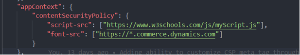
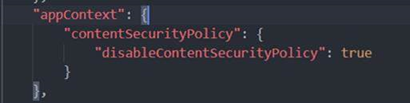

---
# required metadata

title: Configure and enable Content Security Policy (CSP)
description: This topic describes how to configure and enable Content Security Policy (CSP) in Dynamics 365 Commerce.
author: samjarawan
manager: annbe
ms.date: 10/01/2019
ms.topic: article
ms.prod: 
ms.service: dynamics-ax-retail
ms.technology: 

# optional metadata

# ms.search.form: 
audience:  Developer
# ms.devlang: 
ms.reviewer: v-chgri
ms.search.scope: Retail, Core, Operations
# ms.tgt_pltfrm: 
ms.custom: 
ms.assetid: 
ms.search.region: Global
# ms.search.industry: 
ms.author: samjar
ms.search.validFrom: 2019-10-31
ms.dyn365.ops.version: Release 10.0.5

---
# Configure and enable Content Security Policy (CSP)

[!include [banner](../includes/preview-banner.md)]
[!include [banner](../includes/banner.md)]

This topic describes how to configure and enable Content Security Policy (CSP) in Dynamics 365 Commerce.

## Overview

Content Security Policy (CSP) is an additional layer of security that helps to detect and mitigate certain types of web attacks, the purpose of which can be anything from data theft to site defacement to distribution of malware. CSP provides an extensive set of policy directives that enable you to control the resources that a page is allowed to load. Each directive defines the restrictions for a particular resource type.

Enabling CSP for an e-Commerce site enhances security by blocking connections, scripts, fonts, and other types of resources that originate from unknown or malicious sources. CSP in Dynamics 365 Commerce is enabled by default and will likely require some additional configuration for most sites. The Dynamics 365 Commerce online SDK provides a default list of allowed source URLs from which style, script, and API calls can be made. This list can be modified on the Dynamics 365 Commerce Extensibility page.

For more details on CSP, see the [Content Security Policy Reference](https://content-security-policy.com/).

## CSP directives in Dynamics 365 Commerce

The following CSP directives are available for use on Dynamics 365 Commerce sites.

Directive | Description
--- | ---
child-src | Defines valid sources for web workers and nested browsing contexts loaded using elements such as &lt;frame&gt; and &lt;iframe&gt;
connect-src | Define from which URLs AJAX requests can be made
font-src | Defines valid sources for fonts
img-src | Defines valid sources for images
media-src | Defines valid sources of audio and video, for example HTML5 &lt;audio&gt; or &lt;video&gt; elements
object-src | Defines valid sources of plugins, for example &lt;object&gt;, &lt;embed&gt;, or &lt;applet&gt;
script-src | Defines valid sources of JavaScript
style-src | Defines valid sources of stylesheets

### Example of CSP directive configuration

For an example of CSP directive configuration, if a site with CSP enabled needs to call an external script such as https://www.example.com/scripts/example.js, an entry must be added to the **script-src** directive under the **Content Security Policy** tab on the **Site Management** **Extensibility** page, as shown in the following screenshot.

After any changes are made, ensure the "Save and Publish" button is pressed.

## Understanding CSP errors

When initially configuring CSP for a site it can be common to see pages not load or not work as intended because CSP is preventing requests, scripts, etc. from loading. 

Fortunately, CSP logs some helpful errors to the console and we can use these errors to fix, fine-tune and even help cleanup unwanted or unneeded requests.

The image below shows an example error as seen within a web browser's developer tools.

In this case we have two CSP errors:

- Eval is blocked by default because it can lead to arbitrary Javascript execution. If you must allow it, you must add ‘unsafe-eval’ (single quotes required) to your sites script-src directive.
- The stylesheet from https://int.fabrikam.com  is blocked. To allow it, add an entry to the style-src to allow stylesheets to be loaded from this domain.

The image below shows how the fixed settings look like in the Dynamics 365 Commerce **Content Security Policy** tab.

## Update page mocks with new CSP

If you are testing modules in a development environment with the online SDK, you can also add CSP using page mocks. In a page mock, you'll need to add or navigate to the top level property "appContext" and create a property under that titled "contentSecurityPolicy".

Here you may add key value pairs of directives to policies.

If you are adding CSP policies in your page mock, please note that it will not include any of the default CSP policies provided by the platform. 

You may also disable CSPO on your page mock by using:

## Disable CSP
If for whatever reason, you want to disable CSP from applying policies to your site, you may disable it altogether. Simply check the **Disable content security policy** check box and then select **Save and publish**.

