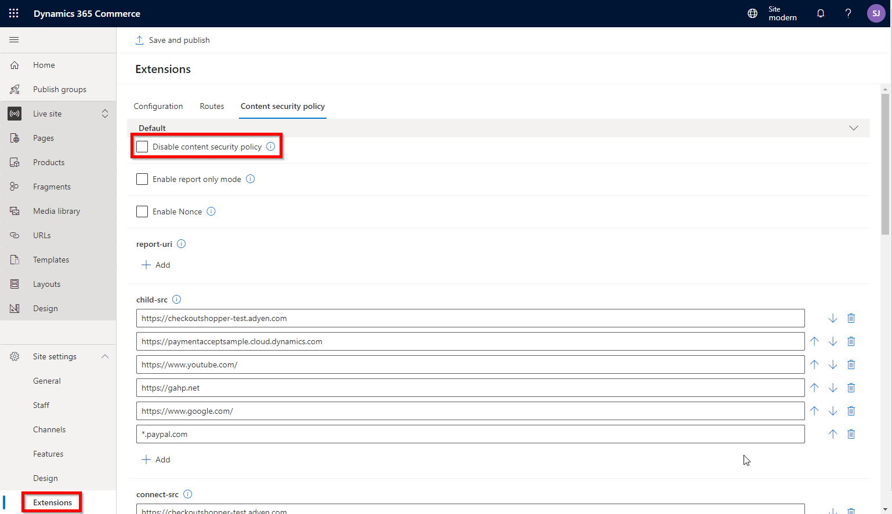

---
# required metadata

title: Configure and enable Content Security Policy (CSP)
description: This topic describes how to configure and enable Content Security Policy (CSP) in Dynamics 365 Commerce.
author: samjarawan
manager: annbe
ms.date: 10/01/2019
ms.topic: article
ms.prod: 
ms.service: dynamics-ax-retail
ms.technology: 

# optional metadata

# ms.search.form: 
audience:  Developer
# ms.devlang: 
ms.reviewer: v-chgri
ms.search.scope: Retail, Core, Operations
# ms.tgt_pltfrm: 
ms.custom: 
ms.assetid: 
ms.search.region: Global
# ms.search.industry: 
ms.author: samjar
ms.search.validFrom: 2019-10-31
ms.dyn365.ops.version: Release 10.0.5

---
# Configure and enable Content Security Policy (CSP)

[!include [banner](../includes/preview-banner.md)]
[!include [banner](../includes/banner.md)]

This topic describes how to configure and enable Content Security Policy (CSP) in Dynamics 365 Commerce.

## Overview

Content Security Policy (CSP) is an additional layer of security that helps to detect and mitigate certain types of web attacks, the purpose of which can be anything from data theft to site defacement to distribution of malware. CSP provides an extensive set of policy directives that enable you to control the resources that a page is allowed to load. Each directive defines the restrictions for a particular resource type.

Enabling CSP for an e-Commerce site enhances security by blocking connections, scripts, fonts, and other types of resources that originate from unknown or malicious sources. CSP in Dynamics 365 Commerce is enabled by default and will likely require some additional configuration for most sites. The Dynamics 365 Commerce online SDK provides a default list of allowed source URLs from which style, script, and API calls can be made. This list can be modified on the Dynamics 365 Commerce Extensibility page.

For more details on CSP, see the [Content Security Policy Reference](https://content-security-policy.com/).

## CSP directives in Dynamics 365 Commerce

The following CSP directives are available for use on Dynamics 365 Commerce sites.

Directive | Description
--- | ---
child-src | Defines valid sources for web workers and nested browsing contexts loaded using elements such as &lt;frame&gt; and &lt;iframe&gt;
connect-src | Define from which URLs AJAX requests can be made
font-src | Defines valid sources for fonts
img-src | Defines valid sources for images
media-src | Defines valid sources of audio and video, for example HTML5 &lt;audio&gt; or &lt;video&gt; elements
object-src | Defines valid sources of plugins, for example &lt;object&gt;, &lt;embed&gt;, or &lt;applet&gt;
script-src | Defines valid sources of JavaScript
style-src | Defines valid sources of stylesheets

### Example of CSP directive configuration

The following example describes how to enable an external script to be called in Dynamics 365 Commerce.

To configure a directive to allow an external script to be called, follow these steps.

1. In Dynamics 365 Commerce, navigate to your site.
1. Go to **Site Management \> Extensibility**.
1. Select the **Content Security Policy** tab.
1. Under **script-src**, select **+Add**, and then enter the full URL of the external script to be called.
1. Select **Save and Publish**.

The following screenshot shows where an external script URL would be entered on the **Content Security Policy** tab.

## Interpret and fix CSP errors

When initially configuring CSP for a site, it is common to see pages that will not load or work as intended because CSP is preventing requests, scripts, etc. from loading. Fortunately CSP logs some helpful errors that can be used to fix, tune, and clean up unwanted or unneeded requests.

The following example screenshot shows some CSP errors as seen within a web browser's developer tools.

In this example we have two CSP errors:

- The Eval function is blocked by default because it can lead to arbitrary Javascript execution. To allow it, you must add 'unsafe-eval' (single quotes required) to your site's script-src directive.
- The stylesheet is blocked. To allow stylesheets to be loaded from an external domain, you would add the URL to the style-src directive.

The following screenshot shows what the fixed settings would look like on the Dynamics 365 Commerce **Content Security Policy** tab.

## Update page mocks with new CSP

If you are testing modules in a development environment with the online SDK, you can also add CSP using page mocks. In a page mock, you'll need to add or navigate to the top level property "appContext" and create a property under that titled "contentSecurityPolicy".

Here you may add key value pairs of directives to policies.

If you are adding CSP policies in your page mock, please note that it will not include any of the default CSP policies provided by the platform. 

You may also disable CSPO on your page mock by using:

## Disable CSP
If for whatever reason, you want to disable CSP from applying policies to your site, you may disable it altogether. Simply check the **Disable content security policy** check box and then select **Save and publish**.

