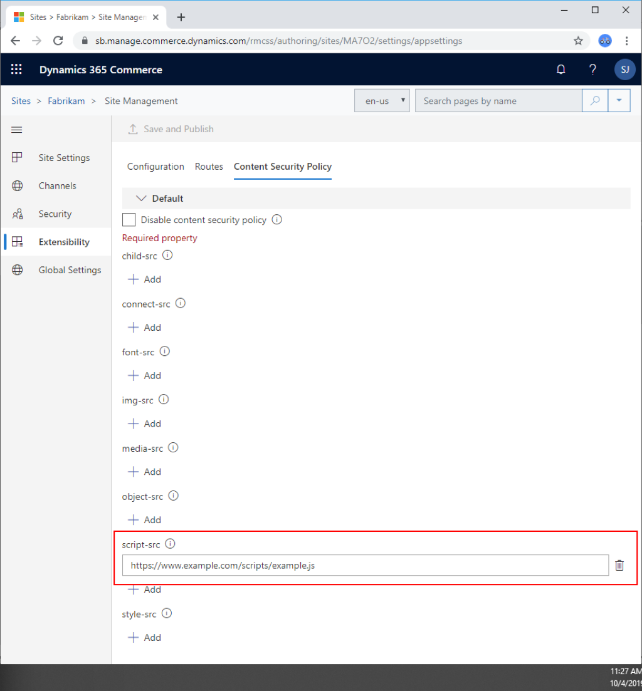

---
# required metadata

title: Content Security Policy
description: This topic describes how to enable and configure content security policy.
author: samjarawan
manager: annbe
ms.date: 10/01/2019
ms.topic: article
ms.prod: 
ms.service: dynamics-ax-retail
ms.technology: 

# optional metadata

# ms.search.form: 
audience:  Application user
# ms.devlang: 
ms.reviewer: v-chgri
ms.search.scope: Retail, Core, Operations
# ms.tgt_pltfrm: 
ms.custom: 
ms.assetid: 
ms.search.region: Global
# ms.search.industry: 
ms.author: samjar
ms.search.validFrom: 2019-10-31
ms.dyn365.ops.version: Release 10.0.5

---
# Content Security Policy

[!include [banner](../includes/preview-banner.md)]
[!include [banner](../includes/banner.md)]

This topic describes how to enable and configure content security policy.

## Overview
Enabling content security policy will enhance the security of an e-Commerce site by blocking connections, scripts, fonts, etc. from unknown sources.

The Dynamics 365 Commerce Online SDK provide a default allow list of source URLs where styles, scripts and API calls can be made.  The allow list can also be extended from within the authoring tools **Extensibility section** per site on a tenant.  

For more details see the [Content Security Policy referece guide](https://content-security-policy.com/) .

The following directives are extendable on each site.

Directive | Description
--- | ---
child-src | Defines valid sources for web workers and nested browsing contexts loaded using elements such as <frame> and <iframe>
connect-src | The connect-src directive restricts to which URLs AJAX requests can be made.
font-src | Defines valid sources for fonts.
img-src | Defines valid sources for images.
media-src | Defines valid sources of audio and video, eg HTML5 <audio>, <video> elements.
object-src | Defines valid sources of plugins, eg <object>, <embed> or <applet>.
script-src | Defines valid sources of JavaScript.
style-src | Defines valid sources of stylesheets.

Extending these policies can be done through authoring on a per-site basis.

Content Security Policy is enabled by default and will require some extra configuration for most sites.  Below outlines how this can be done.

As an example, with content security policy enabled, if a site needs to call an external script such as https://www.example.com/scripts/example.js, an entry must add it to the **script-src** directive under the **Content Security Policy** tab on the **Site Management** **Extensibilty** page.

After any changes are made, ensure the "Save adn Publish" button is pressed.

## Understanding CSP errors
When initially configuring CSP for a site it can be common to see pages not load or not work as intended because CSP is preventing requests, scripts, etc. from loading. 
Fortunately, CSP logs some helpful errors to the console and we can use these errors to fix, fine-tune and even help cleanup unwanted or unneeded requests.

Below is an example error shown within a web browser's developer tools.

In this case we have two CSP errors:

1.	Eval is blocked by default because it can lead to arbitrary Javascript execution. If you must allow it, you must add ‘unsafe-eval’ (single quotes required) to your sites script-src directive.
2.	The stylesheet from https://int.fabrikam.com  is blocked. To allow it, add an entry to the style-src to allow stylesheets to be loaded from this domain

Below shows how the fixed settings look like in the **Content Security Policy** tab:

