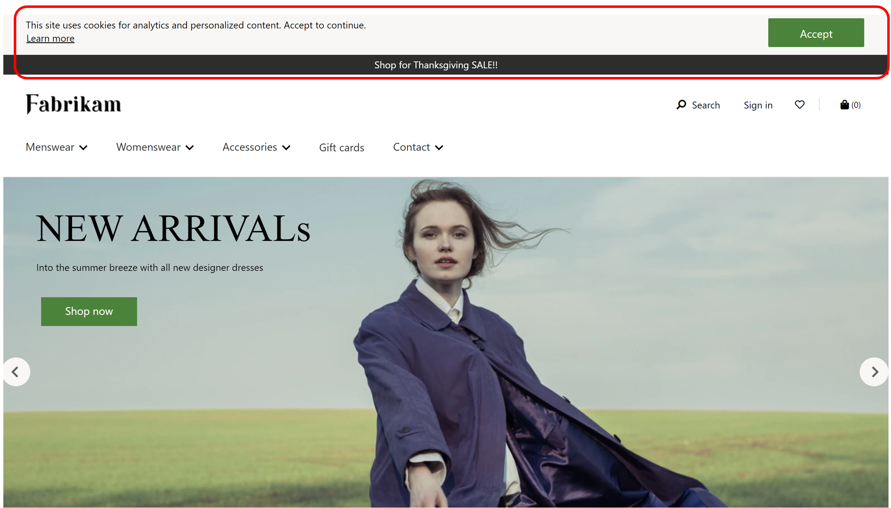

# Cookie consent module

[!include [banner](includes/banner.md)]

This article covers cookie consent modules and describes how to add them to site pages in Microsoft Dynamics 365 Commerce.

The cookie consent module prompts site users to explicitly provide consent to allow cookies for any feature or module that tracks browser cookies. The consent is required the first time a site user browses a site in a new browser session. When consent is received, it's tracked and the site user isn't prompted for consent again. For more information, see [Cookie compliance](cookie-compliance.md).

If a site user cookie consent is not received, any features or modules that require cookie consent aren't rendered on the page. For example, the checkout module, social share module, and preferred store feature all require cookie consent and aren't rendered if site user consent isn't received. 

A cookie consent module can be configured on a page's header fragment so that it can be enforced when the page loads. The cookie consent module should have a clear message informing the site user about cookie usage on the site and should provide a link to the site's privacy page.

The following illustration highlights an example of a cookie consent message with a link to the site's privacy policy page displayed on the header of a site page.

## Cookie consent module properties

| Property name             | Value                 | Description |
|---------------------------|-----------------------|-------------|
| Rich Text                  | Rich Text | Specifies a Rich Text notification to site users that the site uses browser cookies and users should accept the use of cookies for the site to be fully functional. |
| Links | URL | One or more links can be added to a site's privacy page that describes the types of cookies that are tracked on the site. |

## Add a cookie consent module to site pages

To efficiently add a cookie consent module to multiple site pages, it can be added to a shared page header fragment. After the header fragment is added to all site pages, a cookie consent notification will automatically be rendered the first time a site user navigates to any site page.

For more information about header fragments and modules, see [Header module](author-header-module.md).

## Additional resources

[Module library overview](starter-kit-overview.md)

[Header module](author-header-module.md) 

[Cookie compliance](cookie-compliance.md)

[!INCLUDE[footer-include](../includes/footer-banner.md)]
