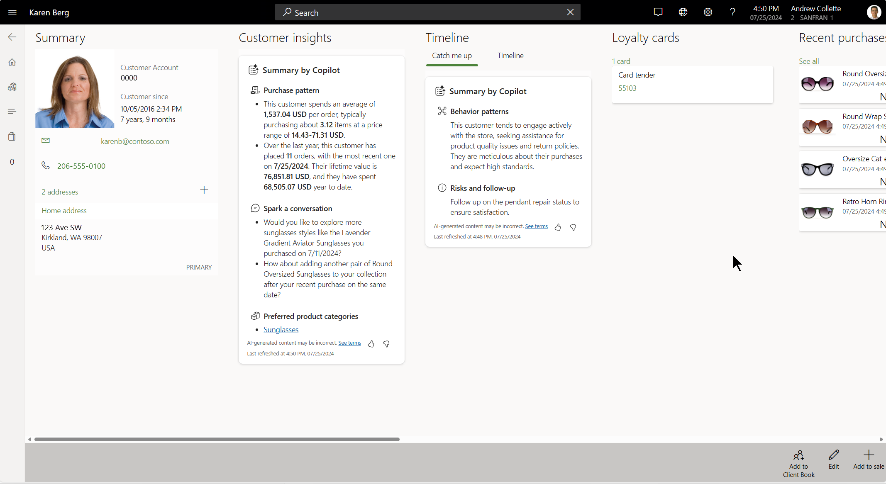

# Customer insights by Copilot

[!include [banner](includes/banner.md)]

This article describes how store associates can use Microsoft Copilot to enhance customer interactions and create personalized shopping experiences in Dynamics 365 Commerce.

Customer insights by Copilot is a feature in the Dynamics 365 Commerce Store Commerce app that uses AI to transform customer service and create individualized shopping experiences. Customer insights by Copilot connects relevant data points from Commerce and presents them to store associates in an intuitive and actionable way. By using Customer insights by Copilot, store associates can:

- Access comprehensive and in-depth profiles of each customer, including:

    - Preferred product categories.
    - Price ranges.
    - Recency, frequency, monetary (RFM) analysis.
    - Lifetime value.

- View a summarized timeline of each customer's activity, such as store visits, notes, events, and previous interactions. In this way, associates can easily pick up conversations where they were left off or provide custom follow-up.
- Spark a conversation through personalized icebreaker questions that are based on a customer's purchases within the last year.
- Offer relevant and customized recommendations that are based on a customer's purchase history, interests, and budget.

## Benefits of Customer insights by Copilot

Customer expectations are growing. Customers increasingly want individualized experiences when they enter a store. To respond, store staff must be able to analyze customer behavior. Typically, this task is done manually. However, such an approach is not only inefficient and daunting, but is ultimately an obstruction to providing effective personalized encounters.

Harnessing the power of Copilot simplifies the process of understanding your clientele. It can be challenging to monitor each customer's timeline of activities, such as store visits, notes, and events. Copilot efficiently summarizes each customer's engagement timeline and updates you about their previous interactions. Therefore, you can more easily pick up conversations where they were left off or provide custom follow-up suggestions.

Customer insights by Copilot empowers store associates to excel at service delivery, so that they can turn transactions into lasting customer relationships. Customers, in turn, benefit from a personalized and memorable shopping experience that meets their needs and expectations.

Customer insights by Copilot is the ultimate tool for clienteling in retail. It shifts the focus from sales to the creation of individualized experiences and helps create loyal customers through exceptional service.

## Enable Customer insights by Copilot in the Store Commerce app

To enable Customer insights by Copilot in the Store Commerce app, follow these steps.

1. In Commerce headquarters, go to the **Feature management** workspace (**Systems administration** \> **Workspaces** \> **Feature management**), and enable the temporary **Enable Copilot in Store Commerce** feature flag. In this way, you give your organization's administrators governing control over the rollout of Copilot features in the Store Commerce app. This flag will eventually be retired.
1. Go to the **Commerce shared parameters** page (**Retail and Commerce** \> **Headquarters setup** \> **Parameters** \> **Commerce shared parameters**), and enable the **Enable Copilot in Store Commerce** flag. In this way, you give your organization's administrators additional governing control over the management of Copilot feature availability in the Store Commerce app. This flag is automatically enabled when you enable the temporary flag in the previous step. It will continue to be available after the temporary flag is retired.
1. Go to your point of sale (POS) functionality profile (**Retail and Commerce** \> **Channel setup** \> **POS setup** \> **POS profiles** \> **Functionality profiles**). On the **Copilot** FastTab, enable **Customer insights** to get Customer insights by Copilot reports in the Store Commerce app.
1. Run the **1070 (Channel configuration)** job to sync the updated settings to the channel database.

This capability is available to customers who use the following English-language Commerce versions:

- Commerce version 10.0.39, proactive quality update 4 (PQU-4) and later (Commerce Scale Unit: 9.49.24184.3, Store Commerce app: 9.49.24193.1)
- Commerce version 10.0.40, PQU-1 and later (Commerce Scale Unit: 9.50.24184.2, Store Commerce app: 9.50.24189.1)

> [!NOTE]
> - AI-generated content might be incorrect. Learn more in [Service Agreement & Microsoft Products and Services Data Protection Addendum](https://aka.ms/BusinessApplicationLegal).
> - For performance reasons, Customer insights by Copilot results are cached for 15 minutes at the store level. Therefore, an associate who accesses the same customer information on different registers can view the cached response.
> - For Copilot experiences in the Store Commerce app, you must link your Dataverse instance to your environment by enabling Copilot capabilities in your finance and operations apps. Learn more in [Enable Copilot capabilities in finance and operations apps](/dynamics365/fin-ops-core/dev-itpro/copilot/enable-copilot).
> - If your hosting environment is in one of the regions where Azure OpenAI Service isn't currently available, consider enabling the **Move data across regions** capability in the Power Platform admin center. If your Commerce environments are hosted in the EU Data Boundary, you use an Azure OpenAI endpoint in the same boundary. If the required AI services are already available in your Dataverse region, you don't have to set up support for cross-region calls. If cross-region data movement is required but disabled, users can't view Copilot-generated summaries in the Store Commerce app. [Learn more](/power-platform/admin/geographical-availability-copilot).

## Additional resources

[FAQ for Copilot-based insights](responsible-ai/faqs-ai-copilot-store-comm-summaries.md)

[!INCLUDE[footer-include](../includes/footer-banner.md)]
