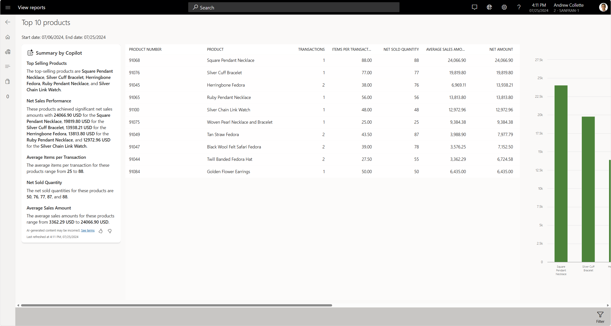

# Store report insights by Copilot

[!include [banner](includes/banner.md)]

This article describes how Microsoft Copilot-generated insights for store reports simplify the process of measuring the performance of your retail channels in Dynamics 365 Commerce.

Store report insights by Copilot is a feature that uses AI to generate natural language summaries of store reports in the Dynamics 365 Commerce Store Commerce app. Copilot helps you quickly understand the key insights and trends from your channel sales and store performance data. Copilot summaries are available for both out-of-box reports and custom store reports that you create in the Store Commerce app.

Store report insights by Copilot enhances the efficiency of store associates by providing real-time analysis of your store data. You can access Copilot-generated summaries every time you load a report in the Store Commerce app, without having to spend time on manual data interpretation.

Copilot summaries are governed by data access control settings. Therefore, you can ensure that only authorized users can view the reports. For example, a store cashier can analyze or view only reports that are related to their own point of sale (POS) activity. However, a store manager has broader permissions and can access reports for the entire store's POS activity.

Copilot can generate narrative summaries for channel reports. In this way, you get a clear and concise overview of key indicators such as sales, revenue, profit, margin, and overall store performance. You can also get real-time analysis, because Copilot updates the summaries as new data comes in.

## Enable Store report insights by Copilot in the Store Commerce app

To enable Store report insights by Copilot in the Store Commerce app, follow these steps.

1. In Commerce headquarters, go to the **Feature management** workspace (**Systems administration** \> **Workspaces** \> **Feature management**), and enable the temporary **Enable Copilot in Store Commerce** feature flag. In this way, you give your organization's administrators governing control over the rollout of Copilot features in the Store Commerce app. This flag will eventually be retired.
1. Go to the **Commerce shared parameters** page (**Retail and Commerce** \> **Headquarters setup** \> **Parameters** \> **Commerce shared parameters**), and enable the **Enable Copilot in Store Commerce** flag. In this way, you give your organization's administrators additional governing control over the management of Copilot feature availability in the Store Commerce app. This flag is automatically enabled when you enable the temporary flag in the previous step. It will continue to be available after the temporary flag is retired.
1. Go to your POS functionality profile (**Retail and Commerce** \> **Channel setup** \> **POS setup** \> **POS profiles** \> **Functionality profiles**). On the **Copilot** FastTab, enable **Report insights** to get Store insights by Copilot reports in the Store Commerce app.
1. Run the **1070 (Channel configuration)** job to sync the updated settings to the channel database.

This capability is available to customers who use the following English-language Commerce versions:

- Commerce version 10.0.39, proactive quality update 4 (PQU-4) and later (Commerce Scale Unit: 9.49.24184.3, Store Commerce app: 9.49.24193.1)
- Commerce version 10.0.40, PQU-1 and later (Commerce Scale Unit: 9.50.24184.2, Store Commerce app: 9.50.24189.1)

> [!NOTE]
> - AI-generated content might be incorrect. Learn more in [Service Agreement & Microsoft Products and Services Data Protection Addendum](https://aka.ms/BusinessApplicationLegal).
> - For Copilot experiences in the Store Commerce app, you must link your Dataverse instance to your environment by enabling Copilot capabilities in your finance and operations apps. Learn more in [Enable Copilot capabilities in finance and operations apps](/dynamics365/fin-ops-core/dev-itpro/copilot/enable-copilot).
> - If your hosting environment is in one of the regions where Azure OpenAI Service isn't currently available, consider enabling the **Move data across regions** capability in the Power Platform admin center. If your Commerce environments are hosted in the EU Data Boundary, you use an Azure OpenAI endpoint in the same boundary. If the required AI services are already available in your Dataverse region, you don't have to set up support for cross-region calls. If cross-region data movement is required but disabled, users can't view Copilot-generated summaries in the Store Commerce app. [Learn more](/power-platform/admin/geographical-availability-copilot).
> - Copilot Experience is only available when Store Commerce App is connected to the Cloud Commerce Scale Unit [Learn more](https://learn.microsoft.com/en-us/dynamics365/commerce/dev-itpro/commerce-architecture#commerce-scale-units-cloud)  

## Additional resources

[FAQ for Copilot-based insights](responsible-ai/faqs-ai-copilot-store-comm-summaries.md)

[!INCLUDE[footer-include](../includes/footer-banner.md)]
