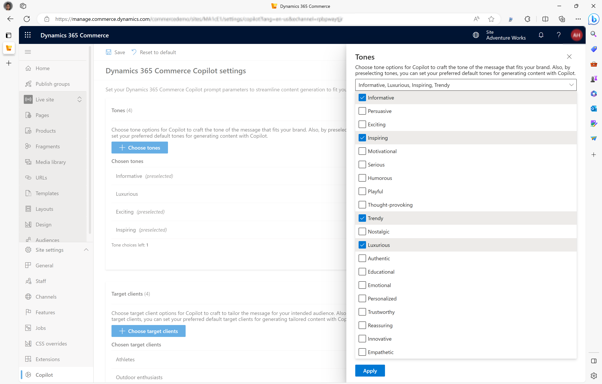
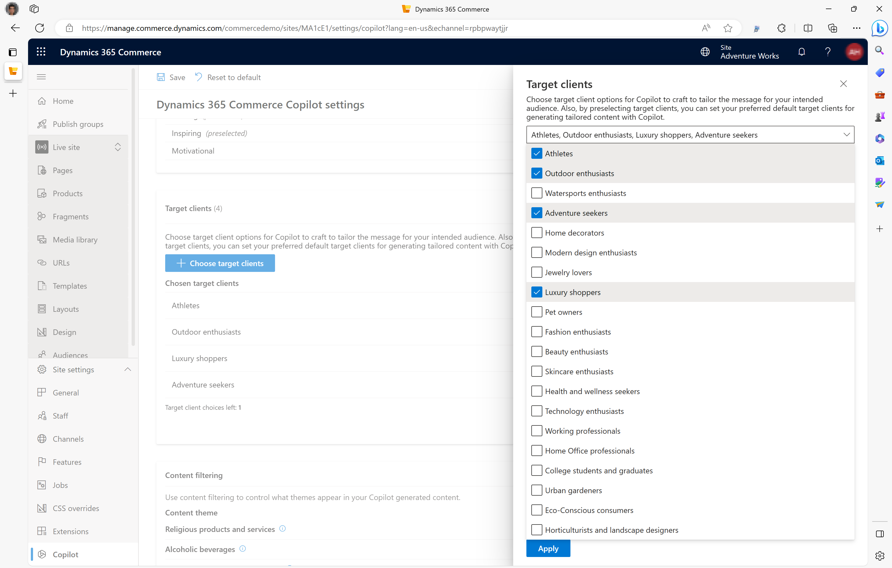

# Use Copilot in site builder to enrich product detail pages

[!include [banner](../includes/banner.md)]

This article describes how to use Microsoft Copilot in site builder to enrich product detail pages for Microsoft Dynamics 365 Commerce e-commerce websites.

> [!NOTE]
> - Starting in March 2024, Copilot in site builder is generally available for all Dynamics 365 Commerce customers globally. With this release, Copilot in site builder is supported in 23+ locales. For more information, see [Copilot International Availability](https://go.microsoft.com/fwlink/?linkid=2263265).
> - Depending on the hosting region for your environment, you may need to access Copilot resources that aren't in your hosting region. If so, you can allow your request to be routed to another region by following the instructions in [Enable cross-geo communication for Copilot](#enable-cross-geo-communication-for-copilot). For more information, see [Enable copilots and generative AI features](https://go.microsoft.com/fwlink/?linkid=2263523).

If you run an e-commerce website, you know the importance of engaging and persuasive product enrichment and marketing content that can attract and convert your customers. However, it can be time-consuming and challenging to create such content, especially if you have a large product catalog and a diverse audience. To help with content creation, Microsoft introduced Copilot in site builder, a new AI-powered tool that helps you easily and efficiently generate high-quality content.

Copilot in site builder works seamlessly with Dynamics 365 Commerce site builder to help you quickly create product enrichment and marketing content that's customized for your target audience and brand tone. Site builder offers a range of templates, features, and tools to help you customize your website to meet your needs and preferences. By using Copilot in site builder, you can quickly and efficiently generate persuasive, compelling, and engaging product enrichment and marketing content for your e-commerce websites.

The following video provides an overview of product enrichment with Copilot in site builder.

> [!VIDEO https://learn-video.azurefd.net/vod/player?id=4eff289d-7763-4ed0-b31a-240a597ed1ec]

To use Copilot in site builder to initiate the creative process, first select a desired tone for your brand, such as "adventurous," "luxurious," or "bold." Next, select an audience from a list of choices that you manage, such as "sports enthusiast" or "college graduate." Copilot then uses these prompts to craft compelling and engaging content based on existing product information such as the name, description, attributes, and price.

Copilot in site builder offers the following capabilities:

- **Initiate the creative process** – Copilot generates content based on basic product information such as the name, description, attributes, and dimensions. You can then use the generated content to spark further ideas.
- **Optimize for search engines** – Optimize your product marketing content for search engines to help rank your e-commerce site rank higher in internet search results and drive up sales.
- **Choose the messaging tone** – You can select the voice that best fits your brand and audience, and you can specify a unique tone for each product. For example, the tone of the messaging for a product might be adventurous, casual, luxurious, formal, informational, or educational.
- **Create custom messages for specific buyers** – Select the intended audience to create custom messages for specific buyers, such as new parents, graduates, older adults, and health care workers.
- **Amplify with key highlights** – Use natural language to augment your content with key highlights that are specific to a product, and generate engaging text snippets that help amplify key highlights for your product.
- **Make basic modifications** – Easily make basic text modifications, either by using an inline rich text editor or by using natural language to provide key prompts to format text.

> [!NOTE]
> Copilot in site builder can be used with content block and text block modules when you enrich product pages. For more information, see [Learn more about standard product enrichment](./enrich-product-page.md).

## Enable the Copilot in site builder feature

To use Copilot in site builder, you must first enable the feature in site builder.

To enable the Copilot in site builder feature, follow these steps.

1. In site builder, go to **Tenant settings \> Features**.
1. Set the **Copilot for Dynamics 365 content generation** option to **On**.

> [!NOTE]
> Content that's generated by AI can include incorrect information. Before you use any AI-generated content that's suggested, review it to ensure that it's accurate and appropriate. By using this feature, you acknowledge and agree to the [Supplemental terms of use for Microsoft Power Platform and Dynamics 365 preview for online services](https://go.microsoft.com/fwlink/?linkid=2189520).

When you enable the Copilot in site builder feature at the tenant level, the Copilot capability is automatically enabled for all sites that are associated with the tenant. However, site administrators can control the availability of Copilot at the level of the individual site.

To control the availability of Copilot in site builder feature at the site level, follow these steps.

1. Go to your site in site builder.
1. Go to **Site settings \> Features**.
1. Set the **Copilot for Dynamics 365 content generation** option to **On** or **Off**.
1. Repeat the previous steps for other sites that are associated with the tenant.

## Enable cross-geo communication for Copilot

Currently, Copilot services are hosted in a [limited number of data centers](/power-platform/admin/geographical-availability-copilot) across the world. To prevent unwanted use of cross-geo services, the default behavior is to disable Copilot features in geos that don't have local Copilot services.

To enable Copilot in geos that don't have local Copilot services, follow these steps.

1. To opt-in to the service, in site builder, go to **Tenant settings \> Features** and set the **Enable cross geo communication for Copilot** feature flag to **On**.
1. In the consent dialog, select **Agree**
1. On the command bar, select **Save**.

## Configure and preselect tones for your brand and organization

You can choose up to five tone options that Copilot in site builder uses to craft messaging that fits your brand and organization. These tones are then available for use by team members who are responsible for updating product enrichment content. You can also preselect any of the chosen tones to set them as defaults for quickly generating content via Copilot.

To choose tone options and preselect default tones in site builder, follow these steps.

1. Go to **Site settings \> Copilot**.
1. Under **Tones**, select **Edit**.
1. Select **Choose tones**. 
1. On the **Tones** flyout menu, select up to five tones, and then select **Apply**.

    

1. Under **Chosen tones**, select any tones that you want to preselect as default tones.
1. On the command bar, select **Save**.

## Configure and preselect target client options

You can choose up to five target client options to help Copilot craft messaging that targets your intended audience. These target clients are then available for use by team members who are responsible for updating product enrichment content. You can also preselect any of the chosen target clients to set them as defaults for quickly generating content via Copilot.

To choose target client options and preselect default target clients in site builder, follow these steps.

1. Go to **Site settings \> Copilot**.
1. Under **Target clients**, select **Edit**.
1. Select **Choose target clients**.
1. On the **Target clients** flyout menu, select up to five target clients, and then select **Apply**.

    

1. Under **Chosen target clients**, select any target clients that you want to preselect as default target clients.
1. On the command bar, select **Save**.

## Selective content filtering

Microsoft is committed to providing a responsible and ethical solution for your e-commerce needs. We designed Copilot in site builder so that, by default, it avoids promoting products from sensitive and regulated industries, such as alcohol, tobacco, and soft drugs.

However, you might have different preferences and requirements for your business. Site administrators can override the default content filtering settings and customize the product enrichment and marketing content that Copilot in site builder generates.

To override content filtering restrictions in site builder, follow these steps.

1. Go to **Site settings \> Copilot**.
1. Under **Content filtering**, for the content themes that you want to override, set the options to **Off**.

> [!NOTE]
> Copilot settings for tones, target clients, and sensitive/regulated industries are predefined by the system. If you have feedback or requests to revise or add more options, contact Microsoft Support.

## Use Copilot to create content for a product page

To use Copilot to create content for a product page, follow these steps.

1. In site builder for your site, in the left navigation pane, select **Products**.
1. Select a product for which you want to create content, and that doesn't already have a customized product page.
1. On the action pane, select **Customize product page**.
1. In the **Customize a product page** flyout menu, for **Page description**, enter a description. 
1. For **Tags**, enter any tags you want to associate with the custom page, and then select **Next**.
1. Select a template, and then select **Next**.
1. Select a layout, and then select **Next**.
1. Review the summary of information you entered, and then select **Create page**.
1. Select **Go to page**.
1. To launch Copilot in site builder, in the Outline pane, select a **Content block** or **Text block** module, and then in the module's properties pane, select **Create Content**. If there are no **Content block** or **Text block** modules available, add them as appropriate.
1. In the **Generate content with Copilot** flyout menu, under **Select product information**, select product information that you want Copilot to use as input, such as **Price**, **Dimensions**, **Product description**, or **Product attributes**. Clear boxes for product information that you don't want to include.
1. Under **Draft with Copilot**, enter specific instructions for Copilot to follow when creating the content, and then select **Generate content**. For example, you can tell Copilot to highlight the benefits of the product using a friendly tone, or targeting a specific audience. If you don't provide any instructions, Copilot uses the default options from your site settings.
1. After processing, review the content Copilot generated in the **Copilot suggested enrichment content** preview box.
1. If you aren't satisfied with the response, in the text box, add more details for Copilot to use, and then select the right-facing arrow to generate updated content. You can also return to **Update product information** and change the selection of product information if needed. 
1. After Copilot creates a new response based on your updated input, you can repeat the process as many times as necessary until you get a response that meets your expectations.
1. Once you're satisfied with the response, select **Use response**, which copies the response to the text or content block you're updating. If needed, you can review and edit the response again to make any final changes, and also add images, links, or other elements to enhance the product page.
1. When you're finished, select **Save**, select **Finish editing** to check in the page, and then select **Publish** to publish it.  

[!INCLUDE[footer-include](../includes/footer-banner.md)]
