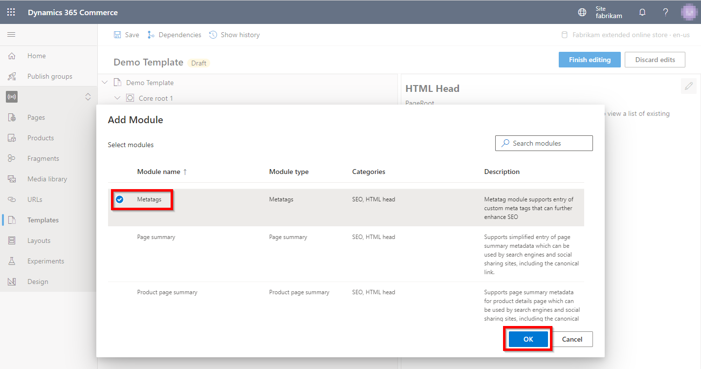
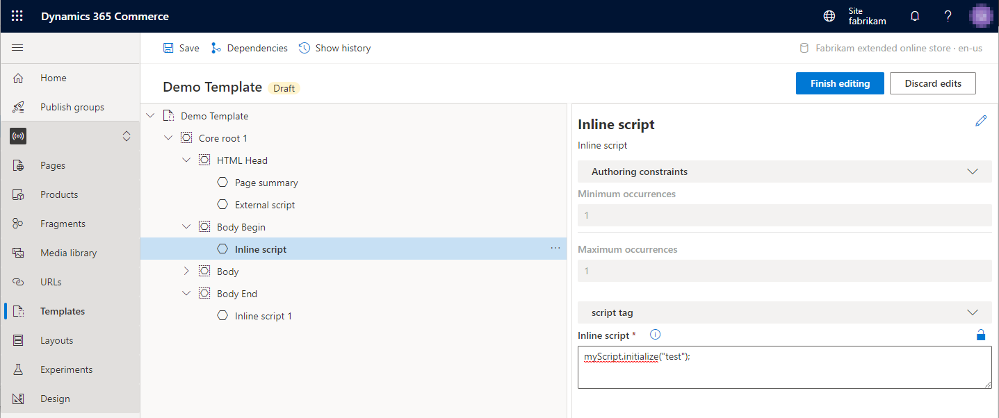

---
# required metadata

title: Metatags modules
description: This topic covers the metatags module and describes how to add one to a template in Microsoft Dynamics 365 Commerce.
author: samjarawan
manager: annbe
ms.date: 02/11/2021
ms.topic: article
ms.prod: 
ms.service: dynamics-365-commerce
ms.technology: 

# optional metadata

# ms.search.form: 
audience: Developer
# ms.devlang: 
ms.reviewer: v-chgri
# ms.tgt_pltfrm: 
ms.custom: 
ms.assetid: 
ms.search.region: Global
# ms.search.industry: 
ms.author: samjar
ms.search.validFrom: 2019-10-31
ms.dyn365.ops.version: Release 10.0.5

---

# Metatags modules

[!include [banner](includes/banner.md)]

This topic covers the metatags module and describes how to add one to a template in Microsoft Dynamics 365 Commerce.

The metatags module can be added to a template's **HTML Head** slot.  One or more meta tags can be added using the **Add Meta Tag** configuration field button.  An example below shows a metatags module added to the HTML head of a template:

## Metatags module properties

| Property name     | Values | Description |
|-------------------|--------|-------------|
| Meta Tags | Text | One or more meta tags can be added to the module. |

## Adding a metatags module to a template

1. From within a site builder template select the **Add Module** option within the **...** of the slot you intend to add the script module to as shown below.

2. Select the script module followed by the **OK** button as shown below. 

Once the summary module is added it should look similar to the below image.  The module can now be configured and the template can be saved and published.

## Additional resources

[Module library overview](starter-kit-overview.md)

[Default page module](core-default-page-module.md)

[Page summary modules](core-page-summary-modules.md)

[!INCLUDE[footer-include](../includes/footer-banner.md)]
