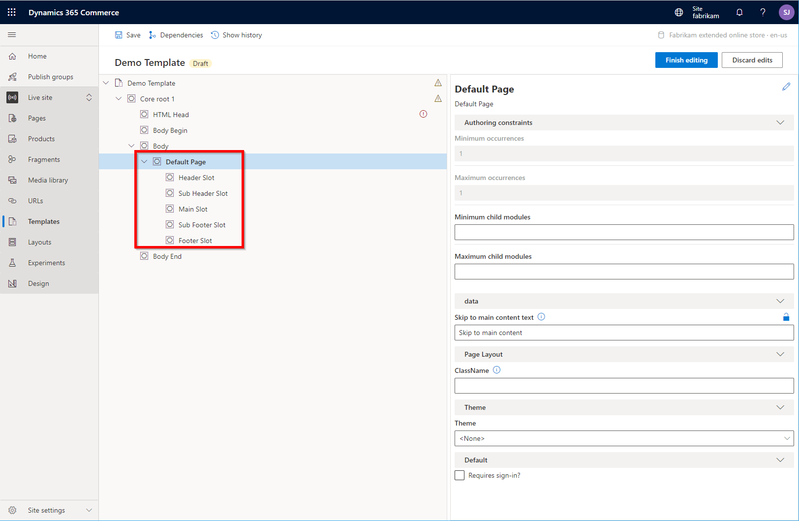

---
# required metadata

title: Default page module
description: This topic covers the default page module and describes how to add one to a template in Microsoft Dynamics 365 Commerce.
author: samjarawan
manager: annbe
ms.date: 02/11/2021
ms.topic: article
ms.prod: 
ms.service: dynamics-365-commerce
ms.technology: 

# optional metadata

# ms.search.form: 
audience: Developer
# ms.devlang: 
ms.reviewer: v-chgri
# ms.tgt_pltfrm: 
ms.custom: 
ms.assetid: 
ms.search.region: Global
# ms.search.industry: 
ms.author: samjar
ms.search.validFrom: 2019-10-31
ms.dyn365.ops.version: Release 10.0.5

---

# Default page module

[!include [banner](includes/banner.md)]

This topic covers the default page module and describes how to add one to a template page in Microsoft Dynamics 365 Commerce.

The default page module is a special module that becomes the root of a page and can only be added to a templates **Body** slot. Only one page module is available with the module library but additional page modules can be created using the [online channel extensibility SDK](e-commerce-extensibility/overview.md) if desired.  The page model defines the core slots ("Header Slot", "Sub Header Slot", "Main Slot", "Sub Footer Slot" and "Footer Slot") that will show up in the page editor within site builder as shown in the below image.

## Page module properties

| Property name     | Values | Description |
|-------------------|--------|-------------|
| Skip to main content text |  | Text to be displayed in the "skip to main content" link. |
| Theme             | A list of available themes will be uploaded | Specifies the theme to use for the pages derived from this template.  **Note: this configuration property has been deprecated and will be removed in a future release. Themes should only be set at the site level.**
| Requires sign-in? | True/False | This boolean property controls whether the page requires sign-in to be accessed.  If set to true the user will be redirected to the sign in page if not signed in. |

## Adding a page module to a template

1. From within a site builder template select the **Add Module** option within the **...** of the **Body** slot as shown below.

2. From within the "Add Module" dialog box, select the **Default Page** module and the **OK** button as shown below.

Once the default page module is added it should look similar to the below iamge.  The module can now be configured and the template can be saved and published.

## Additional resources

[Module library overview](starter-kit-overview.md)

[Footer module](author-footer-module.md)

[!INCLUDE[footer-include](../includes/footer-banner.md)]
