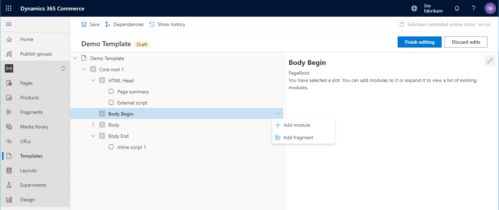

---
# required metadata

title: External and inline script modules
description: This topic covers the external and inline script modules and describes how to add one to a template in Microsoft Dynamics 365 Commerce.
author: samjarawan
manager: annbe
ms.date: 02/11/2021
ms.topic: article
ms.prod: 
ms.service: dynamics-365-commerce
ms.technology: 

# optional metadata

# ms.search.form: 
audience: Developer
# ms.devlang: 
ms.reviewer: v-chgri
# ms.tgt_pltfrm: 
ms.custom: 
ms.assetid: 
ms.search.region: Global
# ms.search.industry: 
ms.author: samjar
ms.search.validFrom: 2019-10-31
ms.dyn365.ops.version: Release 10.0.5

---

# External and inline script modules

[!include [banner](includes/banner.md)]

This topic covers the external and inline script modules and describes how to add one to a template in Microsoft Dynamics 365 Commerce.

External and inline scripts can be added to a template's **HTML Head**, **Body Begin** or **Body End** slots.  An example below shows external and inline scripts added to various slots in a template.

## External script module properties

| Property name     | Values | Description |
|-------------------|--------|-------------|
| Script source | Text | The URL of the script file location. |
| execute script asynchronously | **True** or **False** | If true, the script will execute asynchronously. |
| defer script execution | **True** or **False** | If set to true, the script will execute when the page has finished executing. |

## Inline script module properties

| Property name     | Values | Description |
|-------------------|--------|-------------|
| Inline script | Text | The collection of scripting statements that will be inserted inline into script tags on the HTML page. |

## Content security policy

If you have content security policy enabled, external scripts may not run.  You will need to add the domain URLs to the CSP rules within site builder.  See [Manage Content Security Policy](manage-csp.md) for more information.

## Adding a script module to a template

1. From within a site builder template select the **Add Module** option within the **...** of the slot you intend to add the script module to as shown below.

2. Select the script module followed by the **OK** button as shown below. 

Once the summary module is added it should look similar to the below image.  The module can now be configured and the template can be saved and published.

## Additional resources

[Module library overview](starter-kit-overview.md)

[Default page module](core-default-page-module.md)

[Page summary modules](core-page-summary-modules.md)

[Metatags module](core-metatags-module.md)

[!INCLUDE[footer-include](../includes/footer-banner.md)]
