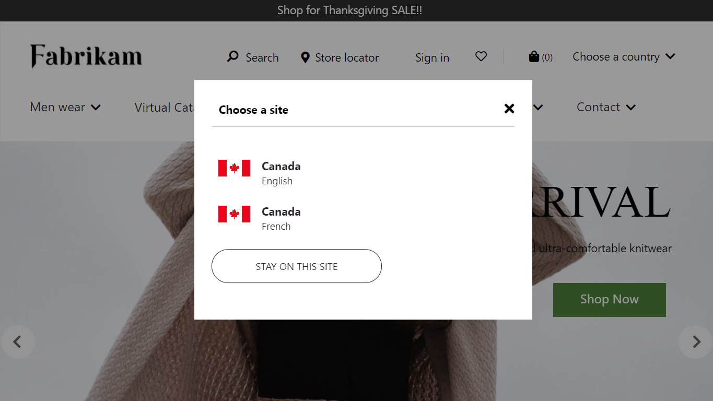

# Country/region picker module

[!include [banner](includes/banner.md)]

This article covers the country/region picker module and describes how to configure it in Microsoft Dynamics 365 Commerce.

The country/region picker module uses the [geo detection and redirection](geo-detection-redirection.md) feature in Dynamics 365 Commerce to show recommended sites to customers who request an e-commerce site URL that isn't associated with their country or region.

For example, a customer in Canada requests a site URL that is associated with a country other than Canada. In this case, the country/region picker module shows a dialog box that recommends site URLs that are associated with Canada. 

## How it works

When geo detection and redirection are enabled for a site, and a customer requests a site URL, the country/region that is detected for the customer and the URL that they requested are used to determine whether that URL is mapped to the country/region where the customer is. The mapping between URLs and countries/regions is defined on the **Channels** page under **Site settings** in Commerce site builder. 

If the request URL doesn't match any URL that is mapped to the customer's country, the list of one or more URLs that are mapped to that country is returned in the response. The country/region picker compares each URL in that list to the URLs that have been configured in the country/region module. For every exact match that is found, the country/region picker renders the display heading, subheading, and image for that URL, and hyperlinks those elements by using the URL.

When a customer selects on an option in the country/region picker, they are taken to the hyperlinked URL. That URL is written to the **\_msdyn365\_\_\_site\_** cookie so that it can be used as the customer's site preference. Then, the next time that the customer requests the URL that isn't associated with their country or region, they are automatically redirected to their preferred country. Therefore, we recommend that you also use the [site picker module](site-selector.md) on your e-commerce site, so that customers have a way to override or update their site preference. 

If a customer closes the country/region picker dialog box, no cookie is written, and the customer stays on the current site. 

The following illustration shows an example of the country/region picker dialog box.

## Country/region picker module properties

| Property name              | Value       | Description                                                  |
| -------------------------- | ----------- | ------------------------------------------------------------ |
| Heading                    | Text        | The heading that appears at the top of the dialog box.       |
| Subheading                 | Text        | The subheading that appears below the heading.               |
| Country: Display string    | Text        | The display name for a URL option (for example, "Canada").   |
| Country: Display substring | Text        | An optional display substring for a URL option (for example, "English" or "French"). |
| Country: Country image     | Media asset | An optional image that is associated with a URL option (for example, an image of the Canadian flag). |
| Country: Country URL       | Text        | The site URL for the country/region that is being configured. This URL must exactly match the URL that you specified for this country/region on the **Channels** page under **Site settings** in Commerce site builder. Additionally, the domain of the URL must be the custom domain that is specified in the **Match domain** field on the **Channels** page, not the working address of the site that Commerce provides when you create your e-commerce environment (for example, the URL `https://<yourcompany>.commerce.dynamics.com/`). |
| Action link                | Action link | An optional link that appears at the bottom of the dialog box. For example, this link can point to an internal page that provides a list of all countries and regions that the site supports. |

## Add a country/region picker module to a page

The country/region picker module can be added to the header module either directly or via a shared fragment. For more information about header modules, see [Header module](author-header-module.md).

## Configure the country/region picker module in Commerce site builder

> [!NOTE]
> The URLs that you recommend to your customers must be configured as country objects in the country/region picker module.

For each site URL that you want to show and recommend to customers, follow these steps in Commerce site builder.

1. Select the country/region picker module slot.
1. In the properties pane, under **Country list**, select **Add country**.
1. Select the new **Country** box.
1. In the **Display string** field, enter a display name (for example, **Canada**).
1. Optional: In the **Display substring** field, enter a display substring (for example, **French**, or **fr-ca**).
1. Optional: Select an image from the media library.
1. In the **Country URL** field, enter the URL. This URL must exactly match the URL that appears on the **Channels** page and that is mapped to the channel, including the locale that is associated with the country or region. 
1. Select **OK**.
1. Repeat these steps for any other country URLs that you want the country/region picker module to show.

## Additional resources

[Set up geo detection and redirection](geo-detection-redirection.md)

[Module library overview](starter-kit-overview.md)

[Header module](author-header-module.md)

[Site picker module](site-selector.md)

[Breadcrumb module](add-breadcrumb.md)

[!INCLUDE[footer-include](../includes/footer-banner.md)]
