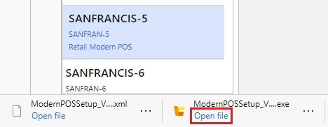

---
# required metadata

title: Configure BOPIS in a Dynamics 365 Commerce sandbox environment
description: This article explains how to configure buy online, pick up in store (BOPIS) in a Microsoft Dynamics 365 Commerce sandbox environment after it has been provisioned.
author: BrianShook
ms.date: 06/14/2022
ms.topic: article
ms.prod: 
ms.technology: 

# optional metadata

# ms.search.form: 
audience: Application user
# ms.devlang: 
ms.reviewer: josaw
# ms.tgt_pltfrm: 
ms.custom: 
ms.assetid: 
ms.search.region: Global
# ms.search.industry: 
ms.author: brshoo
ms.search.validFrom: 2020-04-20
ms.dyn365.ops.version: Release 10.0.5
---

# Configure BOPIS in a Dynamics 365 Commerce sandbox environment

[!include [banner](includes/banner.md)]

This article explains how to configure buy online, pickup in store (BOPIS) in a Microsoft Dynamics 365 Commerce sandbox environment after the environment has been provisioned.

## Prerequisite

Complete the procedures in this article only after your Commerce sandbox environment has been provisioned and configured. For information about how to provision and configure your environment, see [Provision a Dynamics 365 Commerce sandbox environment](provisioning-guide.md) and [Configure a Dynamics 365 Commerce sandbox environment](./cpe-post-provisioning.md).

After your Commerce environment has been provisioned and configured end to end, you can use this article to enable BOPIS scenarios.

## Configure the POS

### Configure Modern POS

BOPIS scenarios that involve a credit card payment require a hardware station. The hardware station is built into Modern POS for Windows and Android clients. If you're using Cloud POS or Modern POS for iOS, the point of sale (POS) client must be paired with a shared hardware station. This article explains how to configure BOPIS for Windows and Android clients. For information about how to set up a shared hardware station, see [Configure and install Retail hardware station](./retail-hardware-station-configuration-installation.md).

1. Go to **Retail and Commerce \> Channel setup \> POS setup \> Registers**.
2. Select register **SANFRAN-5**, and then select **Edit**.
3. Change the value of the **Hardware profile** field from **HW002** to **HW001**, and then select **Save**.
4. To synchronize the changes, go to **Retail and Commerce \> Retail and Commerce IT \> Distribution schedule**.
5. Select distribution schedule **1090**, and then, on the Action Pane, select **Run now**.
6. Select **Yes** and then **OK** to initiate data synchronization. 

### Install Modern POS

1. Go to **Retail and Commerce \> Channel setup \> POS setup \> Devices**.
2. Select device **SANFRANCIS-5**.
3. On the Action Pane, select **Download**, and then select **Configuration file**.
4. Select **Download**, and then select **Retail Modern POS**. 
5. When download of the **ModernPOSSetup.exe** file is completed, select **Open file**.

    

6. Select **Next** to go through the installation process. When installation is completed, select **Close**.

### Activate Modern POS

1. On the Windows desktop, select the **Start** button, and enter **Retail Modern POS**.
2. Select the **Retail Modern POS** application to initiate activation.
3. Select **Next**. The **Server URL**, **Device ID**, and **Register number** fields should be preset by using information from the configuration file that you downloaded in the previous procedure.
4. Select **Activate**.
5. An authentication dialog box appears. Select the account that uses the email address that was previously associated with worker **000713 - Andrew Collette**.

    > [!NOTE]
    > If you haven't yet associated a worker with your identity, activation will be unsuccessful. In this case, follow the steps under the "Associate a worker with your identity" section in the [Configure a Dynamics 365 Commerce sandbox environment](cpe-post-provisioning.md#associate-a-worker-with-your-identity) article.
    
6. When you're prompted to let your organization manage the device, select **This app only**.
7. When activation is completed, select **Get started**.

### Enable BOPIS in Modern POS

1. Sign in to Modern POS by using **000713** as the operator ID and **123** as the password.
2. While the introductory walkthrough video is playing, select the two check boxes in the lower-left corner of the dialog box, and then close the dialog box.
3. If you aren't prompted to close the shift, scroll to the right on the **Welcome** page, select **Close shift**, and then sign back in to the POS.
4. After you're signed in, when you're prompted, select **Perform a non-drawer operation**.
5. On the **Welcome** page, scroll to the right, and select the **Select hardware station** operation.
6. Select **Manage**, set the **Use hardware station** option to **On**, and then select **OK**.
7. Sign out of the POS, and then sign back in.
8. After you're signed in, select **Open a new shift**, and then select **Drawer**.

## Complete a BOPIS scenario

### Create a storefront order for in-store pickup

1. Go to the URL that you specified in the [Initialize e-Commerce](./provisioning-guide.md#initialize-e-commerce) step during environment configuration.
2. Select an item, and select **Add to cart**.
3. On the shopping bag page, select **Pick this up** for the order line that you just added.
4. In the **Select a store** dialog box, enter **San Francisco**, and then select the **Search** button.
5. In the list of results, find the San Francisco store, and select **Pick up here**.
6. On the shopping bag page, select **Checkout as Guest**. 

    > [!NOTE]
    > To continue with checkout, you must accept the cookie notice. This notice appears as a banner at the top of the checkout page.

7. For the credit card payment method, enter the following details:

    - **Cardholder name:** Enter any name.
    - **Card number:** Enter **4111-1111-1111-1111**.
    - **Expiration date:** Enter **10/20**.
    - **Card verification value (CVV) code:** Enter **737**.

    > [!IMPORTANT]
    > Never, under any circumstances, try to use actual credit card information on the test site.

8. Continue with checkout by entering details of the billing address, and then select **Save and continue**.
9. When the order is ready to be placed, select **Checkout**.

### Synchronize online orders to the back office

For information about how to synchronize online orders, see [Posting of online sales and payments](./tasks/posting-online-sales-payments.md).

### Pick up an order in the store

1. Sign in to the POS.
2. On the **Welcome** screen, select **Order fulfillment**
3. In the list of items for pickup, select the line from the order that was placed online.
4. While the order line is selected, select **Pick up**.

    The line item is added to the transaction screen, and **$0.00** is shown as the balance that is due.

5. Select the balance due of **$0.00**, or select any payment method to conclude the transaction.

## Troubleshooting

### Online orders that are retrieved in the POS have a non-zero balance due

When an order is retrieved for in-store pickup, if the balance due isn't 0 (zero), make sure that Modern POS is being used, and that the hardware station is active. If Cloud POS or Modern POS for iOS is being used, make sure that a shared hardware station is active. Some form of active hardware station is required to retrieve payments that were made online.

### General issues with payment capture

For all general issues, you should always consult the Modern POS or Internet Information Services (IIS) Hardware Station event logs as a first step. You can find these logs under the following nodes in the Windows event log:

- Application and Services Logs \> Microsoft \> Dynamics \> Commerce-ModernPOS
- Application and Services Logs \> Microsoft \> Dynamics \> Commerce-Hardware Station

## Additional resources

[Provision a Dynamics 365 Commerce sandbox environment](provisioning-guide.md)

[Configure optional features for a Dynamics 365 Commerce sandbox environment](cpe-optional-features.md)

[Microsoft Lifecycle Services (LCS)](/dynamics365/unified-operations/dev-itpro/lifecycle-services/lcs-user-guide)

[Retail Cloud Scale Unit (RCSU)](/business-applications-release-notes/october18/dynamics365-retail/retail-cloud-scale-unit)

[Microsoft Azure portal](https://azure.microsoft.com/features/azure-portal)

[Dynamics 365 Commerce website](https://aka.ms/Dynamics365CommerceWebsite)

[Adyen payment connector](./dev-itpro/adyen-connector.md?tabs=8-1-3)

[Saving online payment instruments with the Adyen connector](./dev-itpro/adyen-connector-listpi.md)

[Omni-channel payments overview](./omni-channel-payments.md)

[!INCLUDE[footer-include](../includes/footer-banner.md)]
