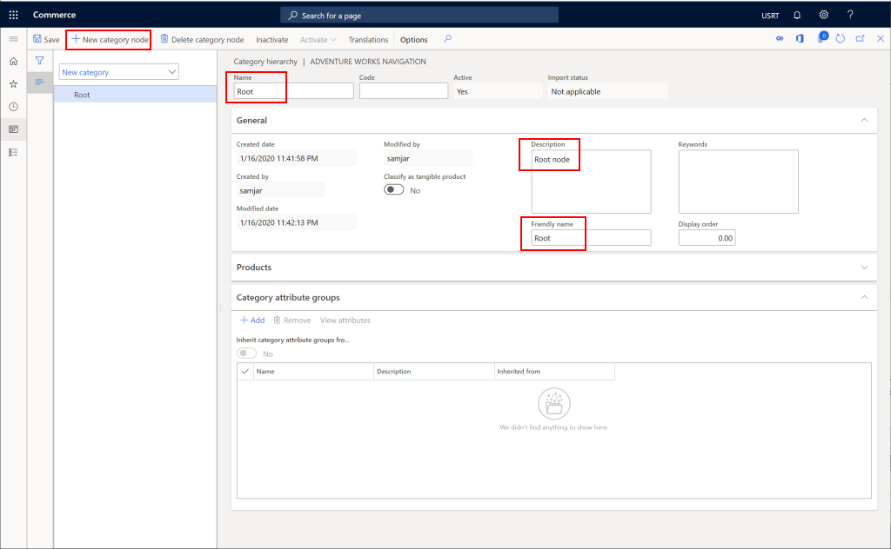
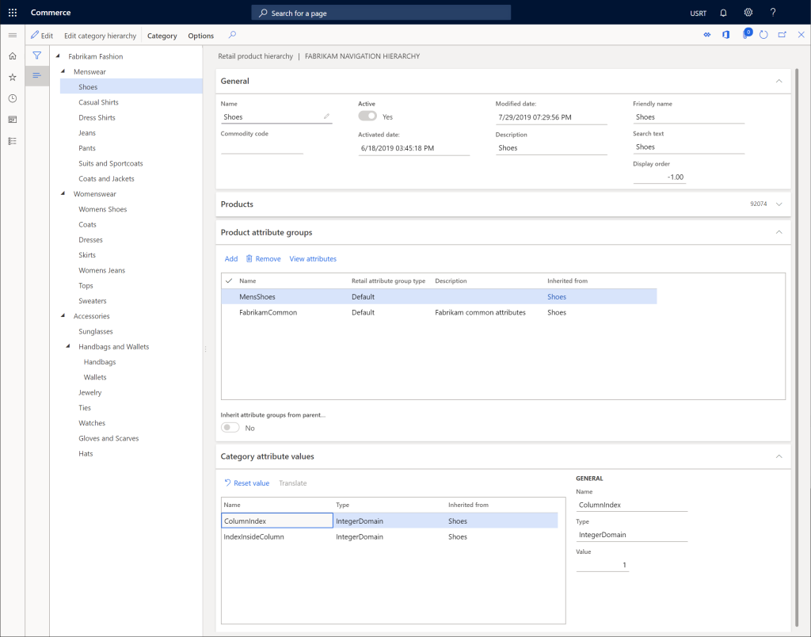

---
# required metadata

title: Create a channel navigation hierarchy
description: This topic describes how to create a channel navigation hierarchy in Microsoft Dynamics 365 Commerce.
author: samjarawan
manager: annbe
ms.date: 01/20/2020
ms.topic: article
ms.prod: 
ms.service: dynamics-365-commerce
ms.technology: 

# optional metadata

# ms.search.form: 
audience: Application User
# ms.devlang: 
ms.reviewer: v-chgri
ms.search.scope: Retail, Core, Operations
# ms.tgt_pltfrm: 
ms.custom: 
ms.assetid: 
ms.search.region: Global
# ms.search.industry: 
ms.author: samjar
ms.search.validFrom: 2020-01-20
ms.dyn365.ops.version: Release 10.0.8

---
# Create a channel navigation hierarchy

[!include [banner](../includes/preview-banner.md)]
[!include [banner](../includes/banner.md)]

This topic describes how to create a channel navigation hierarchy in Microsoft Dynamics 365 Commerce.

## Overview

A channel navigation hierarchy is used to group and organize products into categories so that the products can be browsed online or in Point of sale (POS).

## Create a channel navigation hierarchy

1. Go to **Navigation pane \> Modules \> Retail \> Products and categories \> Channel navigation categories**.
1. On the **Action pane**, select **New** to create a new channel navigation hierarchy.
1. Provide a **Name** and **Description** then press the **Create** button.
1. Create a root node by selecting **New category node** on the **Action pane**.
1. Provide a **Name**, **Description** and **Friendly name**.
1. On the **Action pane**, select **Save**.

The below image shows a sample root node.

## Create the navigation nodes
Follow the below steps to create any additional navigation categories to represent the product categories on the channel.

1. Select the parent node to add a category to.
1. On the **Action pane**, select **New category node**.
1. Provide a **Name**, **Description** and **Friendly name** and optionally a **Display order**.
1. On the **Action pane**, select **Save**.

The below image shows a sample complete channel navigation hierarchy.

## Add products to category nodes
The following steps show how to add products to a node inside the channel navigation hierarchy.  Note this step is not sufficient for the products to show up on a selected channel, the products must also be **assorted** to a product.  

1. Select a category node.
1. Expand the **Products** section and select the **Add** button to add a new product.
1. Find the new product(s) you would like to add by product number or product name and select the **OK** button.
1. On the **Action pane**, select **Save**.

The below image shows a sample node with products added.

## Add product attribute groups to category nodes
The following steps show how to add product attribute groups to a node inside the channel navigation hierarchy.  Note - this is assuming product attribute groups have already been created. 

1. Select a category node.
1. Expand the **Product attribute group** section and select the **Add** button to add a new product.
1. Find the attribute group(s) you would like to add select the **OK** button.
1. On the **Action pane**, select **Save**.

The below image shows a sample node with product attribute groups added.

## Additional docs
TBD - Add product assortments reference here
TBD - add link to product attribute groups
