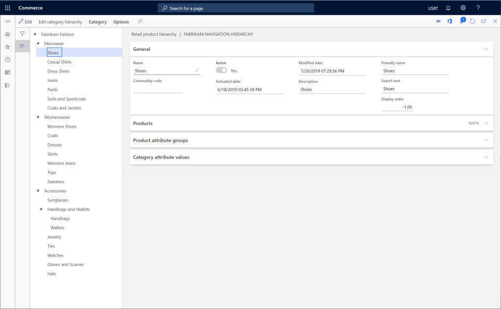
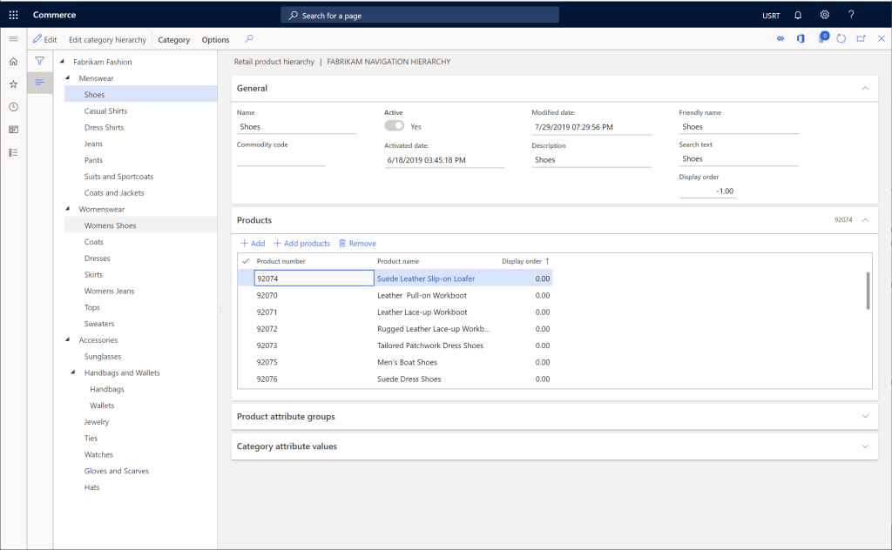

---
# required metadata

title: Create a channel navigation hierarchy
description: This topic describes how to create a channel navigation hierarchy in Microsoft Dynamics 365 Commerce.
author: samjarawan
ms.date: 04/27/2021
ms.topic: article
ms.prod: 
ms.technology: 

# optional metadata

# ms.search.form: 
audience: Application User
# ms.devlang: 
ms.reviewer: v-chgri
# ms.tgt_pltfrm: 
ms.custom: 
ms.assetid: 
ms.search.region: Global
# ms.search.industry: 
ms.author: samjar
ms.search.validFrom: 2020-01-20
ms.dyn365.ops.version: Release 10.0.8

---
# Create a channel navigation hierarchy

[!include [banner](includes/banner.md)]

This topic describes how to create a channel navigation hierarchy in Microsoft Dynamics 365 Commerce.

## Overview

A channel navigation hierarchy is used to group and organize products into categories so that the products can be browsed online or in point of sale (POS).

## Create a channel navigation hierarchy

To create a channel navigation hierarchy, follow these steps.

1. In the navigation pane, go to **Modules \> Retail and commerce \> Products and categories \> Channel navigation categories**.
1. On the action pane, select **New**.
1. In the **Name** box, enter a name.
1. In the **Description** box, enter a description.
1. Select **Create**.
1. On the action pane, select **New category node** to create a root node.
1. In the **Name** box, enter a name.
1. In the **Description** box, enter a description.
1. In the **Friendly name** box, enter a friendly name.
1. On the action pane, select **Save**.

The following image shows a example root node.

## Create navigation category nodes

To create any additional navigation category nodes to represent the product categories on the channel, follow these steps.

1. In the navigation pane, select the parent node to add a category to.
1. On the action pane, select **New category node**.
1. In the **Name** box, enter a name.
1. In the **Description** box, enter a description.
1. In the **Friendly name** box, enter a friendly name.
1. In the **Display order** box, enter a display order (optional).
1. On the action pane, select **Save**.

The following image shows an example of a completed channel navigation hierarchy.

## Add products to category nodes

To add products to category nodes, follow these steps.

1. Select a category node.
1. Under **Products**, select **Add**.
1. Find the new product(s) you want to add using product number or product name, and then select **OK**.
1. On the action pane, select **Save**.

> [!NOTE]
> Adding products to a node inside the channel navigation hierarchy is not sufficient for the products to show up on a selected channel, the products must also be assorted to a channel. For more information on assortments, see [Assortment management](assortments.md).

The following image shows an example node with products added.

## Add product attribute groups to category nodes

> [!NOTE]
> Attribute groups must be created before you can add them to a node inside the channel navigation hierarchy.

To add product an attribute group to a category node, follow these steps.

1. Select a category node.
1. Under **Product attribute group**, select **Add**.
1. Find the attribute group(s) you would like to add, and then select **OK**.
1. On the action pane, select **Save**.

The following image shows a sample node with product attribute groups added.

## Additional resources

[Set up assortments](set-up-assortments.md)

[Manage attributes and attribute groups](attribute-attributegroups-lifecycle.md)

[!INCLUDE[footer-include](../includes/footer-banner.md)]
