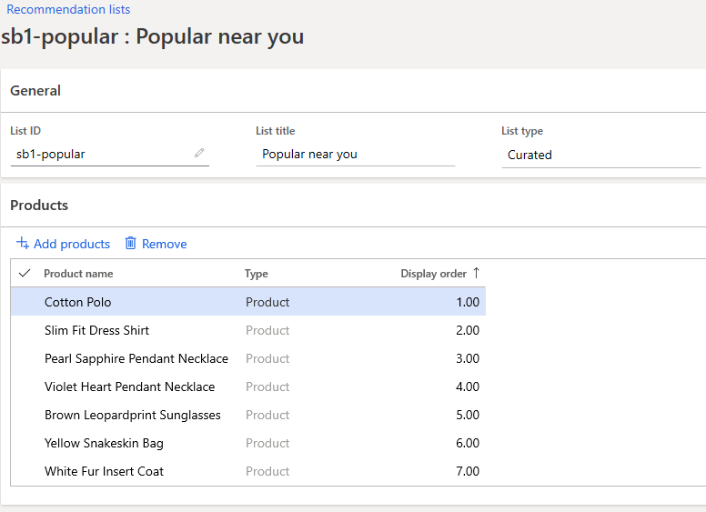

---
# required metadata

title: Manually create curated recommendations
description: This article explains how merchandizers can manually create and manage product lists for Microsoft Dynamics 365 Commerce customers.
author: bebeale
ms.date: 04/21/2023
ms.topic: article
ms.prod: 
ms.technology: 

# optional metadata

ms.search.form: 
# ROBOTS: 
audience: Application User
# ms.devlang: 
ms.reviewer: josaw
# ms.tgt_pltfrm: 
ms.custom: 
ms.assetid: 
ms.search.region: global
ms.search.industry: Retail, eCommerce
ms.author: bebeale
ms.search.validFrom: 2019-10-31
ms.dyn365.ops.version: Version 1611

---

# Manually create curated recommendations

[!include [banner](includes/banner.md)]

This article explains how merchandizers can manually create and manage product recommendations lists for Microsoft Dynamics 365 Commerce customers.

Curated lists are collections of individual content, created and curated by people.  

## Create a new list

To create a curated product recommendation list, follow these steps.

1. Go to **Retail and Commerce &gt; Product recommendations &gt; Recommendation lists**.
1. Select **New**.
1. In the **List Id** field, enter a value.
1. In the **List name** field, enter a value.
    - The **List name** is the title of the list that will appear in the curated lists section of the **Product collection** module.
1. To add products to the list, select **Add products**.
1. To change the order of the products in the list, enter a value in the **Display order** column.
    - If two products have the same display order value, then the final order of those two results may differ from the back office.
1. Select **Save** to save the list.

## Example List

## Additional resources

[Product recommendations overview](product-recommendations.md)

[Enable Azure Data Lake Storage in a Dynamics 365 Commerce environment](enable-adls-environment.md)

[Enable product recommendations](enable-product-recommendations.md)

[Enable personalized recommendations](personalized-recommendations.md)

[Opt out of personalized recommendations](opt-out-personalization.md)

[Enable "shop similar looks" recommendations](shop-similar-looks.md)

[Add product recommendations on POS](product.md)

[Add recommendations to the transaction screen](add-recommendations-control-pos-screen.md)

[Adjust AI-ML recommendations results](modify-product-recommendation-results.md)

[Create recommendations with demo data](product-recommendations-demo-data.md)

[Product recommendations FAQ](faq-recommendations.md)

[!INCLUDE[footer-include](../includes/footer-banner.md)]
