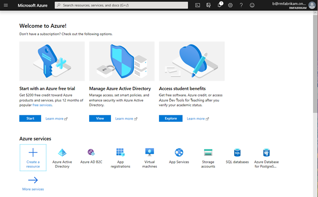
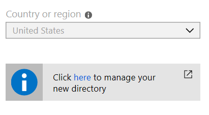

# Create or link to an existing Azure AD B2C tenant in the Azure portal

[!include [banner](includes/banner.md)]

This article describes how create or link to an Azure Active Directory (Azure AD) business-to-consumer (B2C) tenant in the Microsoft Azure portal. For more information, see [Tutorial: Create an Azure Active Directory B2C tenant](/azure/active-directory-b2c/tutorial-create-tenant).

To create or link to an existing Azure AD B2C tenant in the Azure portal, follow these steps.

1. Sign in to the [Azure portal](https://portal.azure.com/).
1. From the Azure portal menu, select **Create a resource**. Be sure to use the subscription and directory that will be connected with your Commerce environment.

    

1. Go to **Identity \> Azure Active Directory B2C**.
1. Once on the **Create New B2C Tenant or Link to existing Tenant** page, use one of the options below that best suits your company's needs:

    - **Create a new Azure AD B2C Tenant**: Use this option to create a new Azure AD B2C tenant.
        1. Select **Create a new Azure AD B2C Tenant**.
        1. Under **Organization name**, enter the organization name.
        1. Under **Initial domain name**, enter the initial domain name.
        1. For **Country or region**, select the country or region.
        1. Select **Create** to create the tenant.

     

     - **Link an existing Azure AD B2C Tenant to my Azure subscription**: Use this option if you already have an Azure AD B2C tenant you want to link to.
        1. Select **Link an existing Azure AD B2C Tenant to my Azure subscription**.
        1. For **Azure AD B2C Tenant**, select the appropriate B2C tenant. If the message "No eligible B2C Tenants found" appears in the selection box, you do not have an existing eligible B2C tenant and will need to create a new one.
        1. For **Resource group**, select **Create new**. Enter a **Name** for the resource group that will contain the tenant, select the **Resource group location**, and then select **Create**.

    

1. Once the new Azure AD B2C directory is created (this may take a few moments), a link to the new directory will appear on the dashboard. This link will direct you to the "Welcome to Azure Active Directory B2C" page.

    

> [!NOTE]
> If you have multiple subscriptions within your Azure account or have set up the B2C tenant without linking to an active subscription, a **Troubleshoot** banner will direct you to link the tenant to a subscription. Select the troubleshooting message and follow the instructions to resolve the subscription issue.

The following image shows an example of an Azure AD B2C **Troubleshoot** banner.

## Next steps

To continue the process of setting up a B2C tenant in Commerce, proceed to [Create the B2C application](create-b2c-app.md).

## Additional resources

[Set up a B2C tenant in Commerce](set-up-b2c-tenant.md)

[Create the B2C application](create-b2c-app.md)

[Create user flow policies](create-user-flow-policies.md)

[Add social identity providers (Optional)](add-social-identity-providers.md)

[Update Commerce headquarters with the new Azure AD B2C information](update-hq-aad-b2c-info.md)

[Configure your B2C tenant in Commerce site builder](config-b2c-tenant-site-builder.md)

[Additional B2C information](additional-b2c-info.md)

[!INCLUDE[footer-include](../includes/footer-banner.md)]
