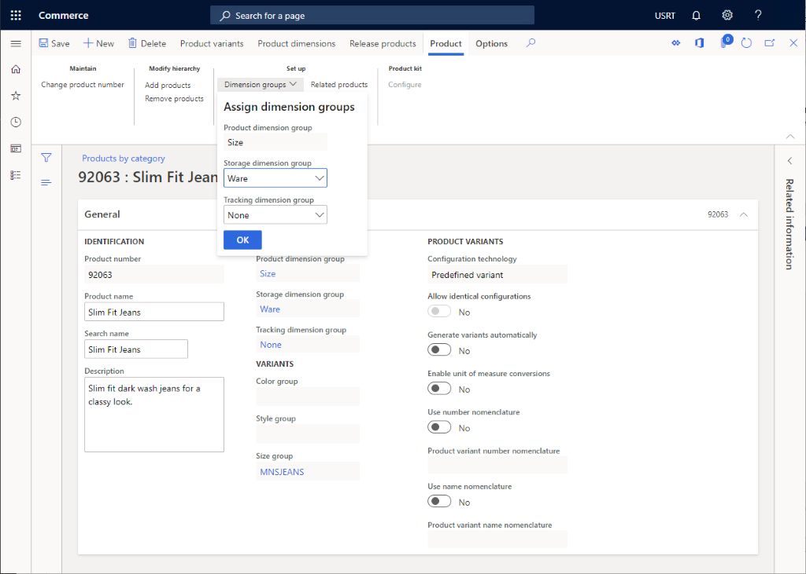
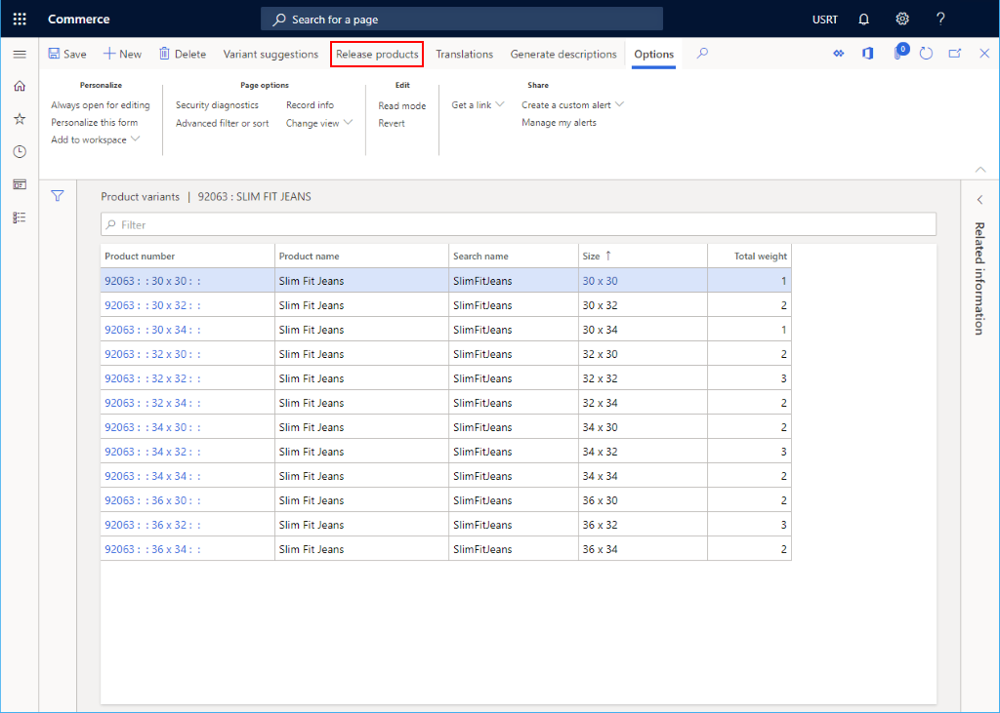
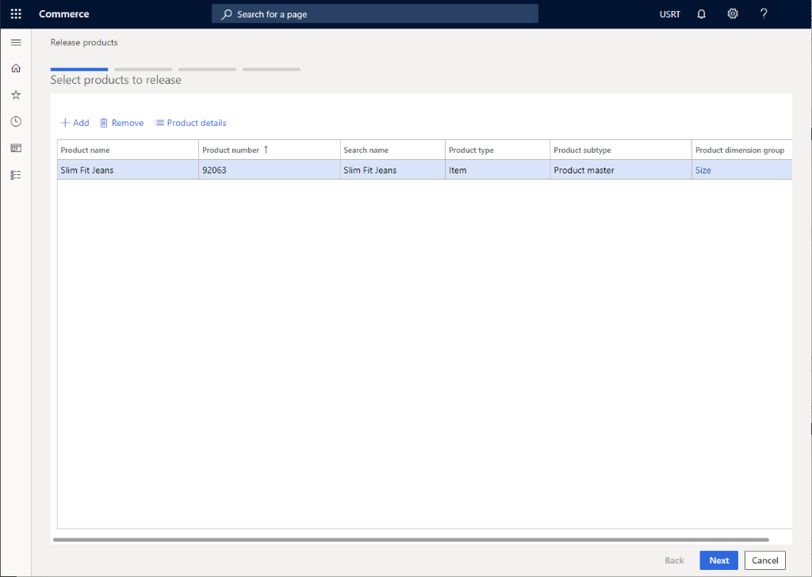
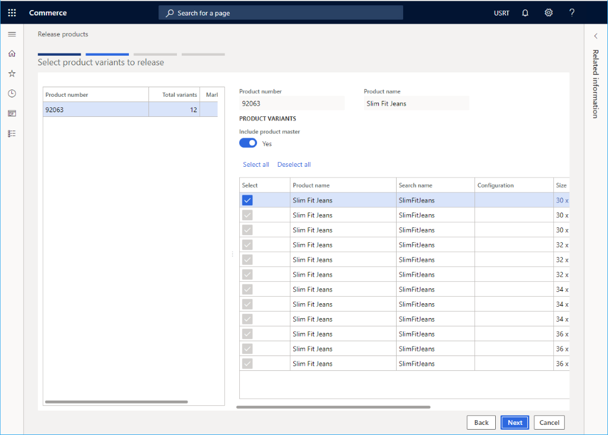
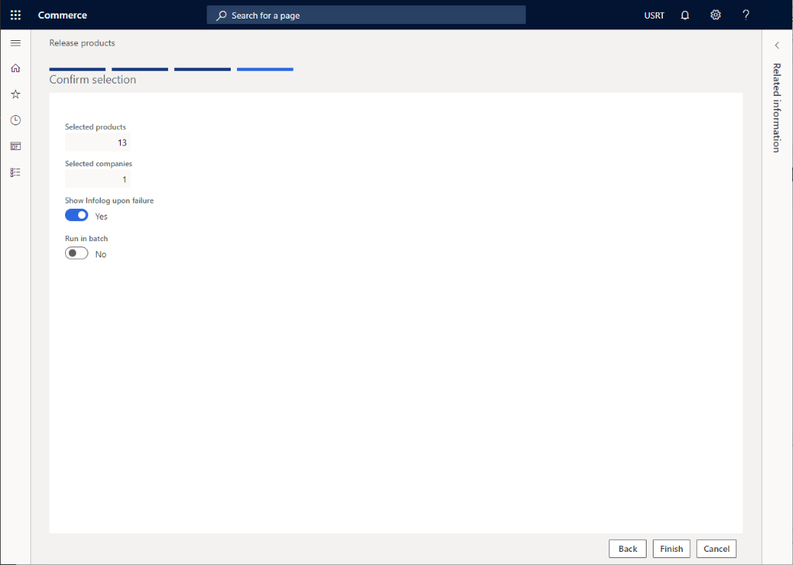
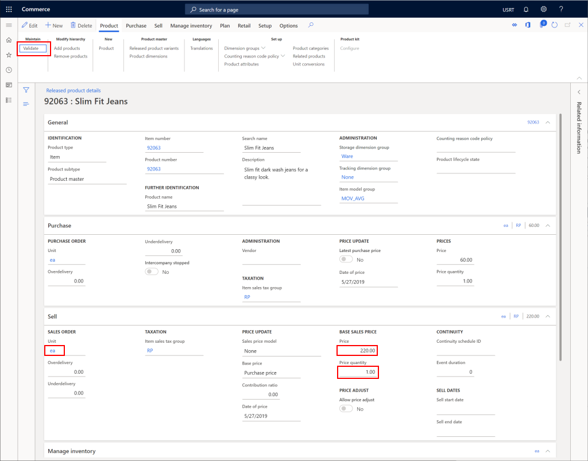

---
# required metadata

title: Create a new product in Commerce
description: This topic describes how to create a new product in Microsoft Dynamics 365 Commerce.
author: samjarawan
ms.date: 01/27/2020
ms.topic: article
ms.prod: 
ms.technology: 

# optional metadata

# ms.search.form: 
audience: Application User
# ms.devlang: 
ms.reviewer: v-chgri
# ms.tgt_pltfrm: 
ms.custom: 
ms.assetid: 
ms.search.region: Global
# ms.search.industry: 
ms.author: samjar
ms.search.validFrom: 2020-01-20
ms.dyn365.ops.version: Release 10.0.8

---
# Create a new product in Commerce

[!include [banner](includes/banner.md)]

This topic describes how to create a new product in Microsoft Dynamics 365 Commerce.

## Overview

A product is primarily defined by a product number, name, and description. However, other data is also required in order to describe a product or service:

## Create a new product

1. In the navigation pane, go to **Modules \> Retail and commerce \> Products and categories \> Products by category**.
1. On the action pane, select **New**.
1. In the **Product type** drop-down list, select either **Item** or **Service**.
1. In the **Product subtype** drop-down list, select either **Product** (if the product will have no variants) or **Product master** (if the product will have variants).
1. In the **Product number** box, enter a product number if one is not already prepopulated.
1. In the **Product name** box, enter a product name.
1. In the **Search name** box, enter a search name.
1. In the **Retail category** drop-down list, select an appropriate category.
1. If the product is a kit, select **Yes** for **Product kit**.
1. If the product subtype is product master, set the **Product dimension group** to include the supported variants. Options include **Color**, **Size**, **Style**, and **Configuration**. You may need to create additional product dimension groups if needed.
1. In the **Configuration technology** drop-down list, select an appropriate option.
1. Select **OK**.

The following image shows an example product being added.

Once a product is added, additional data can be set for it, such as **Product description**, **Variant groups**, **Dimension groups**, **Product attributes**, and **Related products**.

The following image shows a product's additional details.

### Create product variants

If the product subtype is **Product master**, specific variants will need to be created. 

To create product variants, follow these steps.

1. On the action pane, select **Product variants**.
1. If variant groups have been selected on the action pane, select **Variant suggestions*.
1. Select the variants you would like to support for the product.
1. Select **Create**.

## Release a product

To sell a product it must first be released to a legal entity.

1. From the product page, select **Release products**.

    

1. Select the product to release, and then select **Next**.

    

1. Select the set of product variants to release, and then select **Next**.

    

1. Select the legal entity, and then select **Next**.

    

1. Select **Finish**.

    

## Configure a released product

Once a product is released, it will then require further configuration that includes adding a price to the product.

1. In the navigation pane, go to **Modules \> Retail and commerce \> Products and categories \> Released products by category**.
1. Select the product category node for the product that was released, and then select the product from the product list.
1. On the action pane, select **Edit**.
1. In the **Purchase** section, configure any required properties including **Unit**, **Price**,  and **Quantity**.
1. On the action pane, select **Validate** to ensure that no errors are reported for missing fields.
1. On the action pane, select **Save**.

The following image shows an example configuration for a released product.

## Additional resources

[Create legal entities](channels-legal-entities.md)

[Create a variant group](create-variant-group.md) 

[!INCLUDE[footer-include](../includes/footer-banner.md)]