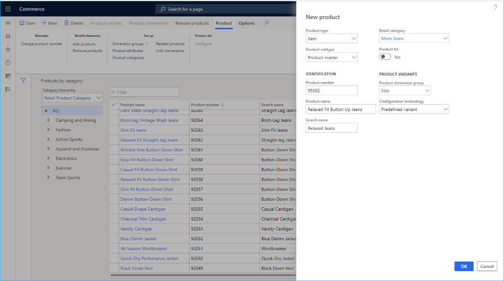

---
# required metadata

title: Create a product
description: This topic describes how to create a new product in Microsoft Dynamics 365 Commerce.
author: samjarawan
manager: annbe
ms.date: 01/20/2020
ms.topic: article
ms.prod: 
ms.service: dynamics-365-commerce
ms.technology: 

# optional metadata

# ms.search.form: 
audience: Application User
# ms.devlang: 
ms.reviewer: v-chgri
ms.search.scope: Retail, Core, Operations
# ms.tgt_pltfrm: 
ms.custom: 
ms.assetid: 
ms.search.region: Global
# ms.search.industry: 
ms.author: samjar
ms.search.validFrom: 2020-01-20
ms.dyn365.ops.version: Release 10.0.8

---
# Create a product

[!include [banner](../includes/preview-banner.md)]
[!include [banner](../includes/banner.md)]

This topic describes how to create a new product in Microsoft Dynamics 365 Commerce.

## Overview

A product is primarily defined by a product number, name, and description. However, other data is also required in order to describe a product or service:

## Create a product

1. Go to **Navigation pane \> Modules \> Retail \> Products and categories \> Products by category**.
1. On the **Action pane**, select **New** to create a new product.
1. Select **Product type** of **Item** or **Service**.
1. In the **Product subtype** drop down select either **Product** if the product will have no variants or **Product master** otherwise.
1. Provide a **Product number** if an auto number is not provided.
1. Provide a **Product name**.
1. Provide a **Search name**.
1. Select an appropriate category in the **Retail category** drop down.
1. If the product is a kit select Yes on the **Product kit** switch.
1. If the product subtype is product master then set the **Product dimension group** to include the supported variants.  Examples includ Color, Size, Style and Configuration.  You may need to create additional product dimension groups if needed.
1. Select an appropriate **Configuration technology**.
1. Select the "OK" button to save.

Below image shows an example product being added.

Once the product is added additional data can be set on it such as the **Product description**, **Variant groups**, **Dimension groups**, **Product attributes** and **Related products**.

Below image shows a products additional details.

## Additional resources
