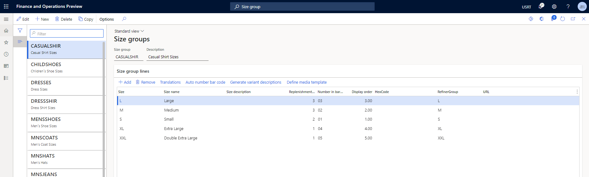

# Create a variant group

[!include [banner](includes/banner.md)]

This article describes how to create a size, style, or color variant group for a product in Microsoft Dynamics 365 Commerce.

## Overview

Dynamics 365 Commerce supports multiple variants for products. It is ideal to set up variant groups for different product categories. For example, a size group can be created for t-shirts with sizes extra small, small, medium, large, and extra large, or a color group could be created to include all available colors of a product. Variant groups should be added before products are added.

In this article, a size group will be created and configured. Similar procedures can be used for adding and configuring style groups and color groups.

## Create a size group

To create a size group, follow these steps.
 
1. In the navigation pane, go to **Modules \> Retail and commerce \> Products and categories \> Variant groups \> Size groups**.
1. On the action pane, select **New**.
1. In the **Size group** box, enter a name for the size group.
1. In the **Description** box, enter an appropriate description.
1. On the action pane, select **Save**.

## Add attributes to the size group

To add attributes to a size group, follow these steps.

1. In the navigation pane, go to **Modules \> Retail and commerce \> Products and categories \> Variant groups \> Size groups**
1. In the navigation pane, select a size group.
1. Under **Size group lines**, select **Add**.
1. In the **Size** box, enter a string representing the size (for example, "XL").
1. In the **Size name** box, enter a name for the size (for example, "Extra Large").
1. In the **Replenishment weight** box, enter a number representing the replenishment weight.
1. In the **Number in bar code** box, enter a number representing the bar code.
1. In the **Display order** box, enter a number representing the display order.
1. When finished adding sizes, select **Save** on the action pane.

The following image shows an example of a size group for "casual shirt sizes".

## Additional resources

[Product information overview](../supply-chain/pim/product-information.md?toc=/dynamics365/commerce/toc.json)

[Set up retail products](set-up-retail-products.md)

[Product dimensions](../supply-chain/pim/product-dimensions.md?toc=/dynamics365/commerce/toc.json)

[!INCLUDE[footer-include](../includes/footer-banner.md)]
