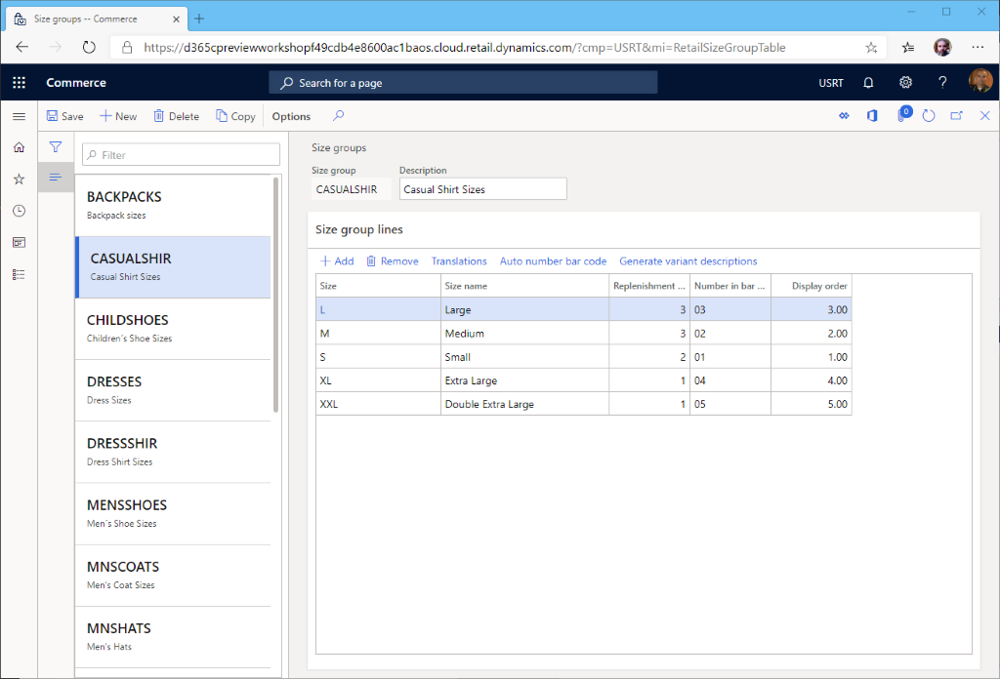

---
# required metadata

title: Create a variant group
description: This topic describes how to create a size, style or color variant group in Microsoft Dynamics 365 Commerce.
author: samjarawan
manager: annbe
ms.date: 01/20/2020
ms.topic: article
ms.prod: 
ms.service: dynamics-365-commerce
ms.technology: 

# optional metadata

# ms.search.form: 
audience: Application User
# ms.devlang: 
ms.reviewer: v-chgri
ms.search.scope: Retail, Core, Operations
# ms.tgt_pltfrm: 
ms.custom: 
ms.assetid: 
ms.search.region: Global
# ms.search.industry: 
ms.author: samjar
ms.search.validFrom: 2020-01-20
ms.dyn365.ops.version: Release 10.0.8

---
# Create a variant group

[!include [banner](../includes/preview-banner.md)]
[!include [banner](../includes/banner.md)]

This topic describes how to create a size, style or color variant group in Microsoft Dynamics 365 Commerce.

## Overview

Microsoft Dynamics 365 Commerce supports multiple variants on products.  It is ideal to setup variant groups for different product categories.  For example a size group can be created for t-shirts with sizes extra small, small, medium, large and extra large, or a color group could be created to hold available colors of a product.

## Create a size group

1. Go to **Navigation pane \> Modules \> Retail \> Products and categories \> Variant groups \> Size groups**.
1. On the **Action pane**, select **New** to create a new size group.
1. Provide a name for the **Size group** and an appropriate **Description**.

### Add sizes to the size group
1. In the **Size group lines** section select **Add**.
1. Provide a string representing the **Size**.
1. Provide a **Size name**.
1. Provide a **Replenishment weight**.
1. Provide a **Number in bar code**.
1. Provide a **Display order**.
1. When finished adding sizes, on the **Action pane**, select **Save**.

The following image shows an example of a size group for "casual shirt sizes".

The above can be adapted to create color and style groups.

## Additional resources
