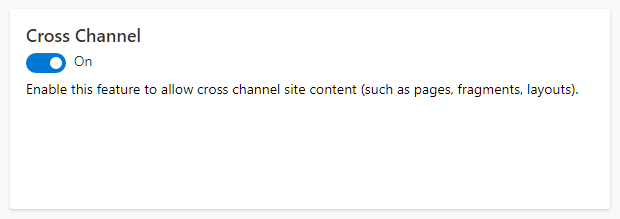
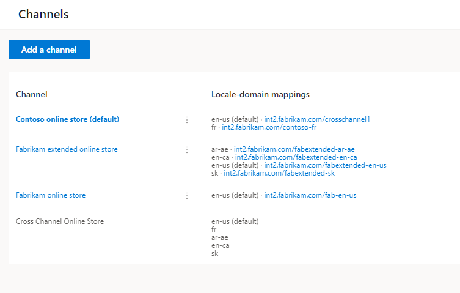

---
# required metadata

title: Enable and use cross-channel sharing
description: This topic describes how to enable and use the cross-channel sharing feature of Dynamics 365 Commerce site builder that allows content to be shared between multiple channels of an e-Commerce site.
author: psimolin
manager: annbe
ms.date: 07/31/2020
ms.topic: article
ms.prod: 
ms.service: dynamics-365-commerce
ms.technology: 

# optional metadata

ms.search.form:  
audience: Application User
# ms.devlang: 
ms.reviewer: v-chgri
ms.search.scope: Retail, Core, Operations
# ms.tgt_pltfrm: 
# ms.custom: 
ms.search.region: Global
ms.search.industry: 
ms.author: psimolin
ms.search.validFrom: 2019-10-31
ms.dyn365.ops.version: Release 10.0.5

---
# Enable and use cross-channel sharing

[!include [banner](includes/banner.md)]
[!include [banner](includes/preview-banner.md)]

This topic describes how to enable and use the cross-channel sharing feature of Dynamics 365 Commerce site builder that allows content to be shared between multiple channels of an e-Commerce site.

## Overview

Cross-channel sharing allows retailers to reuse and share content between multiple channels of a site. This is particularly useful when the site channels have a compatible base language or have a lot of common content items that can be shared between the channels.

Cross-channel sharing works by enabling a default channel which will be searched for available content when a channel-specific version of the requested content is not found. Content meant to be shared between channels is created in this channel and can be localized for any of the locales used on any site channel.

## When to use cross-channel sharing

Cross-channel sharing is useful when there are multiple channels on a single site that can share content between them.

For example, a retailer with multiple brands and storefronts that are grouped under a single site could share some content between some or all of the storefronts. This shared content could include pages such as terms and conditions, payment terms, shipment methods, and frequently asked questions (FAQ). 

Cross-channel sharing also supports fragments, which allows a content page containing channel-specific fragments to be created as cross-channel content. This means that while most of the content would shared between channels, channel-specific fragments on a cross-channel page would only be rendered when requested from the corresponding storefront channel.

Sites with only a single channel or multiple channels that can't share content do not benefit from cross-channel sharing.

## Enable cross-channel sharing

Cross-channel sharing is enabled at the site level and is a one-way operation. Once enabled, it cannot be disabled.

To enable cross-channel sharing in Commerce site builder, follow these steps.

1. Go to **Site settings \> Features**.
1. Under **Cross Channel**, set the feature to **On**. 

The following image shows the **Cross Channel** setting in site builder under **Site settings \> Features**.

After enabling cross-channel sharing, cross-channel information will be visible in the **Channels** section under **Site settings \> Features**, as shown in the following example image.

After enabling cross-channel sharing, the **Channel** drop down menu options on the top right in site builder will include a **Cross Channel Online Store** item to manage cross-channel content, as show in the following image.

## Create and use cross-channel content

Ways to create and use cross-channel content include creating cross-channel fragments, creating cross-channel pages that use cross-channel and channel-specific content, and overriding cross-channel fragments with channel-specific versions of fragments.

### Create a cross-channel fragment

To create a cross-channel fragment in Commerce site builder, follow these steps.

1. Go to **Fragments**, and select **New** to create a new fragment.
1. In the **New page fragment** dialog box, select the **Promo banner** module, and then under **Page fragment name** enter a name (for example, "Cross-channel banner"), and then select **OK**.
1. In the **Promo banner** module property pane, select **+ Add Message**, and then select **Message**.
1. In the **Message** dialog box, enter "Cross channel" under **Text**, and the select **OK**. 
1. Select **Save**, select **Finish editing** to check in the page, and then select **Publish** to publish it.

This cross-channel fragment can be used on cross-channel or channel-specific pages created on any site channel.

### Create a cross-channel page that uses cross-channel content

Cross-channel pages are available for use on any channel of your site. This allows you to create a shared content page once and then make any subsequent updates in a single place. For example, a cross-channel "Terms and conditions" page with the URL "/toc" could be shared for all the channels of a site. If the base URLs for the site channels were `www.fabrikam.com/brand1` and `www.fabrikam.com/brand2`, the same cross-channel shared "Terms and conditions" page would be available from both site channel URLs (at `www.fabrikam.com/brand1/toc` and `www.fabrikam.com/brand2/toc` respectively). If the "Terms and conditions" page needed to be updated later, you would only have to update the single, shared page. 

To create a cross-channel page in Commerce site builder that uses cross-channel content, follow these steps.

1. Go to **Pages**, and select **New** to create a new page.
1. In the **Choose a template** dialog box, select a template such as **Marketing**. 
1. Under **Page name**, enter a name for the page (for example, "Cross-channel page").
1. Under **Page URL**, enter a page URL (for example, "examplepage"), and then select **OK**.
1. In the **Main** slot of the new page, select the ellipsis (**...**), and then select **Add Fragment**.
1. In the **Add Fragment** dialog box, select the cross-channel fragment with a promo banner that you created earlier, and then select **OK**.
1. Select **Save**, and then select **Preview** to preview the page. You should be able to see the promo banner that says "Cross channel."
1. Select **Finish editing** to check in the page, and then select **Publish** to publish it.

### Create a channel-specific page that uses cross-channel content

Using cross-channel content on channel-specific pages allows you to create a shared content fragment once and then use it on channel-specific pages. This is very useful for shared content such as terms and conditions, payment terms, or contact information.

To create a channel-specific page in Commerce site builder that uses cross-channel content, follow these steps.

1. From within a specific channel such as "Fabrikam extended online store", go to **Pages**, and then select **New** to create a new page. 
1. In the **Choose a template** dialog box, select a template such as **Marketing**. 
1. Under **Page name**, enter a name for the page (for example, "Channel-specific page").
1. Under **Page URL**, enter a page URL (for example, "channelspecificpage"), and then select **OK**.
1. In the **Main** slot of the new page, select the ellipsis (**...**), and then select **Add Fragment**.
1. In the **Add Fragment** dialog box, under **Channel** select **Cross Channel Online Store**. You should see the cross-channel fragment you created earlier in the list. Select the cross-channel fragment, and then select **OK**.
1. Select **Save**, and then select **Preview** to preview the page. You should be able to see the promo banner that says "Cross channel."
1. Select **Finish editing** to check in the page, and then select **Publish** to publish it.

### Create a channel-specific version of a cross-channel page

Cross-channel sharing supports the overriding of cross-channel content. For example, all of your site channels share the exact same piece of content except one, which needs different content. To implement the different content for the exceptional channel, you would override the cross-channel content with channel-specific content by creating a channel-specific version of the cross-channel page.
 
To create a channel-specific version of a cross-channel page in Commerce site builder, follow these steps.

1. From the **Channel** drop down menu at the top right of site builder, select **Cross Channel Online Store**. 
1. Open the cross-channel page you created earlier. 
1. From the **Channel** drop down menu at the top right, select the channel that you want to have specific content. The page editor will display a message prompting you to create new page variant. 
1. Select **Create page variant**.
1. In the **Main** slot of the page variant, select the ellipsis (**...**), and then select **Add Module**.
1. In the **Add Module** dialog box, select the **Promo banner** module, and then select **OK**.
1. In the **Promo banner** module property pane, select **+ Add Message**, and then select **Message**.
1. In the **Message** dialog box, enter "Channel-specific" under **Text**, and the select **OK**. 
1. Select **Save**, and then select **Preview** to preview the page. You should be able to see the promo banner that says "Channel-specific."
1. Select **Finish editing** to check in the page, and then select **Publish** to publish it.

Now if you use the base URL of the channel and navigate to the URL of the cross-channel page on that site, you will see the channel-specific content instead of the cross-channel content.
 
## Additional resources

[Authoring page overview](authoring-home-overview.md)

[Document states and lifecycle](document-states-overview.md)
