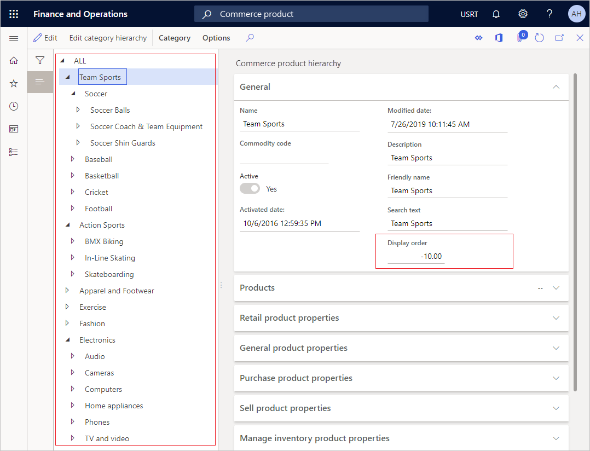
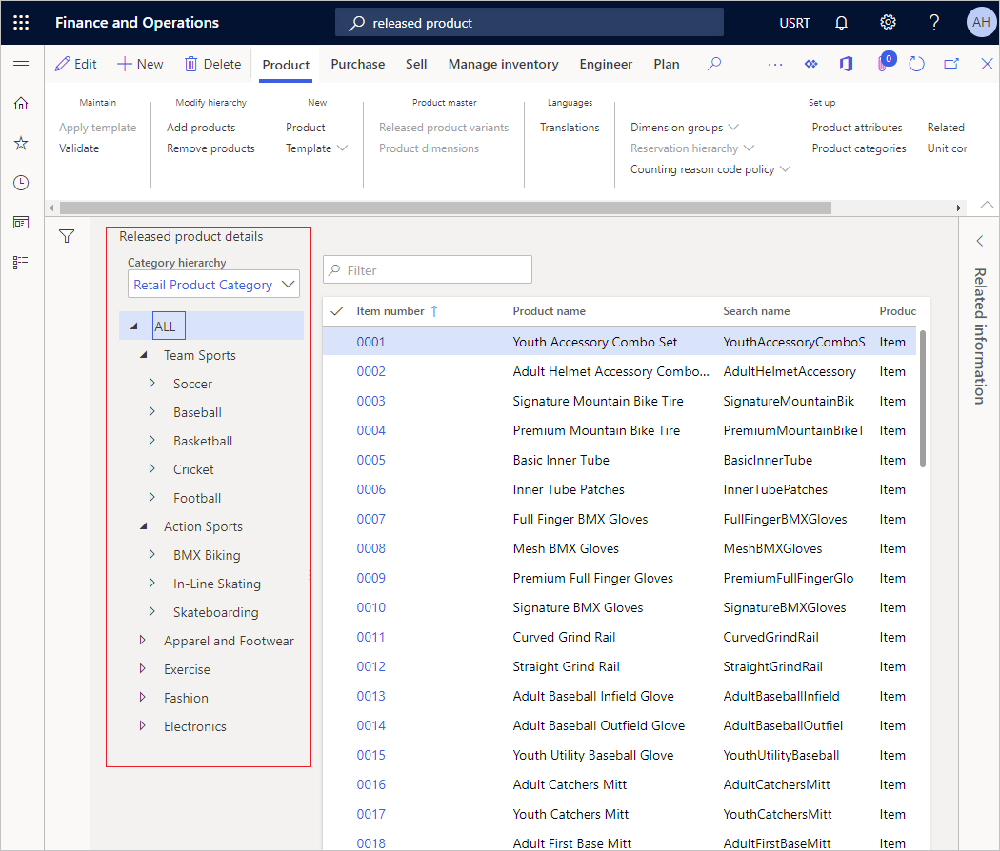
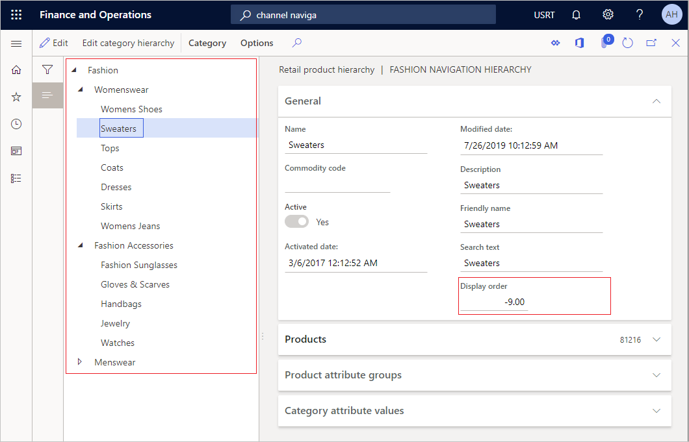
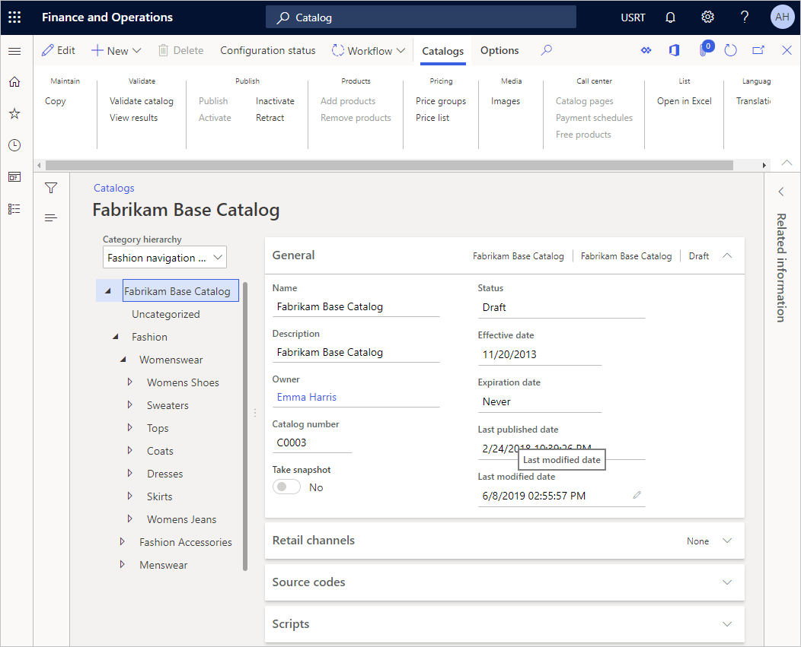
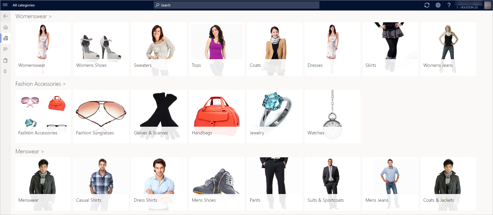

---
# required metadata

title: Change the sort order for merchandising entities
description: This topic explains the concepts that are related to controlling the display order for various merchandising-related entities in Dynamics 365 Commerce.
author: josaw1
ms.date: 08/05/2019
ms.topic: article
ms.prod: 
ms.technology: 

# optional metadata

ms.search.form: Category, Retail product hierarchy, Navigation hierarchy
# ROBOTS: 
audience: Application User, Merchandising manager, Catalog manager
# ms.devlang: 
ms.reviewer: josaw
# ms.tgt_pltfrm: 
ms.custom: 268444
ms.search.region: global
ms.search.industry: Retail
ms.author: brshoo
ms.search.validFrom: 2016-11-30
ms.dyn365.ops.version: Version 1611

---

# Change the sort order for merchandising entities

[!Include [banner](includes/banner.md)]

Retailers consider product discovery a primary tool for customer interaction across all channels. Various functionality can help customers easily discover products. For example, they can browse categories, search, and filter.

This topic explains the concepts that are related to controlling the display order for various merchandising-related entities. It also explains how to change the sort order.

## Overview

The support for sorting various merchandising-related entities has been enhanced. This support is now better aligned with existing customer scenarios that previously required extensions from implementation partners.

In versions of Retail that are earlier than version 10.0.5, the sort order for categories in the navigation hierarchy was alphabetical. The new custom sort order functionality lets merchandising managers configure the sort order for various merchandising-related entities across all end-user clients. These clients include headquarters (HQ) and call centers.

## Configure the display order for categories in the product hierarchy

Before you can complete this procedure, demo data must be installed in your environment.

1. Go to **Retail and Commerce \> Products and categories \> Commerce product hierarchy**.
2. Click **Edit category hierarchy**.
3. Click **Edit**.
4. In the tree, expand **ALL \> Action Sports**.
5. In the tree, expand **ALL \> Team Sports**.
6. In the **Display order** field, enter a number. (The number can be negative.)
7. Repeat steps 4 through 6 for any additional categories that you want to change the order of.

The display order for the channel navigation hierarchy will be reflected in HQ for the commerce product hierarchy and released products by category.

## Configure the display order for categories in the channel navigation hierarchy

Before you can complete this procedure, demo data must be installed in your environment.

1. Go to **Retail and Commerce \> Products and categories \> Channel navigation categories**.
2. In the list, select the **Fashion navigation** hierarchy.
3. Click **Edit category hierarchy**.
4. Click **Edit**.
5. In the tree, select **Fashion \> Womenswear \> Womens Shoes**.
6. In the **Display order** field, enter a number.
7. In the tree, select **Fashion \> Womenswear \> Tops**.

    Likewise, you can define the sort order for the sub-categories.

8. In the tree, select **Fashion \> Menswear \> Casual Shirts**.
9. In the **Display order** field, enter a number.
10. In the tree, select **Fashion \> Menswear \> Coats & Jackets**.
11. In the **Display order** field, enter a number.
12. Repeat for any additional categories that you want to change the order of.

The display order for the channel navigation hierarchy is reflected in HQ, catalog, and channels.

> [!NOTE]
> By default the custom sort order feature is turned off. To learn how to turn on this feature and other features, see [Feature management](/dynamics365/unified-operations/fin-and-ops/get-started/feature-management/feature-management-overview).

[!INCLUDE[footer-include](../includes/footer-banner.md)]