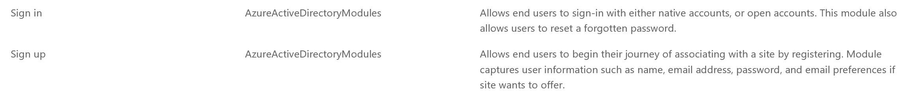
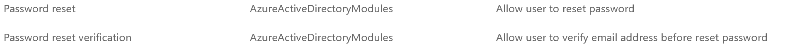
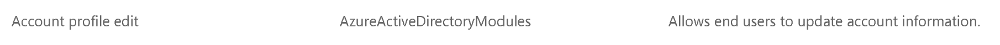

---
# required metadata

title: Set up custom pages for user logins
description: This topic describes how to build custom pages for user logins in Dynamics 365 Commerce.
author: brianshook
manager: annbe
ms.date: 10/01/2019
ms.topic: article
ms.prod: 
ms.service: dynamics-ax-retail
ms.technology: 

# optional metadata

# ms.search.form: 
audience: Application user
# ms.devlang: 
ms.reviewer: v-chgri
ms.search.scope: Operations, Retail, Core
# ms.tgt_pltfrm: 
ms.custom: 
ms.assetid: 
ms.search.region: Global
# ms.search.industry: 
ms.author: brshoo
ms.search.validFrom: 2019-10-31
ms.dyn365.ops.version: Release 10.0.5

---

# Set up custom pages for user logins

[!include [banner](../includes/preview-banner.md)]
[!include [banner](../includes/banner.md)]

This topic describes how to build custom pages for user logins in Dynamics 365 Commerce.

## Overview

This topic describes how to build custom pages in Dynamics 365 Commerce to use for customized user Logins with your Azure Active Directory (AAD) business-to-consumer (B2C) tenant. 

## Get started

pTo use custom pages authored in Commerce to handle user login flows, you will need to set up the AAD policies that will be referenced in the Commerce environment. You can set up the 'Sign in and sign up', 'Password Reset', and 'Edit Profile' AAD B2C policies using the AAD B2C application. The AAD B2C tenant and policy names can then be referenced for use during the Commerce environment provisioning in Lifecycle Services (LCS) for your Commerce environment. You can build out a custom page in Commerce using the sign in, password reset, or edit profile modules. These published page URLs are then referenced in your AAD B2C policy configurations in the Azure Portal.

## Set up B2C policies

Once you have set up your AAD B2C tenant and associated it with your Commerce environment, in the Azure AD B2C page in the Azure Portal, select the "User flows (policies) menu under the "Policies" section in the left navigation pane. 

The following image show the (lorem ipsum).   

The 'Sign up and sign in', 'Profile editing', and 'Password reset' flows can be configured as follows.

### Sign up and sign in flow

To configure the sign up and sign in flow, do the following.

- Select the "New user flow" button and choose the **Sign up and sign in** policy under the Recommended section.
- Name your policy (ex: B2C_1_SignInSignUp). 

>[!NOTE]
> The policy name will be fully referenced (with the 'B2C_1_' prefix included) in the Dynamics 365 Commerce environment. Policies cannot be renamed once created. If replacing an existing policy for your Commerce environment, you can delete the original and build a new policy with the same name. Or, if already provisioned, you can use a newly named policy by submitting the new policy name with a service request.

- Choose the Identity Providers utilized for the policy (ex: Email signup). Email signup must be chosen at minimum.
- Select the following attributes and claims for the Sign in and sign up policy:
  - Collect Attributes: Email Address, Given Name, Surname
  - Return Claims: Email addresse**s**, Given Name, Identity Provider, Surname, User's Object ID
  
The following image show the (lorem ipsum).   

- Click "Create" to create the policy.
- Select this newly created policy and double-click to update its configurations.
- Under "Properties", set "Enable JavaScript enforcing page layout (preview)" to 'On'.

The following image show the (lorem ipsum).   

![Sign Up Sign In Enable Javascript]./media/B2C_SignInSignUp_EnableJavascript.png)

We'll come back to this policy once we have built out the custom pages to finish the Policy setup. Close out of the policy (the upper-right 'x' button) to return to the User Flows (policies) page in the Azure Portal.

### Profile editing flow 

To configure the profile editing flow, do the following.

- Select the "New user flow" button and choose the **Profile editing** policy under the Recommended section.
- Name your policy (ex: B2C_1_EditProfile). 
- Choose the Identity Providers utilized for the policy (ex: Local Account SignIn). Local Account SignIn must be chosen at minimum
- Select the following attributes and claims for the Profile editing policy:
  - Collect Attributes: Email Addresse**s**, Surname
  - Return claim: Email Addresse**s**, Given Name, Identity Provider, Surname, User's Object ID
  
The following image show the (lorem ipsum).   

- Click "Create" to create the policy.
- Select this newly created policy and double-click to update its configurations.
- Under "Properties", set "Enable JavaScript enforcing page layout (preview)" to 'On'.

We'll come back to this policy once we have built out the custom pages to finish the Policy setup. Close out of the policy (the upper-right 'x' button) to return to the User Flows (policies) page in the Azure Portal.

### Password reset flow

To configure the password reset flow, do the following.

- Select the "New user flow" button and choose the **Password reset v1.1** policy under the **<u>Preview</u>** section.

The following image show the (lorem ipsum).   

 

- Name your policy (ex: B2C_1_ForgetPassword). 
- Select "Reset password using email address" under Identity Providers section
- Select the following claims for the Profile editing policy:
  - Return claim: Email Addresse**s**, Given Name, Surname, User's Object ID

The following image show the (lorem ipsum).   

- Click "Create" to create the policy.
- Select this newly created policy and double-click to update its configurations.
- Under "Properties", set "Enable JavaScript enforcing page layout (preview)" to 'On'.

We'll come back to this policy once we have built out the custom pages to finish the Policy setup. Close out of the policy (the upper-right 'x' button) to return to the User Flows (policies) page in the Azure Portal.

## Build the custom pages

In the Dynamics 365 Commerce authoring tools, navigate to your site and select a New Page. 

Build out 5 Templates and Pages total as follows:

- A 'Sign In' template and page using the 'Sign in' module.
- A 'Sign Up' template and page using the 'Sign up' module.

The following image show the (lorem ipsum).   

- A 'Password Reset' template and page using the 'Password reset' module.
- A 'Password Reset verification' template and page using the 'Password reset verification' module.

The following image show the (lorem ipsum).   

- A 'Profile Edit' template and page using the 'Account profile edit' module

The following image show the (lorem ipsum).   

When building the pages:

- Use a layout and style that best suits your business needs per page/module
- **Do Not** re-use Universal Headers and Footers with relative links.  As these pages will be hosted in the AAD B2C domain when in use, only direct URLs should be used for any links.
- Publish all pages and URLs to utilize in the AAD B2C setup.

Once published, collect the URLs to use in the AAD B2C Policy remaining setup. Each URL will be used with a "?preloadscripts=true" suffix added.

## Set up custom pages in the AAD B2C policies

Navigate back to the Azure Portal AAD B2C Page and go to the "User Flows (policies)" menu.

#### Sign up and sign in

- Select your earlier built **Sign in and sign up** policy. 
- Navigate to the 'Page layouts' section. 
- Select the "Unified sign up or sign in page" Layout
  - Set "Use custom page content" to "Yes"
  - In the "Custom page URI" textbox, enter your full Sign In URL with the preloadscripts=true suffix. (Ex: "www.<my domain>.com/sign-in?preloadscripts=true")
  - Set the Page Layout Version (Preview) to 1.2.0
- Select the "Local account sign up page" Layout
  - Set "Use custom page content" to "Yes"
  - In the "Custom page URI" textbox, enter your full Sign In URL with the preloadscripts=true suffix. (Ex: "www.<my domain>.com/sign-up?preloadscripts=true")
  - Set the Page Layout Version (Preview) to 1.2.0
  - In the User attributes section:
    - Set Email Address, Given Name, and Surname fields for "Requires Verification" to "No"
    - Set Given Name and Surname fields for "Optional" to "No"

#### Password Reset

- Select your earlier built **Password Reset** policy. 
- Navigate to the 'Page layouts' section. 
- Select the "New password page" Layout
  - Set "Use custom page content" to "Yes"
  - In the "Custom page URI" textbox, enter your full Sign In URL with the preloadscripts=true suffix. (Ex: "www.<my domain>.com/password-reset?preloadscripts=true")
  - Set the Page Layout Version (Preview) to 1.2.0
- Select the "Account verification page" Layout
  - Set "Use custom page content" to "Yes"
  - In the "Custom page URI" textbox, enter your full Sign In URL with the preloadscripts=true suffix. (Ex: "www.<my domain>.com/password-reset-verification?preloadscripts=true")
  - Set the Page Layout Version (Preview) to 1.2.0

#### Profile Editing

- Select your earlier built **Profile Editing** policy. 
- Navigate to the 'Page layouts' section. 
- Select the "Profile edit page" Layout
  - Set "Use custom page content" to "Yes"
  - In the "Custom page URI" textbox, enter your full Sign In URL with the preloadscripts=true suffix. (Ex: "www.<my domain>.com/profile-edit?preloadscripts=true")
  - Set the Page Layout Version (Preview) to 1.2.0
  - In the User attributes section:
    - Set Given Name, and Surname fields for "Requires Verification" to "No"
    - Set Given Name and Surname fields for "Optional" to "No"

The login modules as seen in the Starter Kit have default strings set for the labels and descriptions. These items can be customized in the SDK by updating the values in the module's global.json.

For example, the text for the forget password link showing as "Forgotten password?" can be edited in the Module's global.json of the starter kit to "Forgot Password?".

Once completed, deploying the updated modules package will reflect the changes in the displaying module in the Commerce Authoring Tools and when published.
