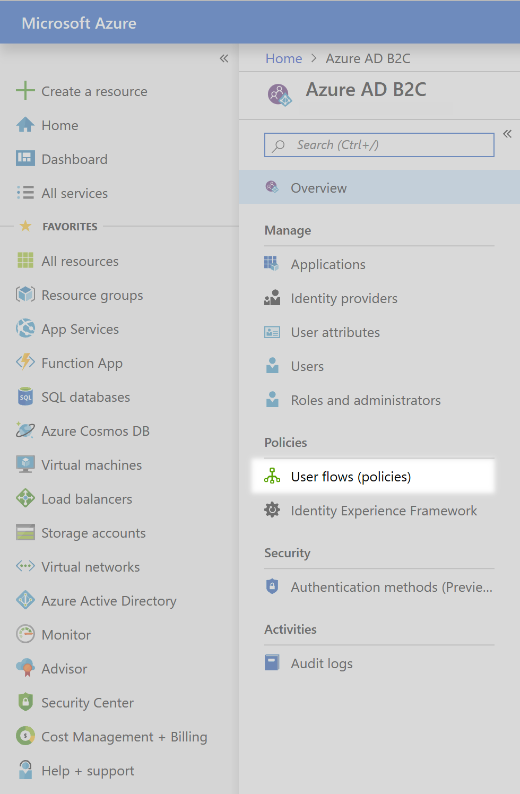
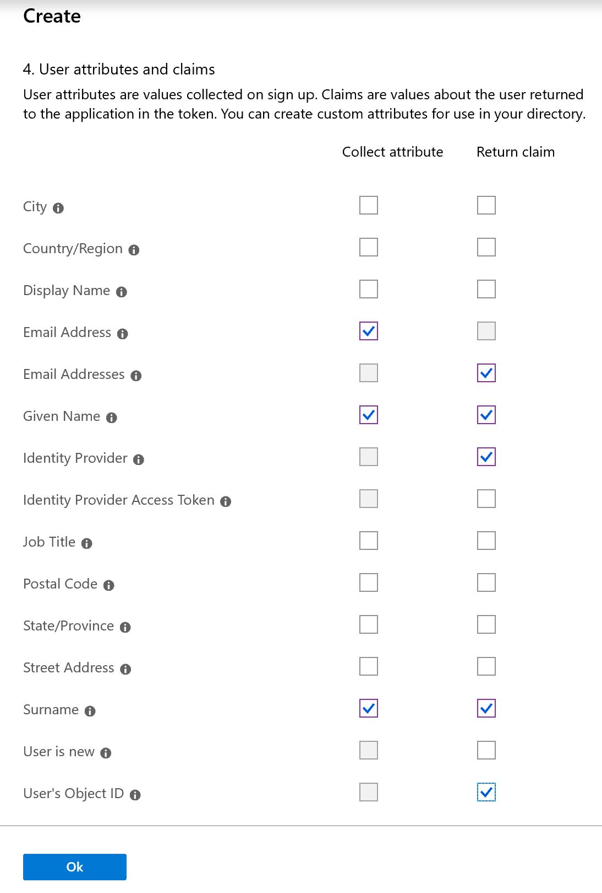
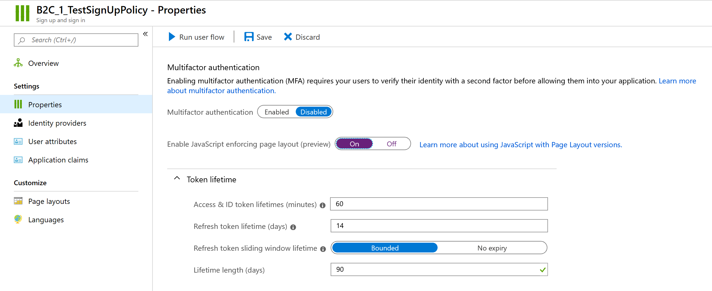
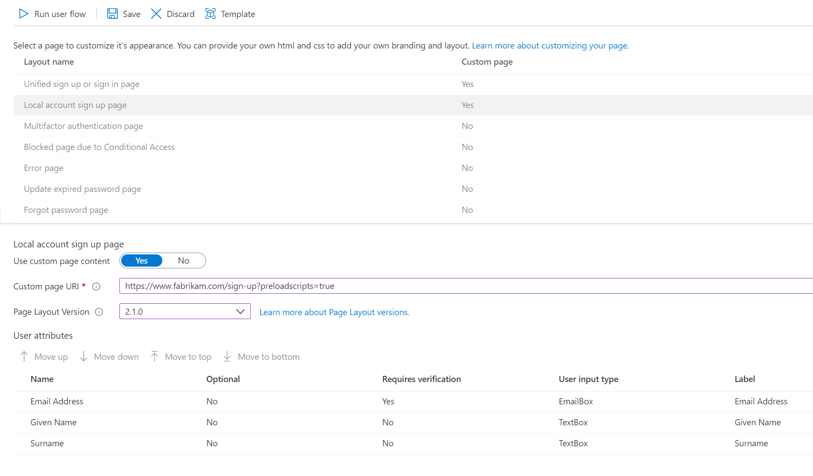
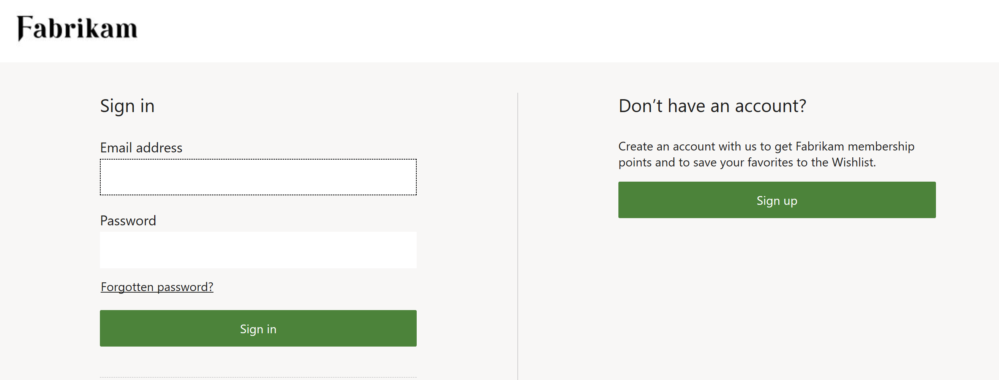
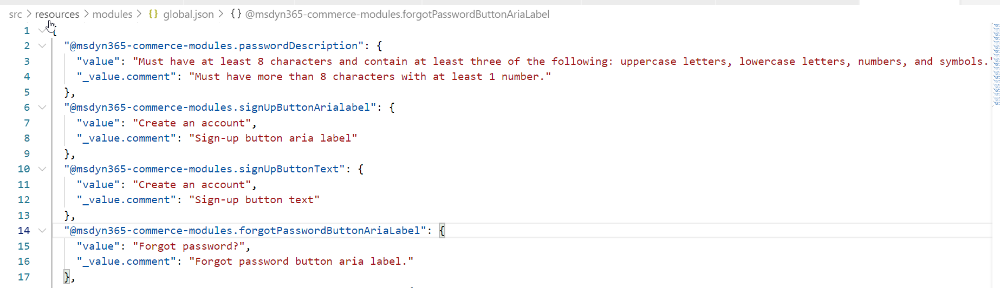

# Set up custom pages for user sign-ins

[!include [banner](includes/banner.md)]

This article describes how to build custom pages in Microsoft Dynamics 365 Commerce that handle customized sign-ins for users of Microsoft Entra business-to-consumer (B2C) tenants.

To use custom pages that are authored in Dynamics 365 Commerce to handle user sign-in flows, you must set up the Microsoft Entra policies that will be referenced in the Commerce environment. You can configure the "Sign up and sign in," "Profile editing," and "Password reset" Microsoft Entra B2C policies by using the Microsoft Entra B2C application. The Microsoft Entra B2C tenant and policy names can then be referenced during the provisioning process that is done for the Commerce environment by using Microsoft Dynamics Lifecycle Services (LCS).

The custom Commerce pages can be built by using the sign in, sign up, account profile edit, password reset, or generic Microsoft Entra modules. The page URLs that are published for these custom pages should then be referenced in Microsoft Entra B2C policy configurations in the Azure portal.

> [!WARNING] 
> Microsoft Entra ID B2C will retire old (legacy) user flows by August 1, 2021. Therefore, you should plan to migrate your user flows to the new recommended version. The new version provides feature parity and new features. For more information, see [User flows in Microsoft Entra ID B2C](/azure/active-directory-b2c/user-flow-overview).

>The module library for Commerce version 10.0.15 or higher should be used with the recommended B2C user flows. The default user policy pages offered in Microsoft Entra ID B2C can also be used, and allow for added background image, logo, and background color changes related to company branding. Though more limited in design capabilities, the default user policy pages provide Microsoft Entra B2C policy functionality without creating and configuring dedicated custom pages. 

## Set up B2C policies

After you set up your Microsoft Entra B2C tenant and associate it with your Commerce environment, go to the **Microsoft Entra B2C** page in the Azure portal, and then, on the menu, under **Policies**, select **User flows (policies)**.

You can now configure the "Sign up and sign in," "Profile editing," and "Password reset" user sign-in flows.

### Configure the "Sign up and sign in" policy

To configure the "Sign up and sign in" policy, follow these steps.

1. Select **New user flow**, select **Sign up and sign in**, select the **Recommended** tab,  and then select **Create**.
1. Enter a name for the policy (for example, **B2C\_1\_SignInSignUp**).
1. In the **Identity Providers** section, select the identity providers to use for the policy. At a minimum, **Email signup** must be selected.
1. In the **Collect attribute** column, select the check boxes for **Email Address**, **Given Name**, and **Surname**.
1. In the **Return claim** column, select the check boxes for **Email Addresses**, **Given Name**, **Identity Provider**, **Surname**, and **User's Object ID**.

    

1. Select **OK** to create the policy.
1. Double-click the new policy name, and then, in the navigation pane, select **Properties**.
1. Set the **Enable JavaScript enforcing page layout (preview)** option to **On**.

    

> [!NOTE]
> The policy name will be fully referenced in the Commerce environment. (The **B2C\_1\_** prefix will be included in the reference.) Policies can't be renamed after they are created. If you're replacing an existing policy for your Commerce environment, you can delete the original policy and build a new policy that has the same name. Alternatively, if the environment has already been provisioned, you can submit the new policy name through a service request.

You will return to this policy to finish the setup after you've built the custom pages. For now, close the policy to return to the **User flows (policies)** page in the Azure portal.

### Configure the "Profile editing" policy

To configure the "Profile editing" policy, follow these steps.

1. Select **New user flow**, select **Profile editing**, select the **Recommended** tab, and then select **Create**.
1. Enter a name for the policy (for example, **B2C\_1\_EditProfile**).
1. In the **Identity Providers** section, select the identity providers to use for the policy. At a minimum, **Local Account SignIn** must be selected.
1. In the **Collect attribute** column, select the check boxes for **Given Name** and **Surname**.
1. In the **Return claim** column, select the check boxes for **Email Addresses**, **Given Name**, **Identity Provider**, **Surname**, and **User's Object ID**.
1. Select **OK** to create the policy.
1. Double-click the new policy name, and then, in the navigation pane, select **Properties**.
1. Set the **Enable JavaScript enforcing page layout (preview)** option to **On**.

You will return to this policy to finish the setup after you've built the custom pages. For now, close the policy to return to the **User flows (policies)** page in the Azure portal.

### Configure the "Password reset" policy

To configure the "Password reset" policy, follow these steps.

1. Select **New user flow**, and then select the **Password reset** option, and choose the **Recommended** tab, and click **Create**.
1. Enter a name for the policy (for example, **B2C\_1\_ForgetPassword**).
1. In the **Identity Providers** section, select **Reset password using email address**.
1. In the **Return claim** column, select the check boxes for **Email Addresses**, **Given Name**, **Surname**, and **User's Object ID**.
1. Select **OK** to create the policy.
1. Double-click the new policy name, and then, in the navigation pane, select **Properties**.
1. Set the **Enable JavaScript enforcing page layout (preview)** option to **On**.

You will return to this policy to finish the setup after you've built the custom pages. For now, close the policy to return to the **User flows (policies)** page in the Azure portal.

## Build the custom pages

Dedicated Microsoft Entra modules are included in Commerce to build custom pages for Microsoft Entra B2C user policies. Pages can be built specifically for each user policy page's layout using the main Microsoft Entra B2C modules detailed below. Alternatively, the **Microsoft Entra Generic** module can be used for all page layouts and policies in Microsoft Entra ID B2C (even for page layout options within policies not listed below). 

- Page-specific Microsoft Entra modules are bound to data input items rendered by Microsoft Entra ID B2C. These modules give you more control over the positioning of the elements in your pages. However, more pages and module extensions may need to be built to account for variances beyond the default settings described below.
- The **Microsoft Entra Generic** module creates the "div" element for Microsoft Entra B2C to render all elements in the user policy page layout, giving more flexibility to the B2C functions of the page, but less control of the positioning and styling (though CSS can be used to match the look and feel of your site).

You can create a single page with the **Microsoft Entra Generic** module and use it for all of your user policy pages, or you can build out specific pages using the individual Microsoft Entra modules for sign-in, sign-up, profile edit, password reset, and password reset verification. You may also use a mix of both, using the specific Microsoft Entra pages for the page layouts noted below, and the generic Microsoft Entra module page for remaining page layouts within these or other user policies pages.

To learn more about the Microsoft Entra Modules that ship with the module library, read more at [Identity management pages and modules](dev-itpro/identity-mgmt-modules.md).

To build the custom pages with specific identity modules to handle user sign-ins, follow these steps.

1. In Commerce site builder, go to your site.
1. Build the following five templates and pages (if not already present in your site):
    - A **Sign In** template and page that use the sign-in module.
    - A **Sign Up** template and page that use the sign-up module.
    - A **Password Reset** template and page that use the password reset module.
    - A **Password Reset verification** template and page that use the password reset verification module.
    - A **Profile Edit** template and page that use the account profile edit module.

When you build the pages, follow these guidelines:

- For each page or module, use the layout and style that best suit your business requirements.
- Publish all pages and URLs that must be used in the Microsoft Entra B2C setup.
- After the pages and URLs are published, collect the URLs that must be used for the Microsoft Entra B2C policy configurations. A **?preloadscripts=true** suffix will be added to every URL when it's used.

> [!IMPORTANT]
> Pages built to be referenced in Microsoft Entra B2C are served directly from the Microsoft Entra B2C tenant's domain. Do not reuse universal headers and footers that have relative links. Because these pages will be hosted in the Microsoft Entra B2C domain when they are used, only absolute URLs should be used for all links. It is recommended to create a specific header and footer with absolute URLs for your Microsoft Entra-related custom pages, with any Commerce-specific modules that require connection to Retail Server removed. For example, the favorites, search bar, sign-in link, and cart modules should not be included in any pages which will be used in Microsoft Entra B2C user flows.

## Configure Microsoft Entra B2C policies with custom page information 

In the Azure portal, return to the **Microsoft Entra B2C** page, and then, on the menu, under **Policies**, select **User flows (policies)**.

### Update the "Sign up and sign in" policy with custom page information

To update the "Sign up and sign in" policy with custom page information, follow these steps.

1. In the **Sign in and sign up** policy that you configured earlier, in the navigation pane, select **Page layouts**.
1. Select the **Unified sign up or sign in page** layout.
1. Set the **Use custom page content** option to **Yes**.
1. In the **Custom page URI** field, enter the full sign-in URL. Include the **?preloadscripts=true** suffix. For example, enter ``www.<my domain>.com/sign-in?preloadscripts=true``.
1. In the **Page Layout Version** field, select version **2.1.0** or later (requires module library for Commerce version 10.0.15 or higher).
1. Select **Save**.
1. Select the **Local account sign up page** layout.
1. Set the **Use custom page content** option to **Yes**.
1. In the **Custom page URI** field, enter the full sign-up URL. Include the **?preloadscripts=true** suffix. For example, enter ``www.<my domain>.com/sign-up?preloadscripts=true``.
1. In the **Page Layout Version** field, select version **2.1.0** or later (requires module library for Commerce version 10.0.15 or higher).
1. In the **User attributes** section, follow these steps:
    1. For the **Given Name** and **Surname** attributes, select **No** in the **Requires Verification** column.
    1. For **Email Address** attribute, it is recommended to leave the default value **Yes** selected in the **Requires Verification** column. This option ensures that users signing up with a given email address verify that they own the email address.
    1. For the **Email Address**, **Given Name**, and **Surname** attributes, select **No** in the **Optional** column.
1. Select **Save**.

    

### Update the "Profile editing" policy with custom page information

To update the "Profile editing" policy with custom page information, follow these steps.

1. In the **Profile Editing** policy that you configured earlier, in the navigation pane, select **Page layouts**.
1. Select the **Profile edit page** layout (may require scrolling down past other layout options, depending on your screen).
1. Set the **Use custom page content** option to **Yes**.
1. In the **Custom page URI** field, enter the full profile edit URL. Include the **?preloadscripts=true** suffix. For example, enter ``www.<my domain>.com/profile-edit?preloadscripts=true``.
1. For **Page Layout Version**, select version **2.1.0** or higher (requires module library for Commerce version 10.0.15 or higher).
1. In the **User attributes** section, follow these steps:
    1. For the **Given Name** and **Surname** attributes, select **No** in the **Optional** column.
    1. For the **Given Name** and **Surname** attributes, select **No** in the **Requires verification** column.
1. Select **Save**.

### Update the "Password reset" policy with custom page information

To update the "Password reset" policy with custom page information, follow these steps.

1. In the **Password Reset** policy that you configured earlier, in the navigation pane, select **Page layouts**.
1. Select the **Forgot password page** layout.
1. Set the **Use custom page content** option to **Yes**.
1. In the **Custom page URI** field, enter the full password reset verification URL. Include the **?preloadscripts=true** suffix. For example, enter ``www.<my domain>.com/password-reset-verification?preloadscripts=true``.
1. In the **Page Layout Version** field, select version **2.1.0** or higher (requires module library for Commerce version 10.0.15 or higher).
2. Select **Save**.
3. Select the **Change password page** layout.
4. Set the **Use custom page content** option to **Yes**.
5. In the **Custom page URI** field, enter the full password reset URL. Include the **?preloadscripts=true** suffix. For example, enter ``www.<my domain>.com/password-reset?preloadscripts=true``.
6. In the **Page Layout Version** field, select version **2.1.0** or higher (requires module library for Commerce version 10.0.15 or higher).
7. Select **Save**.

## Customize default text strings for labels and descriptions

In the module library, sign-in modules are prefilled with default text strings for the labels and descriptions. You can customize the strings in the properties pane of the module you are working on. Additional strings on the page (such as the **Forgotten password?** link text or the **Create an account** call to action text) will require using the Commerce software development kit (SDK) and updating the values in the global.json file for the sign-in module.

For example, the default text for the forgotten password link is **Forgotten password?**. The following shows this default text on the sign-in page.

However, in the global.json file for the module library sign-in module, you can edit the text to **Forgot Password?**, as shown in the following illustration.

After you update the global.json file and publish your changes, the new link text appears in the sign-in module in both Commerce and on the live sign-in page.

## Additional resources

[Configure your domain name](configure-your-domain-name.md)

[Deploy a new e-commerce tenant](deploy-ecommerce-site.md)

[Create an e-commerce site](create-ecommerce-site.md)

[Associate a Dynamics 365 Commerce site with an online channel](associate-site-online-store.md)

[Manage robots.txt files](manage-robots-txt-files.md)

[Upload URL redirects in bulk](dev-itpro/upload-bulk-redirects.md)

[Set up a B2C tenant in Commerce](dev-itpro/set-up-B2C-tenant.md)

[Configure multiple B2C tenants in a Commerce environment](configure-multi-B2C-tenants.md)

[Add support for a content delivery network (CDN)](add-cdn-support.md)

[Enable location-based store detection](enable-store-detection.md)

[!INCLUDE[footer-include](../includes/footer-banner.md)]
