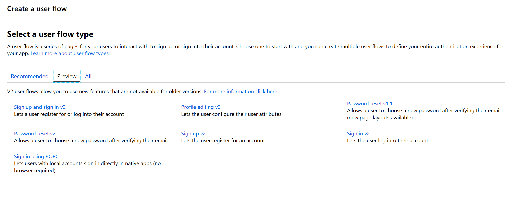
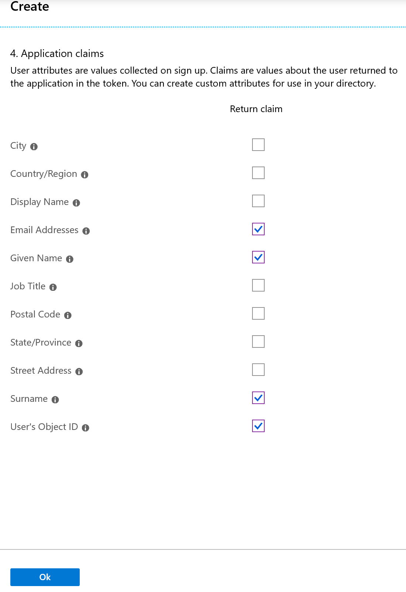
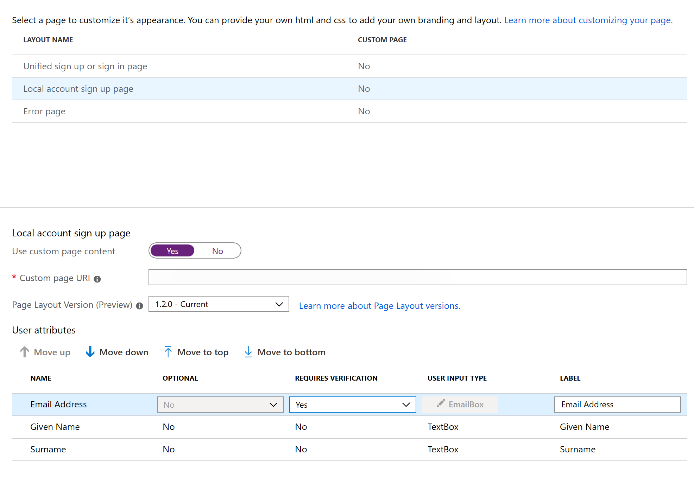

---
# required metadata

title: Set up custom pages for user sign-ins
description: This topic describes how to build custom pages in Microsoft Dynamics 365 Commerce that handle customized sign-ins for users of Azure Active Directory (Azure AD) business-to-consumer (B2C) tenants.
author: brianshook
manager: annbe
ms.date: 12/05/2019
ms.topic: article
ms.prod: 
ms.service: dynamics-365-commerce
ms.technology: 

# optional metadata

# ms.search.form: 
audience: Application user
# ms.devlang: 
ms.reviewer: v-chgri
ms.search.scope: Operations, Retail, Core
# ms.tgt_pltfrm: 
ms.custom: 
ms.assetid: 
ms.search.region: Global
# ms.search.industry: 
ms.author: brshoo
ms.search.validFrom: 2019-10-31
ms.dyn365.ops.version: Release 10.0.5

---

# Set up custom pages for user logins

[!include [banner](includes/banner.md)]

This topic describes how to build custom pages in Microsoft Dynamics 365 Commerce that handle customized sign-ins for users of Azure Active Directory (Azure AD) business-to-consumer (B2C) tenants.

## Overview

To use custom pages that are authored in Dynamics 365 Commerce to handle user sign-in flows, you must set up the Azure AD policies that will be referenced in the Commerce environment. You can configure the "Sign up and sign in," "Profile editing," and "Password reset" Azure AD B2C policies by using the Azure AD B2C application. The Azure AD B2C tenant and policy names can then be referenced during the provisioning process that is done for the Commerce environment by using Microsoft Dynamics Lifecycle Services (LCS).

The custom Commerce pages can be built by using the sign in, sign up, account profile edit, or password reset module. The page URLs that are published for these custom pages should then be referenced in Azure AD B2C policy configurations in the Azure portal.

## Set up B2C policies

After you set up your Azure AD B2C tenant and associate it with your Commerce environment, go to the **Azure AD B2C** page in the Azure portal, and then, on the menu, under **Policies**, select **User flows (policies)**.

You can now configure the "Sign up and sign in," "Profile editing," and "Password reset" user sign-in flows.

### Configure the "Sign up and sign in" policy

To configure the "Sign up and sign in" policy, follow these steps.

1. Select **New user flow**, and then, on the **Recommended** tab, select the **Sign up and sign in** policy.
1. Enter a name for the policy (for example, **B2C\_1\_SignInSignUp**).
1. In the **Identity Providers** section, select the identity providers to use for the policy. At a minimum, **Email signup** must be selected.
1. In the **Collect attribute** column, select the check boxes for **Email Address**, **Given Name**, and **Surname**.
1. In the **Return claim** column, select the check boxes for **Email Addresses**, **Given Name**, **Identity Provider**, **Surname**, and **User's Object ID**.

    

1. Select **OK** to create the policy.
1. Double-click the new policy name, and then, in the navigation pane, select **Properties**.
1. Set the **Enable JavaScript enforcing page layout (preview)** option to **On**.

    

> [!NOTE]
> The policy name will be fully referenced in the Commerce environment. (The **B2C\_1\_** prefix will be included in the reference.) Policies can't be renamed after they are created. If you're replacing an existing policy for your Commerce environment, you can delete the original policy and build a new policy that has the same name. Alternatively, if the environment has already been provisioned, you can submit the new policy name through a service request.

You will return to this policy to finish the setup after you've built the custom pages. For now, close the policy to return to the **User flows (policies)** page in the Azure portal.

### Configure the "Profile editing" policy

To configure the "Profile editing" policy, follow these steps.

1. Select **New user flow**, and then, on the **Recommended** tab, select the **Profile editing** policy.
1. Enter a name for the policy (for example, **B2C\_1\_EditProfile**).
1. In the **Identity Providers** section, select the identity providers to use for the policy. At a minimum, **Local Account SignIn** must be selected.
1. In the **Collect attribute** column, select the check boxes for **Email Addresses** and **Surname**.
1. In the **Return claim** column, select the check boxes for **Email Addresses**, **Given Name**, **Identity Provider**, **Surname**, and **User's Object ID**.
1. Select **OK** to create the policy.
1. Double-click the new policy name, and then, in the navigation pane, select **Properties**.
1. Set the **Enable JavaScript enforcing page layout (preview)** option to **On**.

You will return to this policy to finish the setup after you've built the custom pages. For now, close the policy to return to the **User flows (policies)** page in the Azure portal.

### Configure the "Password reset" policy

To configure the "Password reset" policy, follow these steps.

1. Select **New user flow**, and then, on the **Preview** tab, select the **Password reset v1.1** policy.

    

1. Enter a name for the policy (for example, **B2C\_1\_ForgetPassword**).
1. In the **Identity Providers** section, select **Reset password using email address**.
1. In the **Return claim** column, select the check boxes for **Email Addresses**, **Given Name**, **Surname**, and **User's Object ID**.

    

1. Select **OK** to create the policy.
1. Double-click the new policy name, and then, in the navigation pane, select **Properties**.
1. Set the **Enable JavaScript enforcing page layout (preview)** option to **On**.

You will return to this policy to finish the setup after you've built the custom pages. For now, close the policy to return to the **User flows (policies)** page in the Azure portal.

## Build the custom pages

To build the custom pages to handle user sign-ins, follow these steps.

1. In the Commerce authoring tools, go to your site.
1. Build the following five templates and five pages:

    - A **Sign In** template and page that use the sign in module.
    - A **Sign Up** template and page that use the sign up module.
    - A **Password Reset** template and page that use the password reset module.
    - A **Password Reset verification** template and page that use the password reset verification module.
    - A **Profile Edit** template and page that use the account profile edit module

When you build the pages, follow these guidelines:

- For each page or module, use the layout and style that best suit your business requirements.
- Publish all pages and URLs that must be used in the Azure AD B2C setup.
- After the pages and URLs are published, collect the URLs that must be used for the Azure AD B2C policy configurations. A **?preloadscripts=true** suffix will be added to every URL when it's used.

> [!IMPORTANT]
> Don't reuse universal headers and footers that have relative links. Because these pages will be hosted in the Azure AD B2C domain when they are used, only absolute URLs should be used for all links.

## Configure Azure AD B2C policies with custom page information 

In the Azure portal, return to the **Azure AD B2C** page, and then, on the menu, under **Policies**, select **User flows (policies)**.

### Update the "Sign up and sign in" policy with custom page information

To update the "Sign up and sign in" policy with custom page information, follow these steps.

1. In the **Sign in and sign up** policy that you configured earlier, in the navigation pane, select **Page layouts**.
1. Select the **Unified sign up or sign in page** layout.
1. Set the **Use custom page content** option to **Yes**.
1. In the **Custom page URI** field, enter the full sign-in URL. Include the **?preloadscripts=true** suffix. For example, enter ``www.<my domain>.com/sign-in?preloadscripts=true``.
1. In the **Page Layout Version (Preview)** field, select **1.2.0**.
1. Select the **Local account sign up page** layout.
1. Set the **Use custom page content** option to **Yes**.
1. In the **Custom page URI** field, enter the full sign-up URL. Include the **?preloadscripts=true** suffix. For example, enter ``www.<my domain>.com/sign-up?preloadscripts=true``.
1. In the **Page Layout Version (Preview)** field, select **1.2.0**.
1. In the **User attributes** section, follow these steps:

    1. For the **Email Address**, **Given Name**, and **Surname** attributes, select **No** in the **Requires Verification** field.
    1. For the **Given Name** and **Surname** attributes, select **No** in the **Optional** field.

    

### Update the "Profile editing" policy with custom page information

To update the "Profile editing" policy with custom page information, follow these steps.

1. In the **Profile Editing** policy that you configured earlier, in the navigation pane, select **Page layouts**.
1. Select the **Profile edit page** layout.
1. Set the **Use custom page content** option to **Yes**.
1. In the **Custom page URI** field, enter the full profile edit URL. Include the **?preloadscripts=true** suffix. For example, enter ``www.<my domain>.com/profile-edit?preloadscripts=true``.
1. In the **Page Layout Version (Preview)** field, select **1.2.0**.
1. In the **User attributes** section, follow these steps:

    1. For the **Email Address**, **Given Name** attributes, select **No** in the **Requires Verification** field.
    1. For the **Given Name** and **Surname** attributes, select **No** in the **Optional** field.

### Update the "Password reset" policy with custom page information

To update the "Password reset" policy with custom page information, follow these steps.

1. In the **Password Reset** policy that you configured earlier, in the navigation pane, select **Page layouts**.
1. Select the **New password page** layout.
1. Set the **Use custom page content** option to **Yes**.
1. In the **Custom page URI** field, enter the full password reset URL. Include the **?preloadscripts=true** suffix. For example, enter ``www.<my domain>.com/passwordreset?preloadscripts=true``.
1. In the **Page Layout Version (Preview)** field, select **1.2.0**.
1. Select the **Account verification page** layout.
1. Set the **Use custom page content** option to **Yes**.
1. In the **Custom page URI** field, enter the full password reset verification URL. Include the **?preloadscripts=true** suffix. For example, enter ``www.<my domain>.com/passwordreset-verification?preloadscripts=true``.
1. In the **Page Layout Version (Preview)** field, select **1.2.0**.

## Customize default text strings for labels and descriptions

In the starter kit, sign in modules are prefilled with default text strings for the labels and descriptions. You can customize these strings in the software development kit (SDK) by updating the values in the global.json file for the sign in module.

For example, the default text for the forgotten password link is **Forgotten password?**. The following shows this default text on the sign-in page.

However, in the global.json file for the starter kit sign in module, you can edit the text to **Forgot Password?**, as shown in the following illustration.

After you update the global.json file and publish your changes, the new link text appears in the sign in module in both Commerce and on the live sign-in page.

## Additional resources

[Configure your domain name](configure-your-domain-name.md)

[Deploy a new e-Commerce site](deploy-ecommerce-site.md)

[Create an e-Commerce site](create-ecommerce-site.md)

[Associate an online site with a channel](associate-site-online-store.md)

[Manage robots.txt files](manage-robots-txt-files.md)

[Add support for a content delivery network (CDN)](add-cdn-support.md)

[Enable location-based store detection](enable-store-detection.md)
