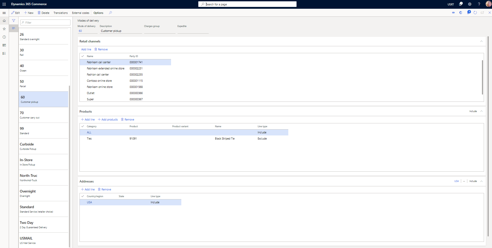
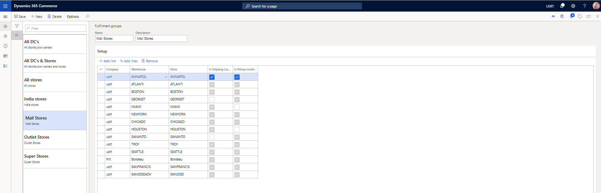
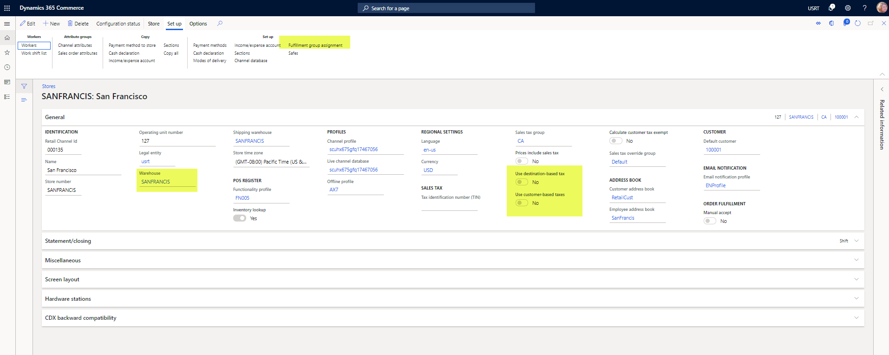
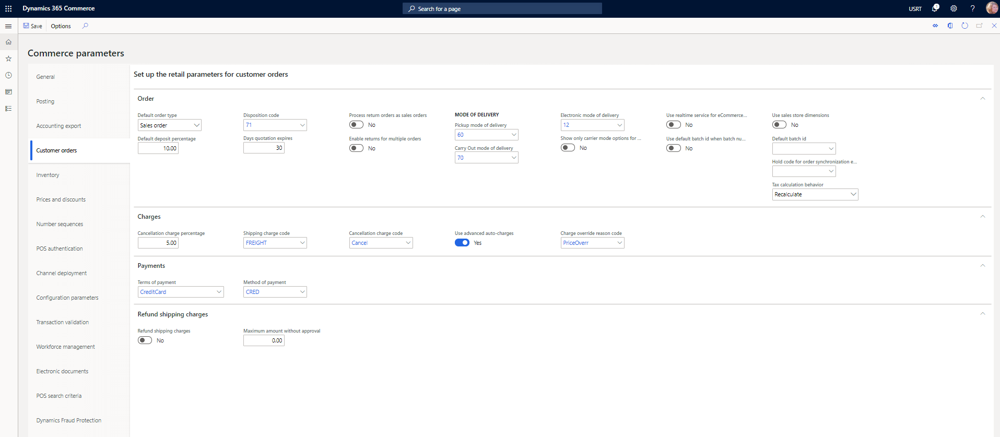
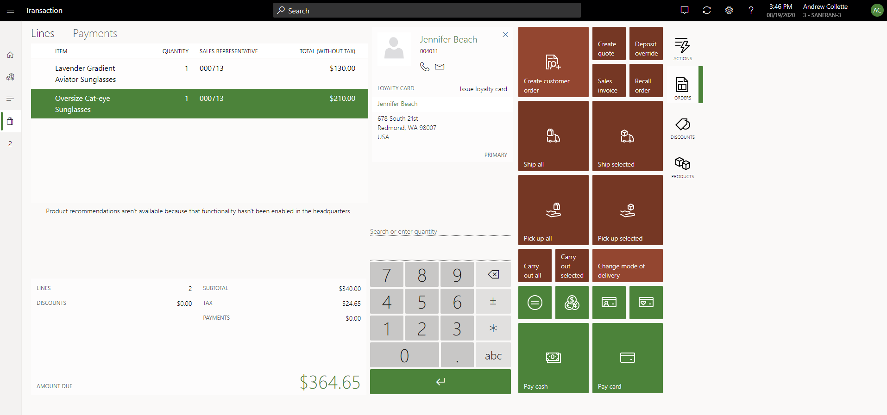

---
# required metadata

title: Customer orders in point of sale (POS)
description: This article provides information about customer orders in point of sale (POS). Customer orders are also known as special orders. The article includes a discussion of related parameters and transaction flows.
author: josaw1
ms.date: 03/03/2023
ms.topic: overview
ms.search.form: RetailFunctionalityProfile 
audience: Application User, Developer, IT Pro
ms.reviewer: josaw
ms.custom: ["260594", "intro-internal"]
ms.assetid: 6fc835ef-d62e-4f23-9d49-50299be642ca
ms.search.region: Global
ms.author: anpurush
ms.search.validFrom: 2016-02-28

---

# Customer orders in point of sale (POS)

[!include [banner](includes/banner.md)]

This article provides information about how to create and manage customer orders in the point of sale (POS) app. Customer orders can be used to capture sales where shoppers want to pick up products on a later date, pick up products from a different location, or have items shipped to them. 

In an omni-channel commerce world, many retailers provide the option of customer orders, or special orders, to meet various product and fulfillment requirements. Here are some typical scenarios:

- A customer wants products to be delivered to a specific address on a specific date.
- A customer wants to pick up products from a store or location that differs from the store or location where the customer purchased those products.
- A customer inside a store location wants to order products today and pick them up from the same store location on a later date.

Retailers can use customer orders to minimize lost sales that stock outages might otherwise cause, because the merchandise can be delivered or picked up at a different time or place.

## Set up customer orders
Before you try to use customer order functionality in POS, make sure that you complete all the required configurations in Commerce headquarters.

### Configure modes of delivery

To use customer orders, you must configure modes of delivery that the store channel can use. You must define at least one mode of delivery that can be used when order lines are shipped to a customer from a store. You must also define at least one pickup mode of delivery that can be used when order lines are picked up from the store. Modes of delivery are defined on the **Modes of delivery** page in Commerce headquarters. For more information about how to set up modes of delivery for Commerce channels, see [Define delivery modes](./configure-call-center-delivery.md#define-delivery-modes).

### Set up fulfillment groups

Some stores or warehouse locations might not be able to fulfill customer orders. By configuring fulfillment groups, an organization can specify which stores and warehouse locations are shown as options to users who create customer orders in POS. Fulfillment groups are configured on the **Fulfillment groups** page. Organizations can create as many fulfillment groups as they require. After a fulfillment group is defined, link it to a store by selecting **Fulfillment group assignment** from the **Set up** tab on the Action Pane of the **Stores** page.

In Commerce version 10.0.12 and later, organizations can define whether the warehouse or warehouse and store combinations that are defined in fulfillment groups can be used for shipping, for pickup, or for both shipping and pickup. This allows for added flexibility for the business to determine which warehouses can be selected when creating a customer order for items to ship vs. which stores can be selected when creating a customer order for items to pick up. To use these configuration options, turn on the **Ability to specify locations as "Shipping" or "Pickup" enabled within Fulfillment group** feature. If a warehouse that's linked to a fulfillment group isn't a store, it can be configured only as a shipping location. It can't be used when orders for pickup are configured in POS.

### Configure channel settings

When you work with customer orders in POS, you must consider some of the settings of the store channel. These settings are found on the **Stores** page in Commerce headquarters.

- **Warehouse** – This field indicates the warehouse that will be used when decrementing inventory for cash and carry and customer pickup orders tied to this store. As a best practice, we encourage the use of unique warehouses for each store channel, to prevent conflicting business logic issues across stores.
- **Shipping Warehouse** - This field indicates the warehouse that will be used when decrementing inventory for customer orders to be shipped from the selected store. If the feature **Ability to specify locations as “Shipping” or “Pickup” enabled within Fulfillment group** has been enabled in your environment, POS users can choose a specific warehouse to ship from in POS, instead of choosing a store to ship from. Therefore, when that feature is enabled, the shipping warehouse is no longer utilized, since the user will pick the specific warehouse to ship the order from when the order is created.
- **Fulfillment group assignment** – Select this button (on the **Set up** tab on the Action Pane) to link the fulfillment groups that are referenced to show options for pickup locations or shipment origins when customer orders are created in POS.
- **Use destination-based tax** – This option indicates whether the shipping address is used to determine the tax group that is applied to order lines that are shipped to the customer's address.
- **Use customer-based tax** – This option indicates whether the tax group that is defined for the customer's delivery address is used to tax customer orders that are created in POS for shipment to the customer's home.

### Set up customer order parameters

Before you try to create customer orders in POS, you must configure the appropriate parameters in Commerce headquarters. These parameters can be found on the **Customer orders** tab of the **Commerce parameters** page.

- **Default order type** – You can specify the order type that is assigned by default to customer orders that are created in POS. These customer orders can be either sales orders or quotation orders. Regardless of the default order type, users can still create both sales orders and customer orders from POS.
- **Default deposit percentage** – Specify the percentage of the order total amount that the customer must pay as a deposit before an order can be confirmed. Depending on their privileges, store associates might be able to override the amount by using the **Deposit override** operation in POS, if that operation is configured for the transaction screen layout.
     > [!NOTE]
     > The deposit percentage setting is ignored if a B2B type customer (a customer who belongs to a customer hierarchy) is added to the customer order. For such customers, the default deposit percentage is always set to zero, but the cashier can override the deposit percentage using the **Deposit override** operation.

- **Pickup mode of delivery** – Specify the mode of delivery that should be applied to sales order lines that are configured for pickup in POS.
- **Carryout mode of delivery** – Specify the mode of delivery that should be applied to sales order lines that are considered carryout order lines when a mixed cart is created, where some lines will be picked up or shipped, and other lines will be carried out by the customer immediately.
- **Cancellation charge percentage** – If a charge should be applied when a customer order is canceled, specify the amount of that charge.
- **Cancellation charge code** – Specify the Accounts receivable charge code that should be used when a cancellation charge is applied to canceled customer orders through POS. The charge code defines the financial posting logic for the cancellation charge.
     > [!NOTE]
     > When advanced auto charges features aren't enabled, it is recommended that you create a dedicated charge code for cancellation charges instead of reusing the shipping charge code, since the latter may result in unexpected behavior when the system selects the sales tax group for the charge. It is also recommended that you choose a cancellation charge code name and description that makes it clear to cashiers that the cancellation charge code is only to be used for cancellations.
- **Shipping charge code** – If the **Use advanced auto charges** option is set to **Yes**, this parameter setting has no effect. If that option is set to **No**, users will be prompted to manually enter a shipping charge when they create customer orders in POS. Use this parameter to map an Accounts receivable charge code that will be applied to orders when users enter a shipping charge. The charge code defines the financial posting logic for the shipping charge.
- **Use advanced auto charges** – Set this option to **Yes** to use system-calculated auto charges when customer orders are created in POS. These auto charges can be used to calculate shipping fees or other order or item-specific charges. For more information about how to set up and use advanced auto charges, see [Omni-channel advanced auto charges](./omni-auto-charges.md).

### Update transaction screen layouts in POS

Make sure that the POS [screen layout](./pos-screen-layouts.md) is configured to support the creation and management of customer orders, and that all required POS operations are configured. Here are some of the POS operations that are recommended to correctly support customer order creation and management:
- **Ship all products** – This operation is used to specify that all lines in the transaction cart will be shipped to a destination.
- **Ship selected products** – This operation is used to specify that selected lines in the transaction cart will be shipped to a destination.
- **Pick up all products** – This operation is used to specify that all lines in the transaction cart will be picked up from a selected store location.
- **Pick up selected products** – This operation is used to specify that selected lines in the transaction cart will be picked up from a selected store location.
- **Carry out all products** – This operation is used to specify that all lines in the transaction cart will be carried out. If this operation is used in POS, the customer order will be converted to a cash-and-carry transaction.
- **Carryout out selected products** – This operation is used to specify that selected lines in the transaction cart are being carried out by the customer at the time of purchase. This operation is useful only in a [hybrid order](./hybrid-customer-orders.md) scenario.
- **Recall order** – This operation is used to search and retrieve customer orders so that POS users can edit, cancel, or perform fulfillment-related operations on them as required.
- **Change mode of delivery** – This operation can be used to quickly change the mode of delivery for lines that are already configured for shipment, without requiring that users go through the "ship all products" or "ship selected products" flow again.
- **Deposit override** – This operation can be used to change the deposit amount that the customer will pay for the selected customer order.

## Work with customer orders in POS

> [!NOTE]
> Revenue recognition functionality isn't currently supported for use in Commerce channels (e-commerce, POS, call center). Items configured with revenue recognition shouldn't be added to orders created in Commerce channels. 

### Create a customer order for products that will be shipped to the customer

1. On the POS transaction screen, add a customer to the transaction.
2. Add products to the cart.
3. Select **Ship selected** or **Ship all** to ship the products to an address on the customer account.
4. Select the option to create a customer order.
5. Confirm or change the "ship from" location, confirm or change the shipping address, and select a shipping method.
6. Enter the customer's desired order shipment date.
7. Use the payment functions to pay for any calculated amounts that are due, or use the **Deposit override** operation to change the amounts that are due, and then apply payment.
8. If the full order total wasn't paid, enter a credit card that will be captured for the balance that is due on the order when it's invoiced.

### Create a customer order for products that the customer will pick up

1. On the POS transaction screen, add a customer to the transaction.
2. Add products to the cart.
3. Select **Pick up selected** or **Pick up all** to initiate the order pickup configuration.
4. Select the store location where the customer will pick up the selected products.
5. Select a date when the item will be picked up.
6. Use the payment functions to pay for any calculated amounts that are due, or use the **Deposit override** operation to change the amounts that are due, and then apply payment.
7. If the full order total wasn't paid, select whether the customer will provide payment later (at pickup), or whether a credit card will be tokenized now, and then used and captured at the time of pickup.

### Edit an existing customer order

Retail orders that are created in either the online or store channel can be recalled and edited through POS as required.

> [!IMPORTANT]
> Not all retail orders can be edited through the POS application. Orders that are created in a call center channel can't be edited through POS if the [Enable order completion](./set-up-order-processing-options.md#enable-order-completion) setting is turned on for the call center channel. To ensure correct payment processing, orders that originated in a call center channel and that use Enable order completion functionality must be edited through the call center application in Commerce headquarters.

> [!NOTE]
> We recommend that you don't edit orders and quotations in POS that are created by a non-call center user in Commerce headquarters. Those orders and quotes don't use the Commerce pricing engine, so if they're edited in POS, the Commerce pricing engine will re-price them.

In version 10.0.17 and later, users can edit eligible orders through the POS application, even if the order is partially fulfilled. However, orders that are fully invoiced still can't be edited through POS. To enable this capability, turn on the **Edit partially fulfilled orders in Point of Sale** feature in the **Feature management** workspace. If this feature is not enabled, or if you're using version 10.0.16 or earlier, users will only be able to edit customer orders in POS if the order is fully open. Further, if the feature is enabled, you can limit which stores can edit partially fulfilled orders. The option to disable this capability for specific stores can be configured through the **Functionality profile** under the **General** FastTab.

1. Select **Recall order**.
2. Use **Search** to enter filters to find the order, and then select **Apply**.
3. Select the order in the list of results, and then select **Edit**. If the **Edit** button is unavailable, the order is in a state where it can't be edited.
4. From the transaction cart, make any necessary changes to the customer order. Some changes might be prohibited during editing.
5. Complete the editing process by selecting a payment operation.
6. To exit the editing process without saving any changes, you can use the **Void transaction** operation.

#### Pricing impact when orders are edited

When orders are placed in POS or on a Commerce e-commerce site, customers commit to an amount. This amount includes a price, and it might also include a discount. A customer who places an order and then contacts the call center later to change that order (for example, to add another item) will have specific expectations about the application of discounts. Even if the promotions on the existing order lines have expired, the customer will expect the discounts that were originally applied to those lines to remain in effect. However, if no discount was in effect when the order was originally placed, but a discount has gone into effect since then, the customer will expect the new discount to be applied to the changed order. Otherwise, the customer might just cancel the existing order and then create a new order where the new discount is applied. As this scenario shows, prices and discounts that customers have committed to must be preserved. At the same time, POS and call center users must have the flexibility to recalculate prices and discounts for sales order lines as required.

When orders are recalled and edited in POS, the prices and discounts of the existing order lines are considered "locked." In other words, they don't change, even if some order lines are canceled or changed, or new order lines are added. To change the prices and discounts of existing sales lines, the POS user must select **Recalculate**. The price lock is then removed from the existing order lines. However, before the Commerce version 10.0.21 release, this capability wasn't available in the call center. Instead, any changes to order lines caused prices and discounts to be recalculated.

In the Commerce version 10.0.21 release, a new feature that is named **Prevent unintentional price calculation for commerce orders** is available in the **Feature management** workspace. This feature is turned on by default. When it's turned on, a new **Price locked** property is available for all e-commerce orders. After order capture is completed for orders that are placed from any channel, this property is automatically enabled (that is, the checkbox is selected) for all the order lines. The Commerce pricing engine then excludes those order lines from all price and discount calculations. Therefore, if the order is edited, the order lines will be excluded from the pricing and discount calculation by default. However, call center users can disable the property (that is, clear the checkbox) for any order line and then select **Recalculate** to include the existing order lines in the pricing calculations.

Even when they are applying a manual discount to an existing sales line, call center users must disable the **Price locked** property of the sales line before they apply the manual discount.

Call center users can also disable the **Price locked** property for order lines in bulk by selecting **Remove price lock** in the **Calculate** group on the **Sell** tab on the Action Pane of the **Sales order** page. In this case, the price lock is removed from all order lines except lines that are non-editable (in other words, lines that have a status of **Partially invoiced** or **Invoiced**). Then, after the changes to the order are completed and have been submitted, the price lock is reapplied to all the order lines.

> [!IMPORTANT]
> When the **Prevent unintentional price calculation for commerce orders** feature is turned on, the setup of trade agreement evaluation will be ignored in the pricing workflows. In other words, the trade agreement evaluation dialog boxes won't show the **Price related** section. This behavior occurs because both the trade agreement evaluation setup and the price lock feature have a similar purpose: to prevent unintentional price changes. However, the user experience for trade agreement evaluation doesn't scale well for large orders where users must select one or more order lines for repricing.

> [!NOTE]
> The **Price locked** property can be disabled for one or more selected lines only when the **Call center** module is used. The behavior of POS remains unchanged. In other words, POS user can't unlock prices for selected order lines. However, they can select **Recalculate** to remove the price lock from all existing order lines.

### Cancel a customer order

1. Select **Recall order**.
2. Use **Search** to enter filters to find the order, and then select **Apply**.
3. Select the order in the list of results, and then select **Cancel**. If the **Cancel** button is unavailable, the order is in a state where it can no longer be canceled.
4. If cancellation charges are configured, confirm them. You can adjust the cancellation charges before you confirm them, as required. 
5. From the transaction cart, complete the cancellation process by selecting a payment operation. If deposits that were paid exceed the cancellation charge, refund payments might be due.
6. To exit the cancellation process without saving any changes, you can use the **Void transaction** operation.

## Finalizing the customer order shipment or pickup from POS

After an order is created, the items will be picked up by the customer from a store location or shipped, depending on the configuration of the order. For more information about this process, see the [store order fulfillment](./order-fulfillment-overview.md) documentation.

## Asynchronous transaction flow for customer orders

Customer orders can be created in POS in either synchronous mode or asynchronous mode. Microsoft recommends that you use the asynchronous order creation mode, because it's much more performant than synchronous order creation mode and provides a better user experience.

### Enable customer orders to be created in asynchronous mode

To enable customer orders to be created in asynchronous mode, follow these steps.

1. In Commerce headquarters, go to **Retail and Commerce \> Channel setup \> Online store setup \> Functionality profiles**. 
1. Select the functionality profile that corresponds to the store that you want to enable asynchronous order creation for.
1. On the **General** FastTab, select from the following configuration options:

    - **Create customer order in async mode**
    - **Use realtime service for order creation with async backup**

> [!NOTE]
> The **Use realtime service for order creation with async backup** option is available in Commerce version 10.0.33 and later.

The **Create customer order in async mode** option always creates the order in a batch process. POS immediately completes the transaction by using the confirmation number for the order, but the order will be created in headquarters after a few minutes (after the relevant jobs have been run). The jobs that are required to create the order are the **P-0001 (Channel transactions)** job and the **Synchronize orders** job. The confirmation number can be used to recall the order for fulfillment and editing scenarios.

The **Use realtime service for order creation with async backup** option depends on the above configuration. In other words, this can only be enabled, if the **Create customer order in async mode** is enabled. The **Use realtime service for order creation with async backup** option first tries to create the order by using the Retail Transaction Service (RTS). If (and only if) that attempt fails, the order will be created by using the same batch process that was just described. Most of the time, the order is created as quickly as it would be created through synchronous order creation. However, with this configuration, POS immediately completes the transaction by using the confirmation number for the order and doesn't wait for the RTS call to be completed. 

> [!NOTE]
> Asynchronous orders can't be edited or canceled unless the orders are created in headquarters. Because the **Create customer order with async fall back** option first tries to create the order by using an RTS call, the order should usually be available for editing and cancellation within a few seconds. The capability to cancel asynchronous orders before they're synced in headquarters is currently planned for future releases.

## Additional resources

[Hybrid customer orders](hybrid-customer-orders.md)

[!INCLUDE[footer-include](../includes/footer-banner.md)]
