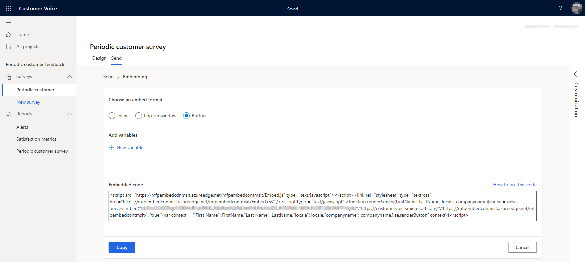
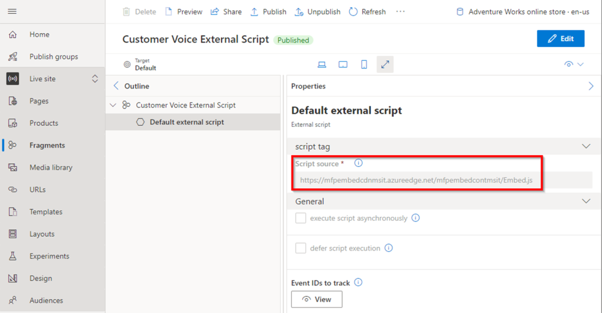
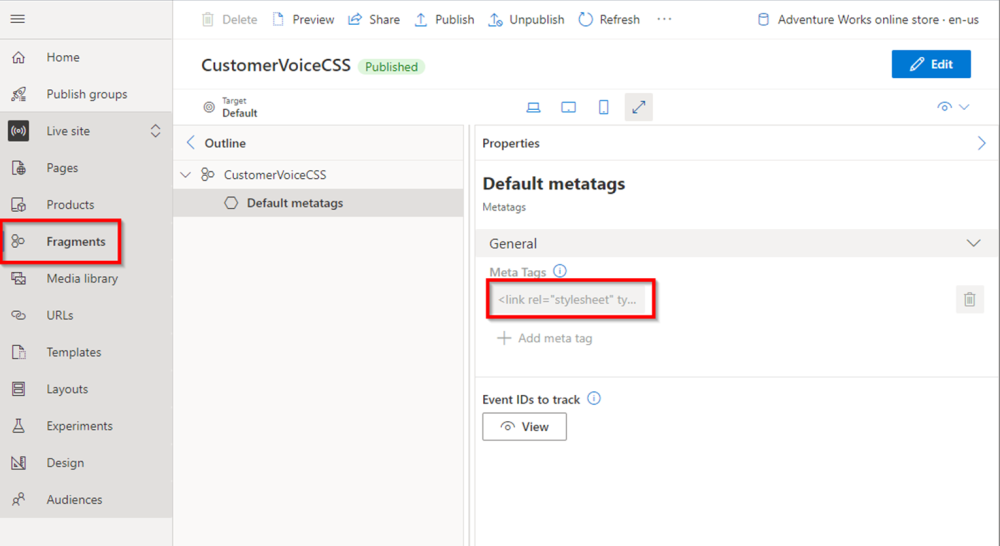
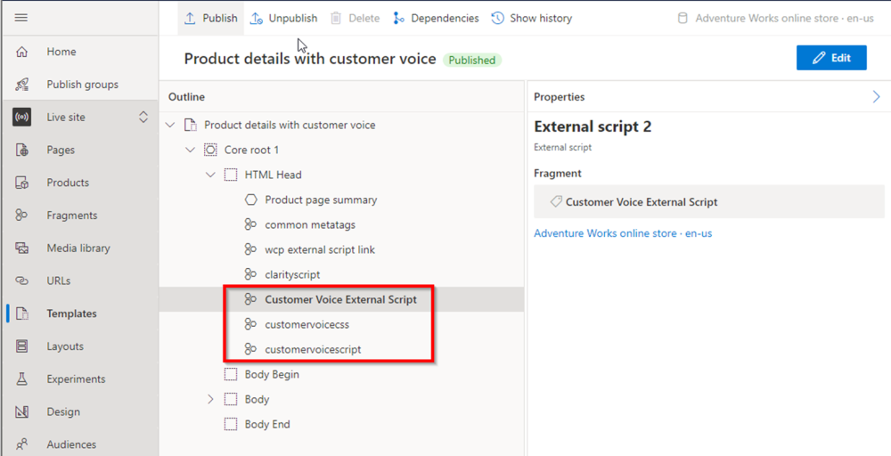

# Integrate Customer Voice into e-commerce site pages

[!include [banner](../includes/banner.md)]

This article describes how to integrate Microsoft Dynamics 365 Customer Voice into Dynamics 365 Commerce e-commerce site pages.

You can integrate [Customer Voice](https://dynamics.microsoft.com/customer-voice/overview/) into your e-commerce site to collect, analyze, and track real-time customer feedback. To get started with the integration, you must create an account and select a Customer Voice project template for the type of feedback that you want to collect.

## Integrate the Customer Voice service

To create a Customer Voice account, go the [Customer Voice](https://dynamics.microsoft.com/customer-voice/overview/), and follow the prompts.

After you create a Customer Voice account and sign in, the next step is to select a project template for the type of feedback that you want to collect.

To select a Customer Voice project template, follow these steps.

1. Go to the [Customer Voice project template page](https://customervoice.microsoft.com/Pages/ProjectPage.aspx).
1. Select **Get started**.
1. Select the project template for the type of feedback that you want to collect, and then select **Next**.
1. On the **Send** tab, under **Choose an embed format**, select an embed format. The **Embedded code** field shows the code that must be embedded in Commerce site builder.

The examples in this article use the **Periodic customer survey** project template and the **Button** embed format.

The following example illustration shows the **Periodic customer survey** project template page, where the option for the **Button** embed format is selected, and the embed code for that option appears in the **Embedded code** field. Three separate actions are required to embed the provided code in your site pages, as described in the following sections.



### Embed the external script URL

On all site pages that should have a Customer Voice survey, you must embed the external script URL that Customer Voice provided in the embed code. The best way to embed the script on multiple site pages is to create a fragment in site builder that contains the external script URL, and then add the fragment to the appropriate page templates. After you publish an updated template, the embedded external script code will resemble the following example on affected site pages.

```html
<script src=https://mfpembedcdnmsit.azureedge.net/mfpembedcontmsit/Embed.js type="text/javascript"></script>
```

For information about fragments, see [Work with fragments](work-with-fragments.md).

> [!NOTE]
> You only have to add the URL to the fragment. The external script module will add the other script code.

To embed the external script URL into a fragment, follow these steps.

1. In site builder, create a fragment that is based on the [External script module](dev-itpro/script-module.md).
1. In the new fragment, select the **Default external script** slot.
1. In the **Default external script** properties pane, in the **Script source** field, enter the external script URL, as shown in the following example illustration.

    

1. Select **Save**, and then select **Finish editing**.
1. Select **Publish** to publish the fragment.

The new fragment that contains the embedded external script block is now ready to be added to the appropriate page template.

### Embed the external style sheet code

Next, on all site pages that should have a Customer Voice survey, you must embed the external stylesheet code that Customer Voice provided in the embed code. As in the previous section, the best way to embed the external style sheet code on multiple site pages is to create a fragment in site builder that contains the style sheet code, and then add the fragment to the appropriate page templates. The embedded external style sheet code will resemble the following example code.

```typescript
<link rel="stylesheet" type="text/css" href=https://mfpembedcdnmsit.azureedge.net/mfpembedcontmsit/Embed.css />
```

To embed the external style sheet code into a fragment, follow these steps.

1. In site builder, create a fragment that is based on the [Metatags module](dev-itpro/metatags-module.md).
1. In the fragment, select the **Default metatags** slot.
1. In the **Default metatags** properties pane, in the **Meta tags** field, enter the style sheet code, as shown in the following example illustration.

    

1. Select **Save**, and then select **Finish editing**.
1. Select **Publish** to publish the fragment.

The new fragment that contains the embedded external style sheet code is now ready to be added to the appropriate page template.

### Embed the inline script code 

Next, on all site pages that should have a Customer Voice survey, you must embed the inline script code that Customer Voice provided in the embed code. As in the previous sections, the best way to embed the inline script code on multiple site pages is to create a fragment in site builder that contains the inline script code, and then add the fragment to the appropriate page templates.

In the following example of inline script code, **SURVEY\_KEY** is a placeholder. The value for **SURVEY\_KEY** should match the actual survey key that Customer Voice provided in the embed code. The last line calls the code to render the survey button after one second, to ensure that the scripts have enough time to be loaded. Depending on the survey that you selected, you might also have to add or update other metadata, such as the company name.

```html
function renderSurveyButton() {
    var se = new SurveyEmbed("SURVEY_KEY","https://customervoice.microsoft.com/","https://mfpembedcdnmsit.azureedge.net/mfpembedcontmsit/","true");

    var context = {
        "First Name":"",
        "Last Name": "",
        "locale": "en-us",
        "companyname": "Adventure Works"
    };
    se.renderButton(context);
}

setTimeout(renderSurveyButton, 4000);
```

To embed the inline script code into a fragment, follow these steps.

1. In site builder, create a fragment that is based on the [Inline script module](dev-itpro/script-module.md).
1. In the fragment, select the **Default inline script** slot.
1. In the **Default inline script** properties pane, in the **Inline script** field, enter the inline script code, as shown in the following example illustration.

    

1. Select **Save**, and then select **Finish editing**.
1. Select **Publish** to publish the fragment.

The new fragment that contains the embedded inline script code is now ready to be added to the appropriate page template.

## Add fragments to a template

When you've finished creating the fragments that contain the Customer Voice embedded code, you must add them to the page templates that are associated with the site pages where you want to use them. In the following example illustration, the three example fragments have been added to a product details page (PDP) template.



After the updated template is published, the Customer Voice survey will appear on all pages that are controlled by the template.

For information about templates, see [Work with templates](work-with-templates.md).

## Configure content security policy

By default, content security policy (CSP) doesn't allow calls to other services unless additional configuration is done. Therefore, after you publish the updated templates, it's likely that the survey will fail to be loaded on the relevant site pages. To view the CSP-related errors, open your web browser's developer tools (F12), and then go to a page that has the survey. The CSP-related errors will appear in the console output.

To configure CSP in site builder to fix the errors, follow these steps.

1. Go to **Site settings \> Extensions**.
1. On the **Content security policy** tab, add `https://customervoice.microsoft.com/` to the **child-src** directive.
1. Add `https://customervoice.microsoft.com/` to the **frame-src** directive.
1. Add `https://mfpembedcdnmsit.azureedge.net` and **.azureedge.net** to the **img-src** directive.

For more information, see [Content security policy](dev-itpro/manage-csp.md).

## Additional resources

[External script module](dev-itpro/script-module.md)

[Metatags module](dev-itpro/metatags-module.md)

[Inline script module](dev-itpro/script-module.md)

[Content security policy](dev-itpro/manage-csp.md)

[Work with fragments](work-with-fragments.md)

[Work with templates](work-with-templates.md)
