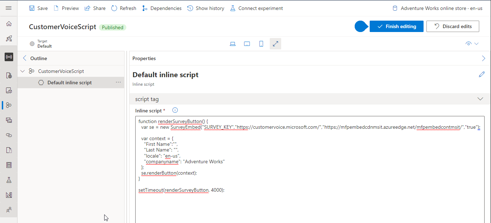

---
# required metadata

title: Integrate Customer Voice into an e-commerce page
description: 
author: samjarawan
ms.date: 09/14/2021
ms.topic: overview
ms.prod: 
ms.technology: 

# optional metadata

# ms.search.form: 
audience: Developer
# ms.devlang: 
ms.reviewer: v-chgri
# ms.tgt_pltfrm: 

ms.assetid: 
ms.search.region: Global
# ms.search.industry: 
ms.author: samjar
ms.search.validFrom: 2019-10-31
ms.dyn365.ops.version: Release 10.0.5

---
# Integrate Customer Voice into an e-commerce page

[!include [banner](../includes/banner.md)]

[Customer Voice](https://dynamics.microsoft.com/customer-voice/overview/) can be used to collect, analyze and track real-time feedback within your e-commerce web site.  This topic will cover the steps needed to integrate the service into the Dynamics 365 Commerce e-commerce platform.

As a pre-requisite you will require an account within Dynamics 365 Customer Voice and have created the desired survey. 

## Service Integration
1. Select the survey you will be using from the [Customer Voice](https://customervoice.microsoft.com/Pages/ProjectPage.aspx.) portal.
2. Select the **Send** tab and the **Embed** link which will provide the necessary code to embed within the site builder tool and select the type of survey you want as shown below.  We'll use the **Button** type for this example.


The above code will be split into 3 parts described in the below sections.

### External script link

The external script block needs to be embedded on any pages that will have a Customer Service survey.  The best way to do this is to create a fragment that holds the script and embed the fragment on the page template(s). The script that will be embedded looks like this:

```html
<script src=https://mfpembedcdnmsit.azureedge.net/mfpembedcontmsit/Embed.js type="text/javascript"></script>
```

To embed the above external script, create a fragment in site builder based off the [External script](script-module.md) module then add the URL to the **Script source** configuration as shown in the below image.


### External style sheet

The external stylesheet needs to be embedded on any pages that will have a survey. The best way is to create a fragment and ensure the fragment is added to the appropriate page template(s). The stylesheet link looks like this:

```html
<link rel="stylesheet" type="text/css" href=https://mfpembedcdnmsit.azureedge.net/mfpembedcontmsit/Embed.css />
```

To embed the above link, create a fragment in site builder based off the [Metatags](metatags-module.md) module and paste the link into the **Meta Tags** configuration field as shown below:


### Inline script

The inline script provided by Customer Voice needs to be embedded as an inline script. The below is just a sample and note the **SURVEY_KEY** should match the one provided by Customer Voice.  Also notice the last line which calls the code to render the survey button after 1 second to ensure time is given for the scripts to be loaded.  You may also need to add other meta data such as company name if needed, this will be dependent on if your survey requires it.  

```html
function renderSurveyButton() {
  var se = new SurveyEmbed("SURVEY_KEY","https://customervoice.microsoft.com/","https://mfpembedcdnmsit.azureedge.net/mfpembedcontmsit/","true");

  var context = {
    "First Name":"",
    "Last Name": "",
    "locale": "en-us",
    "companyname": "Adventure Works"
  };
  se.renderButton(context);
}

setTimeout(renderSurveyButton, 4000);
```

The below image shows the above code added an [inline script](script-module.md) module.




## Enable scripts on e-commerce site

Once the fragments have been created, they can be added to the page templates that you plan to use them on. The below screenshot shows the three fragments added to a product details page template.  Once the changes are published the survey will appear on the pages they were added to.


## Content security policy

After making the above changes, the survey should fail to load due to content security policy since the web site by default can't call out to other services. To see errors caused by this, open developer tools within a browser (F12) and navigate to the page that has the survey and notice CSP errors in the console output.

To fix these errors, from within site builder, select the **Extensions** tab on the bottom left and then the **Content security policy** tab and add the following URLs:

* Add "https://customervoice.microsoft.com/" to **child-src**
* Add "https://customervoice.microsoft.com/" to **frame-src**
* Add "https://mfpembedcdnmsit.azureedge.net" and "*.azureedge.net" to the **img-src** section

Below shows where to add some of these:


* 


