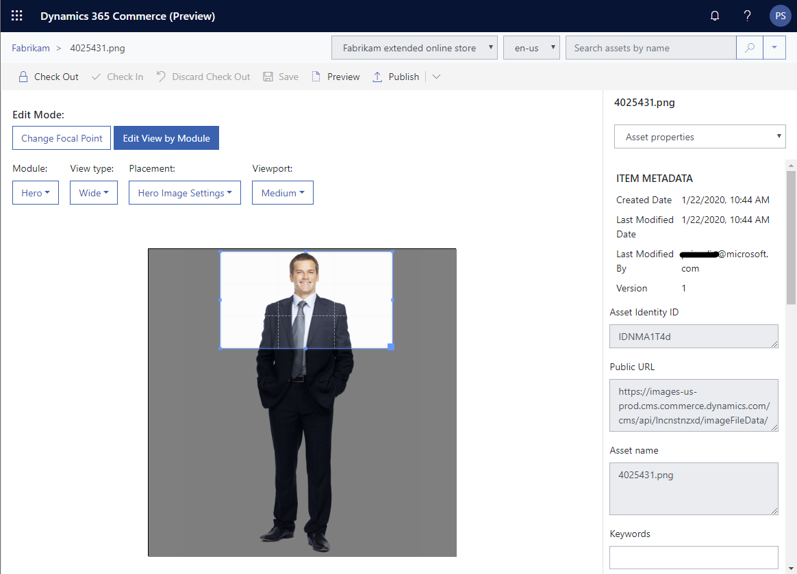

---

# required metadata

title: Crop images
description: This topic describes how to crop images in Microsoft Dynamics 365 Commerce site builder.
author: psimolin
manager: annbe
ms.date: 02/26/2020
ms.topic: article
ms.prod: 
ms.service: dynamics-365-commerce
ms.technology: 

# optional metadata

# ms.search.form: 
# ROBOTS: 
audience: Application User
# ms.devlang: 
ms.reviewer: v-chgri
ms.search.scope: Retail, Core, Operations
# ms.tgt_pltfrm: 
ms.custom: 
ms.assetid: 
ms.search.region: Global
ms.search.industry: 
ms.author: psimolin
ms.search.validFrom: 2019-10-31
ms.dyn365.ops.version: 
---

# Crop images

[!include [banner](../includes/banner.md)]

This topic describes how to crop images in Microsoft Dynamics 365 Commerce site builder.

## Crop an image in site builder

To crop an image in site builder, follow these steps.

1. In the left navigation pane of Commerce site builder, select **Media Library**.
1. In the main window, select the image you want to modify.
1. On the command bar, select **Edit** to check out the file.
1. Select the image to enter **Edit Mode**.
1. Under **Edit Mode**, select **Edit View by Module**.
1. Select the module type from the **Module** drop down menu.
1. Select the view type from the **View type** drop down menu.
1. Select the image placement from the **Placement** drop down menu.
1. Select the viewport size from the **Viewport** drop down menu.
1. The image is overlaid with the area representing the crop region. Move and resize the crop region as needed. The aspect ratio is automatically maintained.
1. When done, on the command bar select **Save**, and then select **Finish editing**. 

Custom cropping will be reflected on the image almost immediately.

## Additional resources

[Digital asset management overview](dam-overview.md)

[Upload images](dam-upload-images.md)

[Upload video](dam-upload-video.md)

[Upload files](dam-upload-files.md)

[Customize image focal points](dam-custom-focal-point.md)
