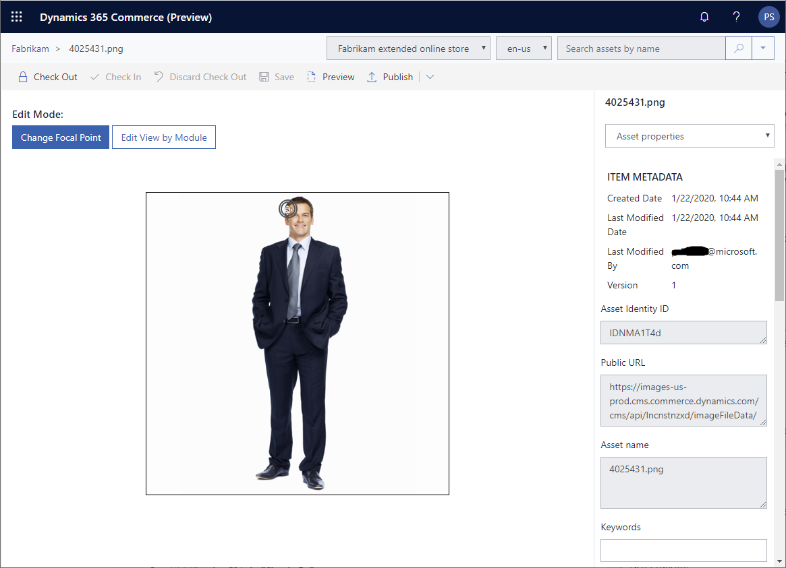

---

# required metadata

title: Customize image focal points
description: This topic describes how to customize image focal points in Microsoft Dynamics 365 Commerce.
author: psimolin
manager: annbe
ms.date: 02/24/2020
ms.topic: article
ms.prod: 
ms.service: dynamics-365-commerce
ms.technology: 

# optional metadata

# ms.search.form: 
# ROBOTS: 
audience: Application User
# ms.devlang: 
ms.reviewer: v-chgri
ms.search.scope: Retail, Core, Operations
# ms.tgt_pltfrm: 
ms.custom: 
ms.assetid: 
ms.search.region: Global
ms.search.industry: 
ms.author: psimolin
ms.search.validFrom: 2019-10-31
ms.dyn365.ops.version: 
---

# Customize image focal points

[!include [banner](../includes/banner.md)]

This topic describes how to customize image focal points in Microsoft Dynamics 365 Commerce.

# Overview

When an image is uploaded to the DAM, the system attempts to determine the focal point of the image. For example, if the image has a person on it, the system will set the focal point to the face of the person by default. In most cases the automatically set focal point and cropping works very well for all viewports. Occasionally you might want to adjust the focal point or define custom crop for an image to ensure that specific part of the image is always visible or if the image needs to be cropped in a certain special way.

In order to manually set a focal point or define custom cropping for specific module and viewport, you need to follow these steps:

### Define a custom focal point for an image

To define a custom focal point for an image, follow these steps.

1. Make sure you have the "Assets"-tab selected
1. Select the image asset you want to modify
1. Make sure the image asset is checked out to you. Check out if necessary by clicking "Check Out"
1. Click "Edit Focal Point"
1. Image will be opened in edit mode and you will see the focal point editor in the view
1. Current focal point is marked with a double circle
1. In order to manually specify a focal point, click the image on the point you want the focal point to be set at
1. Click "Check In"
1. Click "Publish"

## Additional resources

[Digital asset management overview](dam-overview.md)

[Upload images](dam-upload-images.md)

[Upload video](dam-upload-video.md)

[Upload files](dam-upload-files.md)

[Crop images](dam-crop-images.md)
