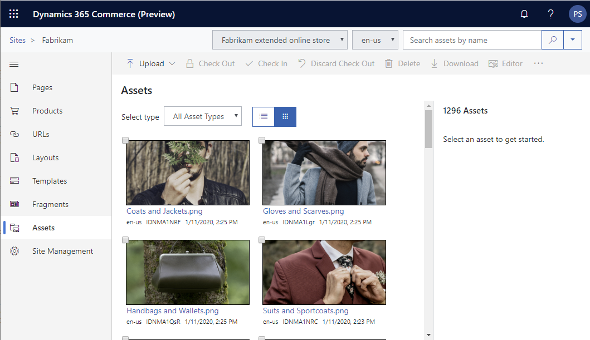
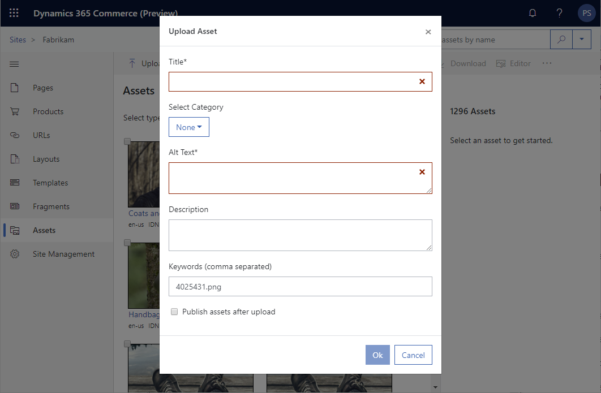
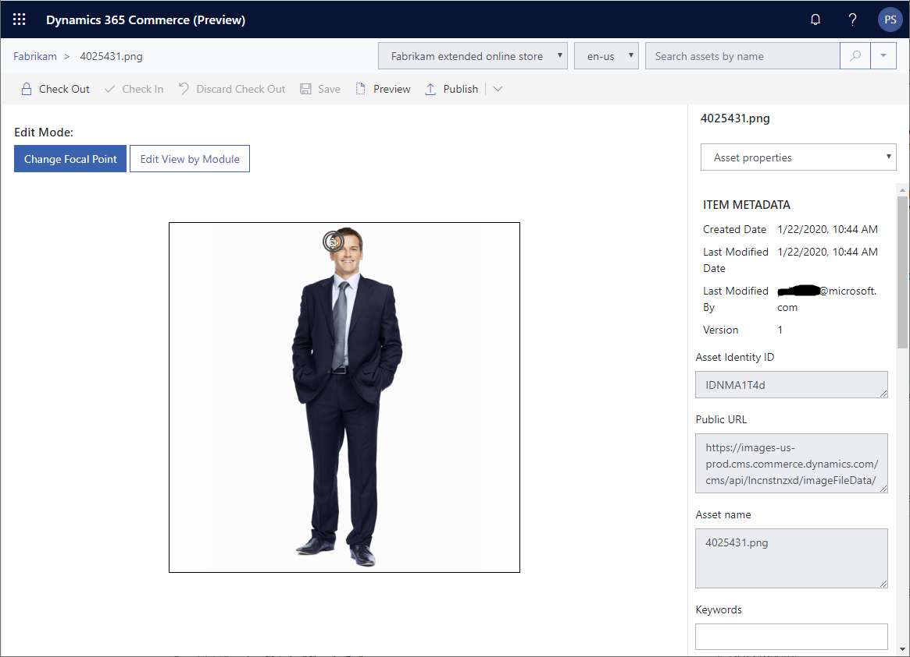

---

# required metadata

title: Digital asset management overview
description: This topic provides an overview of digital asset management in Microsoft Dynamics 365 Commerce.
author: psimolin
manager: annbe
ms.date: 02/24/2020
ms.topic: article
ms.prod: 
ms.service: dynamics-365-commerce
ms.technology: 

# optional metadata

# ms.search.form: 
# ROBOTS: 
audience: Application User
# ms.devlang: 
ms.reviewer: v-chgri
ms.search.scope: Retail, Core, Operations
# ms.tgt_pltfrm: 
ms.custom: 
ms.assetid: 
ms.search.region: Global
ms.search.industry: 
ms.author: psimolin
ms.search.validFrom: 2019-10-31
ms.dyn365.ops.version: 
---

# Digital asset management overview

[!include [banner](../includes/banner.md)]

This topic provides an overview of digital asset management in Microsoft Dynamics 365 Commerce.

## Overview

Dynamics 365 Commerce features rich digital asset management functionality, including support for the following:
- Image assets
- Video assets
- Other type of binary assets such as PDF- and Office-documents
- Localized images
- Folder uploads
- Custom cropping of image assets
- Omni-channel image assets (product, product variants, catalog, category, worker and customer images)

Digital assets are channel-specific, with the exception of omni-channel assets which are e-commerce environment-wide by default. Digital assets and the management features are located under **Assets** in the left navigation pane within a site.

<!--
### Upload an image

To bulk upload a folder of images, follow these steps.

To upload an image, first navigate to the "Assets"-tab. Assets for selected site, channel and locale are shown in the middle pane.

In order to upload a new image, click "Upload" from the action bar, then click "Upload Assets". File dialog will open which allows you to select one or more image assets. Supported image formats are JPEG, PNG and GIF.

After selecting the images you wish to upload, click "Open" (title might vary per browser). The tool will perform image path validation and you will be shown the "Upload Asset"- or "Upload Assets"-dialog depending on the number of images selected.

Single image:

Multiple images:

This dialog allows entering the image meta data, image category information and whether the assets should be published automatically after upload. If more than one image is being uploaded, only category, keywords and publishing information can be entered.

* *Title, Alt Text, Description, Keywords* - Meta data of the image or images
* *Select category*
	* None - e-Commerce Storytelling image
	* Product, Category, Customer, Employee, Catalog - Dynamics 365 Commerce Omni-channel image
* *Publish assets after upload* - Whether the image or images are published right after upload finishes

After entering the information, click OK. Image upload will start. If you are uploading multiple images, you will see the progress dialog on the screen.

After the upload completes, you will see the images appear in the middle pane and you can start using them.

Note: You should always upload the version of the image with highest resolution and quality. The image resizer component will automatically optimize the image for different viewports/breakpoints.

### Upload a folder of images

To bulk upload a folder of images, follow these steps.

1. Navigate to the "Assets"-tab of the site
1. Click "Upload" from the action bar, then choose "Upload folder"
1. Select the folder you want to upload, then click "Upload"
1. Confirmation dialog will appear. Press "Upload"
1. After validation, you are asked to enter the common metadata for the images. Click "Ok" to proceed
1. Folder upload will start and you will be shown a progress bar while waiting
1. After upload has finished, you are sent back to the "Assets"-view

### Naming conventions for omni-channel images 

If you have configured the DAM as the omni-channel image backend, you can use image categories to indicate which category the uploaded image belongs to. There is also a naming convention that needs to be followed to make sure that images are retrieved correctly by other channels (such as POS).

The default naming convention varies based on the category:
* Catalog images should be named "**/Catalogs/\{LanguageId\}/\{CatalogName\}.jpg**"
* Category images should be named "**/Categories/\{CategoryName\}.png**"
* Customer images should be named "**/Customers/\{CustomerNumber\}.jpg**"
* Employee images should be named "**/Workers/\{WorkerNumber\}.jpg**"
* Product images should be named "**/Products/\{ProductNumber\}_000_001.png**"
	* 001 is the sequence of the image and it can be 001, 002, 003, 004 or 005
* Product variant images should be named "**/Products/\{ProductNumber\} ^ ^ \{Size\} ^ \{Color\} ^\{Style\}_000_001.png**"

Note: Image assets with category are also automatically tagged with the category as keyword to allow searching for assets of specific category

## Upload a video

Uploading a video follows almost the same steps as uploading an image.

1. Click "Upload"
1. Click "Upload Assets"
1. Select one or more video files and click "Open"
1. Enter meta data and other information
1. Click "Ok"

If you are uploading multiple types of assets at the same time (e.g. images and videos), in the "Upload Assets"-dialog you will only be able to specify the keywords, publishing information and if closed captions are generated automatically for video files. All the assets will share the specific keywords.

If single video is being uploaded, you will be able to specify the following information in the "Upload Asset"-dialog:
* *Title, Description, Keywords* - Meta data
* *Automatically generate closed captions* - If closed captions should be automatically generated for the video
* *Closed Caption* - Manually specify the closed captions to be used
* *Regular Audio* - Manually specify the regular audio track
* *Thumbnail* - Specify the thumbnail for the video. If not specified, it will be generated automatically
* *Descriptive Audio* - Manually specify the descriptive audio track

Note: You should always upload the version of the video with highest bitrate and resolution. The video will be converted automatically to be suitable for different viewports/breakpoints.

## Upload other binary assets

Digital asset management also supports other types of binary assets. For example, you might want to upload a PDF-, Excel-, Word- or PowerPoint-document.

The upload process is similar to image and video assets.

1. Click "Upload"
1. Click "Upload Assets"
1. Select one or more files and click "Open"
1. Enter meta data and other information
1. Click "Ok"

* *Title, Description, Keywords* - Meta data of the file or files
* *Publish assets after upload* - Whether the file or files are published right after upload finishes

List is allowed document types
* JPG, JPEG, PNG, GIF, MP4, MPG, MPEG, AVI, WMV, DOC, DOCX, ODT, PDF, RTF, TXT, XLS, XLSX, ODS, PPT, PPTX, ODP, INDD, PS, QXP, EPUB, MP3, TGZ, JAR, RAR, TAR, ZIP, 7Z, SVG, JS, XML, CSS, CS

# Define custom focal point and custom cropping for an image

When an image is uploaded to the DAM, the system attempts to determine the focal point of the image. For example, if the image has a person on it, the system will set the focal point to the face of the person by default. In most cases the automatically set focal point and cropping works very well for all viewports. Occasionally you might want to adjust the focal point or define custom crop for an image to ensure that specific part of the image is always visible or if the image needs to be cropped in a certain special way.

In order to manually set a focal point or define custom cropping for specific module and viewport, you need to follow these steps:

### Define a custom focal point for an image

To define a custom focal point for an image, follow these steps.

1. Make sure you have the "Assets"-tab selected
1. Select the image asset you want to modify
1. Make sure the image asset is checked out to you. Check out if necessary by clicking "Check Out"
1. Click "Edit Focal Point"
1. Image will be opened in edit mode and you will see the focal point editor in the view
1. Current focal point is marked with a double circle
1. In order to manually specify a focal point, click the image on the point you want the focal point to be set at
1. Click "Check In"
1. Click "Publish"

### Define custom cropping for an image

To define custom cropping for an image, follow these steps.

1. Make sure you have the "Assets"-tab selected
1. Select the image asset you want to modify
1. Make sure the image asset is checked out to you. Check out if necessary by clicking "Check Out"
1. Click "Edit Focal Point"
1. Image will be opened in edit mode and you will see the focal point editor in the view
1. Click "Edit View by Module"
1. Choose the module, view type, placement and viewport you wish to set the custom crop rules on e.g. Hero, Wide, Hero Image Settings, Medium
1. View is overlaid with the area representing the crop region. Move and resize the crop region as you wish. Aspect ratio is automatically maintained.
1. Click "Check In"
1. Click "Publish"

Manually set focal point or custom cropping will be reflected on the image almost immediately.

-->

## Additional resources

[Upload images](dam-upload-images.md)

[Upload video](dam-upload-video.md)

[Upload files](dam-upload-files.md)

[Crop images](dam-crop-images.md)

[Customize image focal points](dam-custom-focal-point.md)
