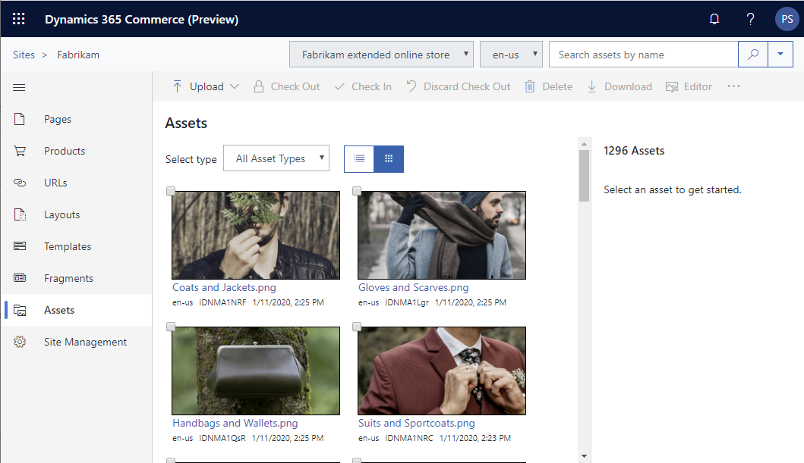
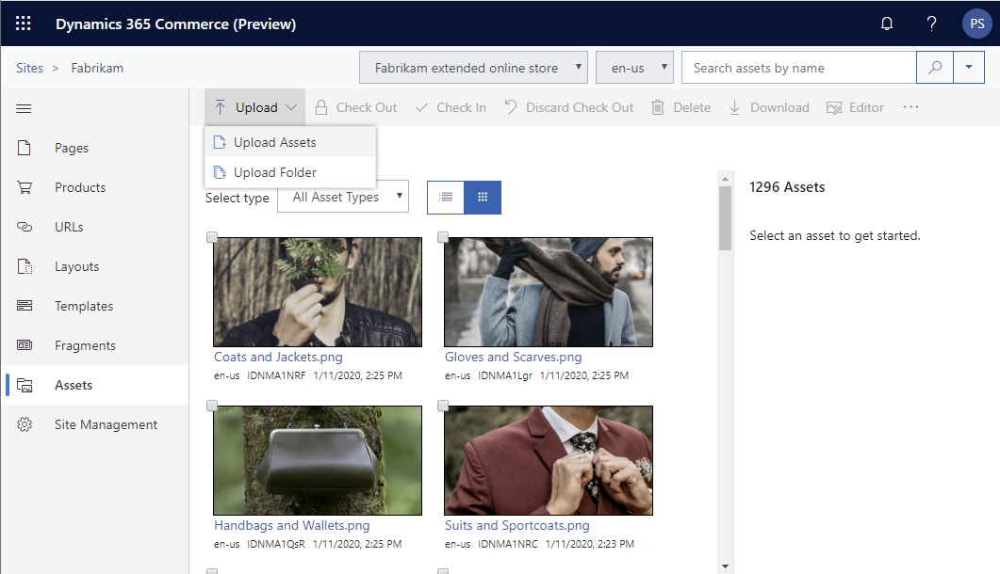
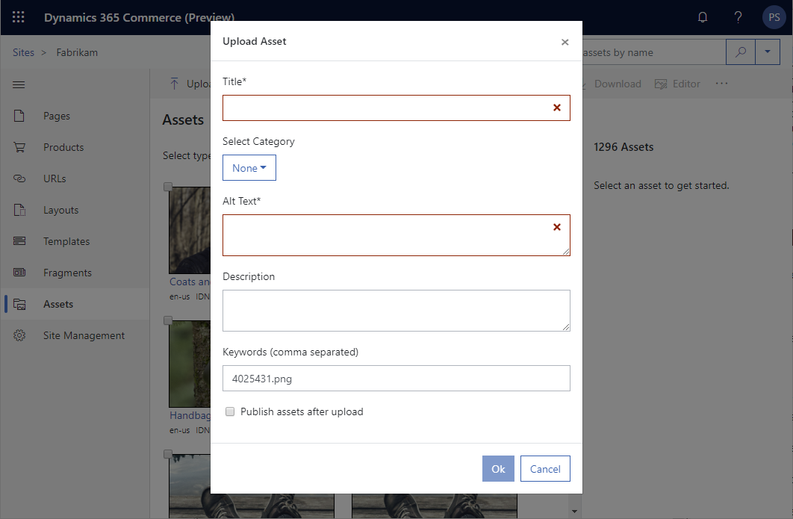

---
# required metadata

title: Upload images
description: This topic describes how to upload images in Microsoft Dynamics 365 Commerce product.
author: psimolin
manager: annbe
ms.date: 02/26/2020
ms.topic: article
ms.prod: 
ms.service: dynamics-365-commerce
ms.technology: 

# optional metadata

# ms.search.form: 
# ROBOTS: 
audience: Application User
# ms.devlang: 
ms.reviewer: v-chgri
ms.search.scope: Retail, Core, Operations
# ms.tgt_pltfrm: 
ms.custom: 
ms.assetid: 
ms.search.region: Global
ms.search.industry: 
ms.author: psimolin
ms.search.validFrom: 2019-10-31
ms.dyn365.ops.version: 
---

# Upload images

[!include [banner](../includes/banner.md)]

This topic describes how to upload images in Microsoft Dynamics 365 Commerce product.

## Overview

## Upload an image

To upload images in site builder, follow these steps.

1. In the left navigation pane, select **Media Library**.
1. On the command bar, select **Upload \> Upload Media Items**.
1. In the File Explorer window, navigate to and select one or more image files to upload, and then select **Open**.
1. In the **Upload Media Item** dialog box, enter the required title and alt text.
1. Enter optional description and keywords and select a category if desired. 
1. If you want to publish the image(s) after immediately upload, select the **Publish media items after upload** check box
1. Select **OK**.

To bulk upload a folder of images, follow these steps.

To upload an image, first navigate to the "Assets"-tab. Assets for selected site, channel and locale are shown in the middle pane.

In order to upload a new image, click "Upload" from the action bar, then click "Upload Assets". File dialog will open which allows you to select one or more image assets. Supported image formats are JPEG, PNG and GIF.

After selecting the images you wish to upload, click "Open" (title might vary per browser). The tool will perform image path validation and you will be shown the "Upload Asset"- or "Upload Assets"-dialog depending on the number of images selected.

Single image:

Multiple images:

This dialog allows entering the image meta data, image category information and whether the assets should be published automatically after upload. If more than one image is being uploaded, only category, keywords and publishing information can be entered.

* *Title, Alt Text, Description, Keywords* - Meta data of the image or images
* *Select category*
	* None - e-Commerce Storytelling image
	* Product, Category, Customer, Employee, Catalog - Dynamics 365 Commerce Omni-channel image
* *Publish assets after upload* - Whether the image or images are published right after upload finishes

After entering the information, click OK. Image upload will start. If you are uploading multiple images, you will see the progress dialog on the screen.

After the upload completes, you will see the images appear in the middle pane and you can start using them.

Note: You should always upload the version of the image with highest resolution and quality. The image resizer component will automatically optimize the image for different viewports/breakpoints.

## Upload a folder of images

To bulk upload a folder of images, follow these steps.

1. Navigate to the "Assets"-tab of the site
1. Click "Upload" from the action bar, then choose "Upload folder"
1. Select the folder you want to upload, then click "Upload"
1. Confirmation dialog will appear. Press "Upload"
1. After validation, you are asked to enter the common metadata for the images. Click "Ok" to proceed
1. Folder upload will start and you will be shown a progress bar while waiting
1. After upload has finished, you are sent back to the "Assets"-view

## Naming conventions for omni-channel images 

If you have configured the DAM as the omni-channel image backend, you can use image categories to indicate which category the uploaded image belongs to. There is also a naming convention that needs to be followed to make sure that images are retrieved correctly by other channels (such as POS).

The default naming convention varies based on the category:
* Catalog images should be named "**/Catalogs/\{LanguageId\}/\{CatalogName\}.jpg**"
* Category images should be named "**/Categories/\{CategoryName\}.png**"
* Customer images should be named "**/Customers/\{CustomerNumber\}.jpg**"
* Employee images should be named "**/Workers/\{WorkerNumber\}.jpg**"
* Product images should be named "**/Products/\{ProductNumber\}_000_001.png**"
	* 001 is the sequence of the image and it can be 001, 002, 003, 004 or 005
* Product variant images should be named "**/Products/\{ProductNumber\} ^ ^ \{Size\} ^ \{Color\} ^\{Style\}_000_001.png**"

> [!NOTE]
> Image assets with category are also automatically tagged with the category as keyword to allow searching for assets of specific category.

## Additional resources

[Digital asset management overview](dam-overview.md)

[Upload video](dam-upload-video.md)

[Upload files](dam-upload-files.md)

[Crop images](dam-crop-images.md)

[Customize image focal points](dam-custom-focal-point.md)
