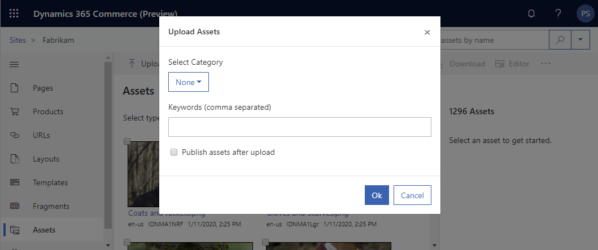

# required metadata

title: Upload images
description: This topic describes how to upload videos in Microsoft Dynamics 365 Commerce.
author: psimolin
manager: annbe
ms.date: 02/26/2020
ms.topic: article
ms.prod: 
ms.service: dynamics-365-commerce
ms.technology: 

# optional metadata

# ms.search.form: 
# ROBOTS: 
audience: Application User
# ms.devlang: 
ms.reviewer: v-chgri
ms.search.scope: Retail, Core, Operations
# ms.tgt_pltfrm: 
ms.custom: 
ms.assetid: 
ms.search.region: Global
ms.search.industry: 
ms.author: psimolin
ms.search.validFrom: 2019-10-31
ms.dyn365.ops.version: 
---

# Upload images

[!include [banner](../includes/banner.md)]

This topic describes how to upload videos in Microsoft Dynamics 365 Commerce.

## Upload a video

Uploading a video follows almost the same steps as uploading an image.

To upload a video in site builder, follow these steps.

1. In the left navigation pane, select **Media Library**.
1. On the command bar, select **Upload \> Upload Media Items**.
1. In the File Explorer window, navigate to and select one or more video files to upload, and then select **Open**.
1. In the **Upload Media Item** dialog box, enter the required title and alt text.
1. Enter optional description and keywords and select a category if desired. 
1. If you want to publish the image(s) after immediately upload, select the **Publish media items after upload** check box
1. Select **OK**.

If you are uploading multiple types of assets at the same time (e.g. images and videos), in the "Upload Assets"-dialog you will only be able to specify the keywords, publishing information and if closed captions are generated automatically for video files. All the assets will share the specific keywords.

If single video is being uploaded, you will be able to specify the following information in the "Upload Asset"-dialog:
* *Title, Description, Keywords* - Meta data
* *Automatically generate closed captions* - If closed captions should be automatically generated for the video
* *Closed Caption* - Manually specify the closed captions to be used
* *Regular Audio* - Manually specify the regular audio track
* *Thumbnail* - Specify the thumbnail for the video. If not specified, it will be generated automatically
* *Descriptive Audio* - Manually specify the descriptive audio track

> [NOTE]
> You should always upload the version of the video with highest bitrate and resolution. The video will be converted automatically to be suitable for different viewports/breakpoints.
