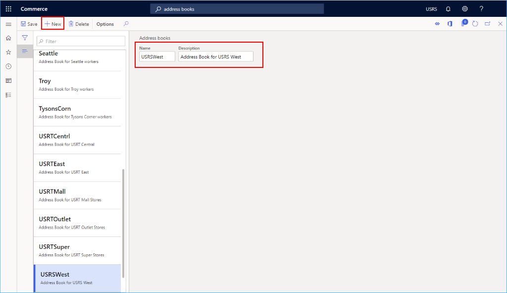

---
# required metadata

title: Create a default customer
description: This topic describes how to create a default customer to use when creating a channel in Microsoft Dynamics 365 Commerce.
author: samjarawan
ms.date: 01/27/2020
ms.topic: article
ms.prod: 
ms.technology: 

# optional metadata

# ms.search.form: 
audience: Application User
# ms.devlang: 
ms.reviewer: v-chgri
# ms.tgt_pltfrm: 
ms.custom: 
ms.assetid: 
ms.search.region: Global
# ms.search.industry: 
ms.author: samjar
ms.search.validFrom: 2020-01-20
ms.dyn365.ops.version: Release 10.0.8

---
# Create a default customer

[!include [banner](includes/banner.md)]

This topic describes how to create a default customer to use when creating a channel in Microsoft Dynamics 365 Commerce.

When creating a channel, you will need to provide a default customer. A default customer can easily be created after first creating the customer group and customer address book.

## Create a customer group

If no customer groups exist yet, you can create one. Examples may be groups to represent different customer groups, such as wholesale, retail, Internet, Employees, etc.

To create a customer group, follow these steps.

1. In the navigation pane, go to **Modules \> Retail and commerce \> Customers \> Customer groups**.
1. On the action pane, select **New**.
1. In the **Customer group** box, enter a customer group ID.
1. In the **Description** box, enter an appropriate description.
1. In the **Terms of payment** box, enter an appropriate value.
1. In the **Time between invoice due date and payment date** box, enter an appropriate value.
1. In the **Default tax group** box, enter a tax group if applicable.
1. Select the **Prices include sales tax** check box if applicable.
1. In the **Default write-off reason** box, enter an appropriate value, if applicable.

The following image shows several configured customer groups.

## Create a customer address book

A customer needs to be associated with an address book. If one has not yet been created, then you will need to create one.

To create a customer address book, follow these steps.

1. In the navigation pane, go to **Modules \> Retail and commerce \> Channel setup \> Address Books**.
1. On the action pane, select **New**.
1. In the **Name** box, enter a name.
1. In the **Description** box, enter a description.
1. On the action pane, select **Save**.

The following image shows an example address book.

## Create a default customer

To create a default customer, follow these steps.

1. In the navigation pane, go to **Modules \> Retail and commerce \> Customers \> All customers**.
1. On the action pane, select **New**.
1. In the **Type** drop-down list, select "Person".
1. In the **Customer account** drop-down list, select or enter an account number (for example, "100001").
1. In the **First name** drop-down list, select or enter a name (for example, "Default").
1. In the **Middle name** drop-down list, select or enter a name (for example, "Retail").
1. In the **Last name** drop-down list, select or enter a name (for example, "Customer").
1. In the **Currency** drop-down list, select or enter a currency (for example, "USD").
1. In the **Currency** drop-down list, select the customer group created previously.
1. In the **Address books**  drop-down list, select an existing customer address book.
1. Select **Save** to save and return to customer details screen for the new customer.

> [!NOTE]
> It is not necessary to add an address for a default customer.

The following image shows an example of customer creation.

The following image shows a default customer configuration.

Most of the default values on the customer detials screen can remain, but two values should be changed.

1. On the customer details screen, expand **Sales order defaults**.
1. In the **Site** drop-down list, select or enter a pre-configured site.
1. In the **Warehouse** drop-down list, and select or enter a pre-configured warehouse.

The following image shows an example customer configuration.

## Additional resources

[Channels overview](channels-overview.md)

[Channel setup prerequisites](channels-prerequisites.md)

[!INCLUDE[footer-include](../includes/footer-banner.md)]
