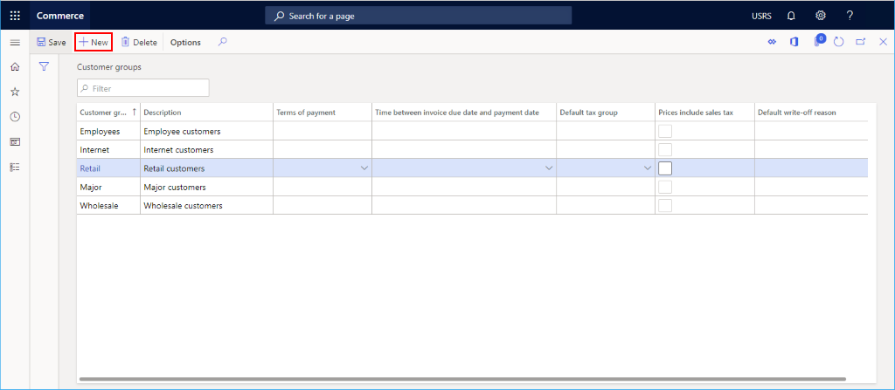

---
# required metadata

title: Default customer
description: This topic presents an overview of how to create a default customer in Microsoft Dynamics 365 Commerce for use when creating a channel.
author: samjarawan
manager: annbe
ms.date: 10/01/2019
ms.topic: article
ms.prod: 
ms.service: dynamics-365-commerce
ms.technology: 

# optional metadata

# ms.search.form: 
audience: Developer
# ms.devlang: 
ms.reviewer: v-chgri
ms.search.scope: Retail, Core, Operations
# ms.tgt_pltfrm: 
ms.custom: 
ms.assetid: 
ms.search.region: Global
# ms.search.industry: 
ms.author: samjar
ms.search.validFrom: 2019-10-31
ms.dyn365.ops.version: Release 10.0.8

---
# Default customer

[!include [banner](../includes/preview-banner.md)]
[!include [banner](../includes/banner.md)]

This topic presents an overview of how to create a default customer in Microsoft Dynamics 365 Commerce for use when creating a channel.

## Overview
When creating a retail or online channel, you will need to provide a default customer.  Default customers can easily be created following the below steps including prerequisites of creating a customer group and a customer address book.

## Create a customer group
If no customer groups exist yet, you can create one.  Examples may be groups to represent different customer groups such as wholesale, retail, Internet, Employees, ...

* Go to **Navigation pane** > **Modules** > **Retail** > **Customers** > **Customer groups**.
* On the **Action pane**, click **New**.
* In the **Customer group**, provide an ID.
* In the **Description** field, provide a descriptive description.
* Select an appropriate **Terms of payment** for the customer group and **Time between invoice due date and payment date**.
* Select a **Default tax group** if applicable.
* Select **Prices include sales tax** if applicable.
* Select a **Default write-off reason** if applicable.

The below example shows several customer groups configured.

## Create a customer address book
A customer needs to be associated with an address book, if one is not created then follow these steps to create one.
* Go to **Navigation pane** > **Modules** > **Retail** > **Channel setup** > **Address Books**.
* On the **Action pane**, click **New**.
* In the **Name** field, provide a name.
* In the **Description** field, provide a description.

Below is an example address book.

## Create a customer
* Go to **Navigation pane** > **Modules** > **Retail** > **Customers** > **All customers**.
* On the **Action pane**, click **New**.
* In the **Type** field, select "Person".
* In the **Customer account** field, provide an account number. "100001" is used in the example below.
* In the **First name** field, provide a name such as "Default" used in the example below.
* In the **Middle name** field, provide a name such as "Retail" used in the example below.
* In the **Last name** field, provide a name such as "Customer" used in the example below.
* In the **Currency** field, provide a currency such as "USD".
* Select an appropriate **Customer group** created in the previous section.
* An address is not necessary for a default customer.
* Select a pre-configured customer **Address book**.
* Click the **Save** button to get back to the customer details for the new customer.

Below example shows a default customer configuration.

Most of the defaults for the customer can remain however there are some others that should be changed.
* Expand the **Sales order defaults**
  * Select the **Site** drop down and select a pre-configured site.
  * Select the **Warehouse** drop down and select a pre-configured warehouse.
  

