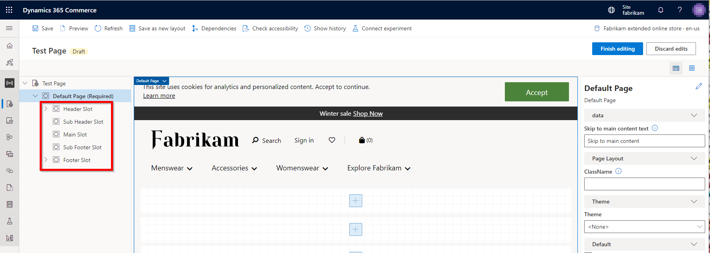
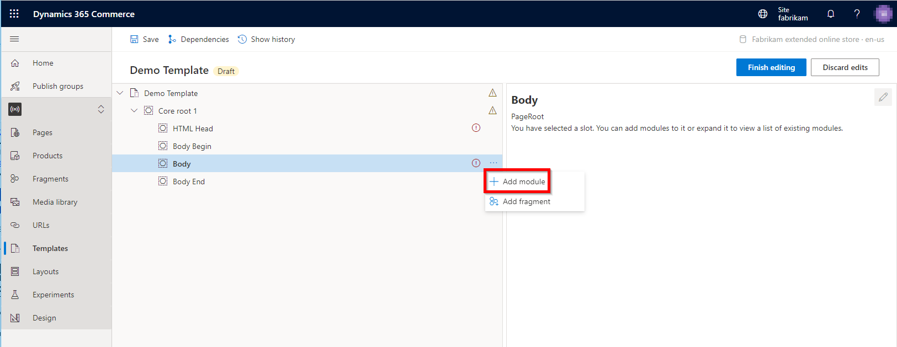
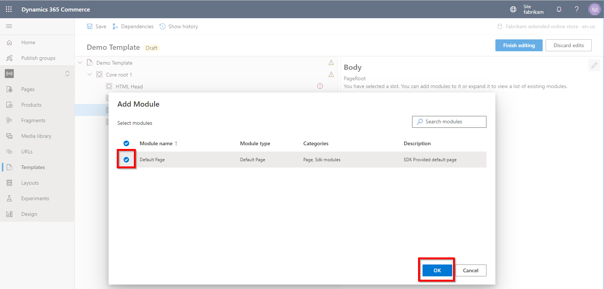
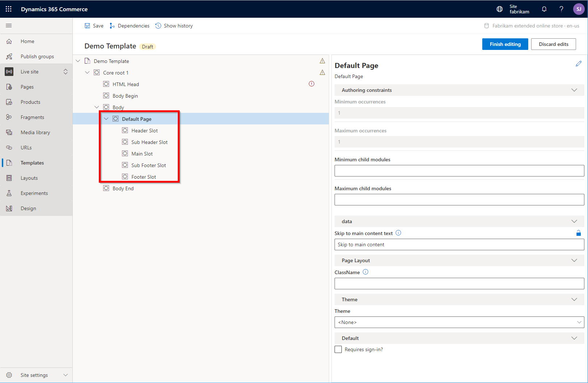

---
# required metadata

title: Default page module
description: This topic covers default page modules and describes how to add them to page templates in Microsoft Dynamics 365 Commerce.
author: samjarawan
ms.date: 04/02/2021
ms.topic: article
ms.prod: 
ms.technology: 

# optional metadata

# ms.search.form: 
audience: Developer
# ms.devlang: 
ms.reviewer: v-chgri
# ms.tgt_pltfrm: 
ms.custom: 
ms.assetid: 
ms.search.region: Global
# ms.search.industry: 
ms.author: samjar
ms.search.validFrom: 2019-10-31
ms.dyn365.ops.version: Release 10.0.5

---

# Default page module

[!include [banner](includes/banner.md)]

This topic covers default page modules and describes how to add them to page templates in Microsoft Dynamics 365 Commerce.

The default page module is a special module that becomes the root container of a page and can be added only to a template's **Body** slot. The default page module defines the core slots (**Header Slot**, **Sub Header Slot**, **Main Slot**, **Sub Footer Slot**, and **Footer Slot**) that appear in the Commerce site builder page editor, as shown in the following example illustration.

The Commerce module library provides only one type of default page module. However, you can use the [Commerce online channel extensibility software development kit (SDK)](e-commerce-extensibility/overview.md) to create additional, custom default page modules as you require.

## Page module properties

| Property name | Values | Description |
|---------------|--------|-------------|
| Skip to main content text | Text | The link text that should appear in the "skip to main content" link on the page. The default value is **Skip to main content**. |
| Theme | A theme that is selected in a list of available themes | The theme to use for the pages that are derived from this template.
<strong>Note:</strong> This property has been deprecated and will be removed in a future release. Themes should be set only at the site level.
 |
| Requires sign-in? | **True** or **False** | This Boolean property controls whether access to the page requires user sign-in. If it's set to **True**, users who aren't signed in will be redirected to the sign-in page. |

## Add a default page module to a template

To add a default page module to a template, follow these steps.

1. In Commerce site builder for your site, select **Templates**.
1. Select a template, and then select **Edit**.
1. In the **Body** slot, select the ellipsis (**...**), and then select **Add module**.

    

1. In the **Add Module** dialog box, select the **Default Page** module, and then select **OK**.

    

After the default page module is added, it should resemble the example in the following illustration. The module can now be configured, and the template can be saved and published.

## Additional resources

[Module library overview](starter-kit-overview.md)

[Page summary modules](page-summary-module.md)

[External and inline script modules](script-module.md)

[Metatags module](metatags-module.md)

[!INCLUDE[footer-include](../includes/footer-banner.md)]
