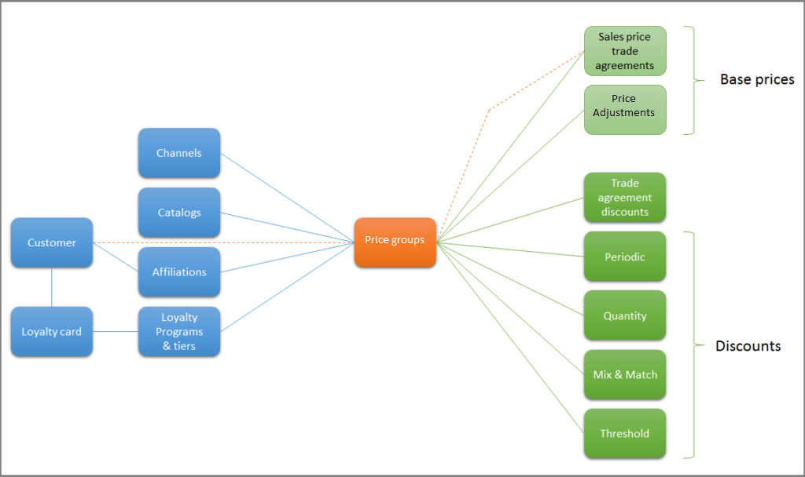

# Define channel-specific discounts

[!include [banner](includes/banner.md)]

This article reviews the concepts you need to know to create a discount for a specific channel.

## Channel-specific discounts

Retailers often offer different discounts in different channels. This may be done to address local market conditions or to deal with competing retailers.

Commerce uses price groups to define channel-specific discounts. Price groups can be assigned to one or more of the following entities: channels, catalogs, affiliations, and loyalty programs. This article discusses channels, but the same concepts apply to catalog discounts, affiliations discounts, and loyalty discounts.

## Price groups

The diagram above illustrates the relationship between entities that may be on a transaction (channel, catalog, affiliation, customer, loyalty card) and the various discount types that can be configured. All transactions occur in a channel, so the channel is guaranteed to be present on a transaction. The remaining entities are optional. On each master data pages there is a link to a related price groups page where you can view and add price groups as needed. A price group is used to relate four different types of entities to discounts, price adjustments, and trade agreements. We recommend that you plan a strategy for how you will name your price groups to keep them organized. One option would be to use a letter or number prefix or suffix to distinguish between the different types. For example, 1-xxxxx for channel price groups and 2-xxxxx for catalog price groups. There are four inquiry pages that focus on each of the commerce entities that can have discounts associated to them.

- **Channel channel price groups** – This page shows a list of channels and discounts linked together for each price group.
- **Catalog price groups** – This page shows a list of catalogs and discounts linked together for each price group.
- **Loyalty price groups** – This page shows a list of loyalty programs and discounts linked together for each price group.
- **Affiliation price groups** – This page shows a list of affiliations and discounts linked together for each price group.

## Example channel discount set up

The following example illustrates the tasks involved in setting up a channel discount.

1. For this example, you have a channel called **Houston**, and you're going to create a new discount called **Back-to-School**.
2. Because the pricing and discount strategy includes the possibility of channel discounts, you always create a channel-specific price group when you create a channel.
3. You have the price group **Houston-PG** and it is assigned to the **Houston** channel.
4. After you create the new **Back-to-School** discount, you need to click **Price groups** on the top of the **Discount** page. The **Discount price groups** page will open. Next, click **New** and select the **Houston-PG** price group.
5. Now you can enable the discount and push it to the channel.

## Additional resources

[Price adjustments and discounts](price-adjustments-discounts.md)

[!INCLUDE[footer-include](../includes/footer-banner.md)]
