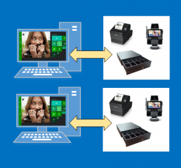

---
# required metadata

title: Connect peripherals to the point of sale (POS)
description: This article covers how to connect peripherals to your Retail POS.
author: BrianShook
ms.date: 01/30/2023
ms.topic: article
ms.prod: 
ms.technology: 

# optional metadata

ms.search.form: RetailTerminalTable, RetailDevice
# ROBOTS: 
audience: Application User
# ms.devlang: 
ms.reviewer: josaw
# ms.tgt_pltfrm: 
ms.assetid: 83f31ea6-f0a2-4501-9d4d-a37b6eec2599
ms.search.region: global
ms.search.industry: Retail
ms.author: brshoo
ms.search.validFrom: 2016-02-28
ms.dyn365.ops.version: AX 7.0.0, Retail July 2017 update

---

# Connect peripherals to the point of sale (POS)

[!include [banner](includes/banner.md)]

This article covers how to connect peripherals to your Retail POS.

> [!NOTE]
> For specific installation instructions, see [Configure and install Retail hardware station](retail-hardware-station-configuration-installation.md) and [Configure, install, and activate Modern POS (MPOS)](retail-modern-pos-device-activation.md).

## Key components

Several components are used to define the relationships among a store, the point-of-sale (POS) registers or channels within the store, and the peripherals that those registers or channels use to process transactions. This section describes each component and explains how it should be used in a store deployment.

### POS registers

Navigation: In Commerce headquarters, go to **Retail and Commerce \> Channel setup \> POS setup \> Registers**.

The POS register is an entity that is used to define the characteristics of a specific instance of the POS. These characteristics include the hardware profile or setup for peripherals that will be used at the register, the store that the register is mapped to, and the visual experience for the user who logs on to that register.

### Devices

Navigation: Go to **Retail and Commerce \> Channel setup \> POS setup \> Devices**.

A device is an entity that represents a physical instance of a device that is mapped to a POS register. When a device is created, it's mapped to a POS register. The device entity tracks information about when a POS register is activated, the type of client that is being used, and the application package that has been deployed to a specific device. 

Devices can be of the following types:
- Retail Modern POS
- Retail Modern POS - Android
- Retail Modern POS - iOS
- Store Commerce
- Store Commerce for web

> [!NOTE]
> Following the deprecation of the Retail hybrid apps for iOS and Android, the "Retail Modern POS - iOS" and "Retail Modern POS - Android" application types will be renamed to "Store Commerce for iOS" and "Store Commerce for Android", respectively.

#### Store Commerce app

Store Commerce app is a POS client application that is installed on Windows 10 or a later PC-based operating system. If the **Store Commerce app** application type is mapped to a device, the download package can be specified for a particular device. The download package can be customized to include different versions of the installation package. The ability to deploy different packages provides flexibility in cases where different POS registers might need different integrations. Store Commerce app is deployed together with a built-in hardware station.

#### Store Commerce for web

Store Commerce for web is a browser-based POS. Because it runs in the browser, Store Commerce for web doesn't require Windows 10 or a later PC-based operating system. If the **Store Commerce for web** application type is mapped to a specific device in headquarters, that device can be used through the browser with no need to download or install a package. Store Commerce for web requires a hardware station to use hardware beyond keyboard wedge based bar code scanning.

### Hardware profile

Navigation: Go to **Retail and Commerce \> Channel setup \> POS setup \> POS profiles \> Hardware profiles**.

A hardware profile identifies the hardware that is connected to a POS register through an integrated or shared hardware station. The hardware profile is also used to specify the payment processor parameters that should be used during communication with the payment software development kit (SDK). The payment SDK is deployed as part of the hardware station.

### Hardware station

Navigation: Go to **Retail and Commerce \> Channels \> Stores \> All stores**, select a store, and then select the **Hardware stations** FastTab.

A hardware station is an instance of business logic that drives POS peripherals. A hardware station is automatically installed together with the Store Commerce app. Alternatively, the hardware station can be installed as a stand-alone component, and then accessed by the Store Commerce app or Store Commerce for web through a web service. The hardware station must be defined at the channel level.

## Scenarios

### Store Commerce app with connected peripheral devices

To connect Store Commerce app to POS peripherals in a traditional, fixed POS scenario, first navigate to the register itself, and assign a hardware profile to it. You can find the POS registers at **Retail and Commerce \> Channel setup \> POS setup \> Registers**. 

After you've assigned the hardware profile, sync changes to the channel database by using the **Registers** distribution schedule. You can find the distribution schedules at **Retail and Commerce \> Retail and Commerce IT \> Distribution schedule**. 

Next, set up a dedicated hardware station on the channel. Go to **Retail and Commerce \> Channels \> Stores \> All stores**, and select a store. 

Then, on the **Hardware stations** FastTab, select **Add** to add a hardware station. Select **Dedicated** as the hardware station type, and then enter a description. The **Hardware profile** field can be left blank, because the hardware profile that is used in this scenario comes from the POS register itself. Then sync the changes to the channel by using the **Channel configuration** distribution schedule. You can find the distribution schedules at **Retail and Commerce \> Retail and Commerce IT \> Distribution schedule**. 

Finally, in the Store Commerce app, use the **Select hardware station** operation to select the hardware station that matches the value that you previously entered for the description, and set the hardware station to **Active**. 

> [!NOTE]
> - Some hardware profile changes, such as changes to cash drawers, require that a new shift be opened after the changes have been synced to the channel.
> - Store Commerce for web must use the stand-alone hardware station to communicate with peripherals.

### Store Commerce app or Store Commerce for web with a stand-alone hardware station

In this scenario, a standalone hardware station is shared by the Store Commerce app and Store Commerce for web clients. This scenario requires that you create a shared hardware station and specify the download package, port, and hardware profile that the hardware station uses. You define a new hardware station by selecting **the Hardware stations** FastTab in the specific channel (**Retail and Commerce \> Channels \> Stores \> All stores**) and adding a new hardware station of the **Shared** type. 

Next, provide a description that will help the cashier identify the hardware station. In the **Host name** field, enter the host machine URL in the following format: `https://<MachineName:Port>/HardwareStation`. (Replace **&lt;MachineName:Port&gt;** with the actual machine name of the hardware station.) For a standalone hardware station, you should also specify the electronic funds transfer (EFT) terminal ID. This value identifies the EFT terminal that is connected to the hardware station when the payment connector communicates with the payment provider. 

Next, from the machine that will host the hardware station, go to the channel in Headquarters, and select the hardware station. Then select **Download** to download the hardware station installer, and install the hardware station. For more information about how to install hardware station, see [Configure and install Retail hardware station](retail-hardware-station-configuration-installation.md). 

Next, from the Store Commerce app and Store Commerce for web, use the **Select hardware station** operation to select the hardware station that was previously installed. Select **Pair** to establish a secure relationship between the POS and the hardware station. This step must be completed once for every combination of a POS and a hardware station. 

After the hardware station is paired, the same operation is used to make the hardware station active while it's used. For this scenario, the hardware profile should be assigned to the shared hardware station instead of the register itself. If no hardware profile is directly assigned to a hardware station for some reason, the hardware profile that is assigned to the register will be used.

## Client maintenance

### Registers

POS registers are managed primarily through the registers themselves, and also through the profiles that are assigned to registers. Attributes that are specific to an individual register are managed at the register level. These attributes include the store where the register is used, the register number, the description, and the EFT terminal ID that is specific to the register itself.

### POS profiles

You can find the POS profiles at **Retail and Commerce** &gt; **Channel setup** &gt; **POS setup** &gt; **POS profiles**. It's useful to manage many aspects of a register through profiles, because the profiles can be shared among many registers. Profiles can be mapped either to an individual register or, if a profile is effective on a store-wide basis, to the store. The following sections describe the POS profiles and how they are used.

#### Offline profile

The offline profile is set at the store level. It's used to specify the upload settings for transactions that are performed on a POS register while that register isn't connected to the channel database.

#### Functionality profile

The functionality profile is set at the store level. It's used to specify store-wide settings about the functions that can be performed at the POS. The following capabilities are managed through the functionality profile. These capabilities are arranged by FastTab.

- **General** FastTab:

    - International Organization for Standardization (ISO).
    - Create a customer in offline mode.
    - Email receipt profile.
    - Central staff logon authentication.

- **Functions** FastTab:

    - Management of logon and extended logon.
    - Financial and currency-related aspects of the POS, such as the ability to key in prices and whether decimals are required for minor currency.
    - Enabling time registration through the POS.
    - How products and payments appear in the POS and on receipts.
    - End-of-day management.
    - Channel database transaction retention parameters.
    - How customers are looked up and created from the POS.
    - How discounts are calculated.

- **Amount** FastTab:

    - Maximum and minimum prices that are allowed.
    - Discount application and calculation.

- **Info codes** FastTab:

    - All aspects of how info codes are managed at the POS. For details, see [Info codes and info code groups](info-codes-retail.md).

- **Receipt numbering** FastTab:

    - Specify receipt numbering masks, which might include segments for the store number, terminal number, constants, and whether sales, returns, sales orders, and quotations are printed in separate sequences, or whether they all follow the same sequence.

#### Receipt profiles

Receipt profiles are assigned to printers within the hardware profile. They are used to specify the receipt types that are printed at a specific printer. The profiles include settings for the receipt formats, and settings that determine whether the receipt is always printed, or whether the cashier is prompted to decide whether the receipt must be printed. Different printers might also use different receipt profiles. For example, printer 1 is a standard thermal receipt printer, and therefore has smaller receipt formats. However, printer 2 is a full-size receipt printer that is used to print only customer order receipts, which require more space. For more information, see [Configure a receipt profile](configure-emailed-receipt-formats.md#configure-a-receipt-profile).

#### Hardware profiles

Hardware profiles are explained as a component for client setup earlier in this article. Hardware profiles are assigned directly to the POS register or to a shared hardware station, and are used to specify the types of devices that a specific POS register or hardware station uses. Hardware profiles are also used to specify the EFT settings that are used to communicate with the payment SDK.

#### Visual profiles

Visual profiles are used to specify the theme for a specific register and are assigned at the register level. The profiles include settings for the type of application that is used (Store Commerce app and Store Commerce for web), the accent color and theme, the font scheme, the sign-in page background, and the POS background. For more information, see [Create point of sale (POS) visual profiles](tasks/create-pos-visual-profile-2016-02.md). 

### Custom fields

You can create custom fields to add fields that aren't provided out of the box to the POS. For more information about how to use custom fields, see the [Working with custom fields blog post](https://blogs.msdn.microsoft.com/axsupport/2012/08/06/ax-for-retail-2012-working-with-custom-fields/).

### Language text

You can override default strings in the POS by using language text entries. To override a string in the POS, add a new language text line. Then specify an ID, the default string that should be overridden, and the text that should be shown at the POS instead of the default string.

### Channel reports configuration

You set up the reports that are available at the channel on the **Channel reports configuration** page. You can create new reports by providing the XML definition of the report and assigning the report to a specific permission group at the POS.

### Devices

Devices are explained earlier in this article. They are used to manage the activation of a specific POS register. Devices are also used to specify the application that is used for a specific register. Here are the device activation states:

- **Pending** – The device is ready to be activated.
- **Activated** – The device has been activated.
- **Deactivated** – The device has been deactivated either in Headquarters or through the POS.
- **Disabled** – The device has been disabled.

Additional activation-related information includes the worker who changed the activation status for the device, a time stamp for the activation, and whether the device configuration has been validated.

### Client data synchronization

All changes to a POS client, except changes in the device activation status, must be synced to the channel database to take effect. To sync changes to the channel database, navigate to **Retail and Commerce** &gt; **Retail and Commerce IT** &gt; **Distribution schedule**, and run the required distribution schedule. For client changes, you should run the **Registers** and **Channel configuration** distribution schedules.

## Additional resources

[Configure and install Retail hardware station](retail-hardware-station-configuration-installation.md)

[!INCLUDE[footer-include](../includes/footer-banner.md)]
