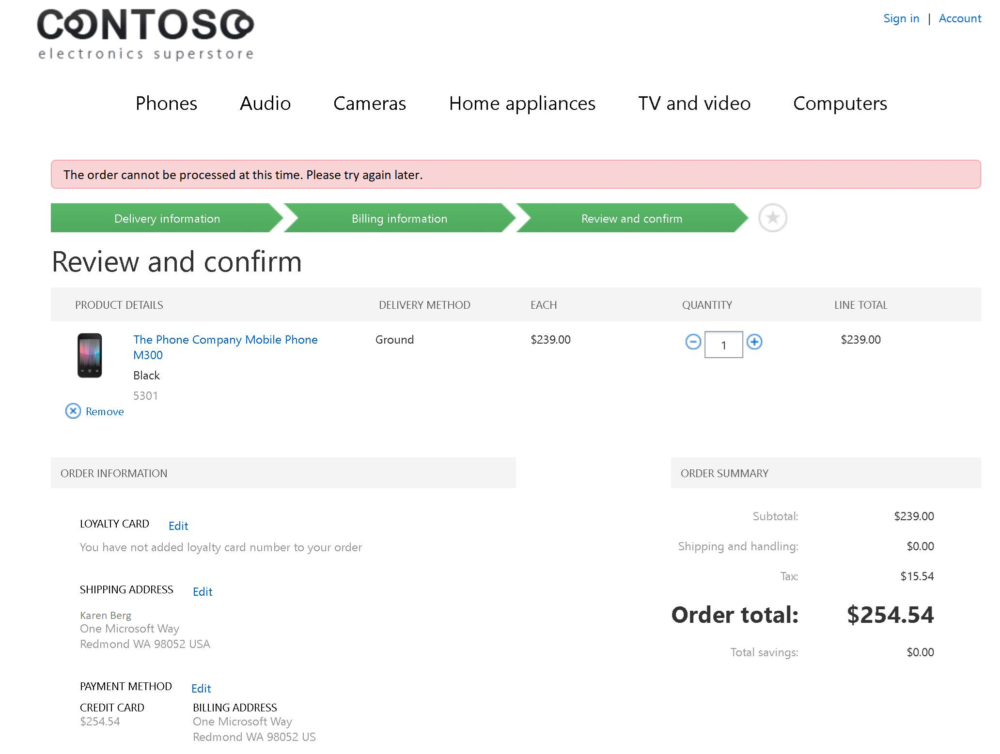

---
# required metadata

title: Dynamics 365 Fraud Protection integration with Dynamics 365 Commerce
description: This article describes out-of-box integrations that are available between Microsoft Dynamics 365 Fraud Protection and Dynamics 365 Commerce. 
author: BrianShook
ms.date: 01/30/2023 
ms.topic: article
audience: Application User, Developer, IT Pro
ms.reviewer: josaw
ms.custom: 141393
ms.assetid: e23e944c-15de-459d-bcc5-ea03615ebf4c
ms.search.region: Global
ms.author: brshoo
ms.search.validFrom: 2019-01-01

---

# Dynamics 365 Fraud Protection integration with Dynamics 365 Commerce

[!include [banner](../includes/banner.md)]

This article describes out-of-box integrations that are available between Microsoft Dynamics 365 Commerce and Dynamics 365 Fraud Protection.

## Key terms

| Term | Description |
|---|---|
| Purchase protection | The Fraud Protection module that analyzes purchases for fraud, based on risk levels that are determined by the merchant. |
| Storefront | The out-of-box e-commerce storefront that is provided with Commerce. |
| Azure Data Lake Storage Gen2 | Data Lake Storage Gen2 is used to make Commerce data available for processing by the **Loss prevention** module. |

## Overview

Fraud Protection is a service that offers fraud protection solutions to help retailers prevent fraudulent activity and identify places where fraud might be unnoticed. This article describes out-of-box integrations between Fraud Protection and Commerce. It will be updated as new integrations between the two services are released in future releases. For more information about Fraud Protection, including information about modules that aren't yet supported by an out-of-box integration with Commerce, visit the [Fraud Protection landing page](https://dynamics.microsoft.com/ai/fraud-protection/). You can also [request a callback](https://dynamics.microsoft.com/get-started/?appname=fraudprotection) from a Dynamics 365 sales representative to discuss how Fraud Protection can help boost profitability, reduce operational expenses, and improve customer experiences.

Starting October 2020, a limited capacity of Fraud Protection is included in the Microsoft Dynamics 365 Commerce license. Commerce customers can now use Fraud Protection for no extra charge, up to the limits specified below:

- **Purchase protection** - Up to 2,000 assessments per month.
- **Account protection** - Up to 20,000 assessments per month. 
- **Loss prevention** - Up to 8,000 transactions per month. 

You have the option of purchasing additional Fraud Protection add-ons if your usage requires higher limits. 

To start using Fraud Protection if you are an existing Commerce customer, visit the [Fraud Protection portal](https://dfp.microsoft.com/), sign in with tenant global administrator credentials, and complete a one-time setup for your environment.

## Purchase protection in Commerce

### Purchase protection overview

The first generally available offering from Fraud Protection is a purchase protection module that lets merchants sign in to the Fraud Protection dashboard for their organization and define fraud rules for online purchases. Based on the settings that a merchant configures in Fraud Protection, e-commerce transactions can be validated with Fraud Protection before they are sent for payment authorization.

When an order is sent to the Fraud Protection purchase protection module, Fraud Protection analyzes the purchase and provides a risk assessment, based on merchant-defined fraud rules, insights that are driven by artificial intelligence (AI), and consortium-based fraud analytics. If the fraud score that is returned for the order exceeds the merchant's risk tolerance, Fraud Protection instructs the storefront to reject the order. If an order isn't rejected, Fraud Protection returns a fraud score that the storefront can use to determine the next steps in the order fulfillment process. Those steps might include putting the order on hold for manual review or follow-up with the customer who placed the order.

### Supported capabilities in the purchase protection integration

#### Purchase events

Currently, Commerce is in public preview. However, when it becomes generally available, the purchase protection integration will support the receipt of Fraud Protection risk assessments and termination of orders in the online storefront.

Here is the flow for purchase events.

1. A storefront customer adds items to the basket and proceeds to checkout.
2. The customer enters shipping and payment details.
3. After the prerequisites are completed, the customer selects **Place order**.
4. Order details are sent to Fraud Protection for purchase protection assessment.
5. If the merchant rules that are defined in Fraud Protection determine that the order should be rejected, a response is sent to the storefront, and the order is terminated.

If Fraud Protection purchase protection causes an order to be terminated, the user receives the following error message: "The order cannot be processed at this time. Please try again later."

Alternatively, if the merchant rules determine that the order should be approved, the response that is sent to the storefront includes the fraud score and the reason code that were determined by Fraud Protection. For the initial integration, the Fraud Protection assessment isn't used in any way, and the response for both approval and rejection scenarios isn't saved.

Rejected orders aren't sent to payment processors for authorization, and they don't go through the order creation process in the back office.

#### Bank events

If an online order is approved based on the Fraud Protection assessment, the next step is to authorize payments for that order, if payment authorizations are applicable. Once the order is authorized with the payment processor, Fraud Protection is notified of the authorization result. By sending these results to Fraud Protection, the advanced AI can be trained to better predict future authorization results, thereby boosting the quality of future Fraud Protection assessments.

#### Purchase status events

Purchase status events resemble bank events. After an order is created in the Commerce back office, a signal is sent to Fraud Protection to indicate that the order was successfully created. Both bank events and purchase status events are informational events. Therefore, no response is expected from Fraud Protection.

### Setup

After the merchant's Fraud Protection environment is available and purchase protection settings have been configured, you can continue the setup in Commerce headquarters. If the environment isn't configured yet, to complete the configuration, sign in to the [Fraud Protection portal](https://dfp.microsoft.com/) with tenant global administrator credentials.

#### Key Vault setup

The integration setup requires that a secret be used when Commerce communicates with Fraud Protection to get a purchase protection result. That secret must be stored by using an Azure Key Vault client. For information about how to set up a Key Vault client, see [Setting up Azure Key Vault Client](https://support.microsoft.com/help/4040305/setting-up-azure-key-vault-client).

The Fraud Protection certificate that is stored in Key Vault can be referenced only if it's referenced by Key Vault parameters in the Commerce back office. To set up Key Vault parameters, go to **Retail and Commerce** \> **Headquarters setup** \> **Parameters** \> **Key Vault parameters** in Commerce.

Next, select the Key Vault URL that is used to store the Fraud Protection secret, and select **Add**. Then specify the name, description, and path of the Key Vault secret that is used to authenticate Commerce when it sends orders for purchase protection assessment.

#### Commerce parameters setup

1. Go to **Retail and Commerce** \> **Headquarters setup** \> **Parameters** \> **Commerce parameters**.
2. On the **Dynamics Fraud Protection** tab, set the **Enable Dynamics Fraud Protection integration** option to **Yes**.
3. On the **Configuration** FastTab, add the Azure Active Directory (Azure AD) client ID, and then select the name of the Key Vault secret that you configured earlier.

    By default, the **Assessment type** field is set to **Evaluate**. In this case, Fraud Protection will passively check orders for fraud but won't actively reject orders. Therefore, merchants can compare Fraud Protection risk assessments with their current fraud tools to understand the impact of Fraud Protection on acceptance rates.

    Alternatively, the **Assessment type** field can be set to **Protect**. In this case, Fraud Protection will return "Reject" assessments, and fraudulent orders will be terminated before they are sent for authorization or created in the back office.

4. The **Dynamics Fraud Protection endpoint URL** field must be set. This URL is provided by Fraud Protection and will vary across user acceptance testing (UAT) and production environments.

## Loss prevention in Commerce

The **Loss prevention** capability in Fraud Protection will be made generally available in the third quarter (Q3) of 2020. The out-of-box integration for Loss prevention will be available in Commerce version 10.0.12.

### Loss prevention overview

Fraud that arises from abuse of return and discount policies is a top source of shrinkage for retailers. Existing physical deterrents are easy to work around. Therefore, to catch the most sophisticated forms of abuse, it's critical that retailers use artificial intelligence (AI) to identify loss.

The **Loss prevention** module in Fraud Prevention analyzes in-store returns and discounts to identify anomalies that might be caused by abuse of return and discount policies. By using AI, the **Loss prevention** module can identify patterns and anomalies that indicate potential fraud, and can uncover hard-to-detect sources of shrinkage.

The **Loss prevention** module analyzes Commerce data that is available through Data Lake Storage Gen2. This integration is an opt-in integration and isn't turned on by default.

After **Loss prevention** has finished analyzing the data, the results are surfaced in a [Fraud Protection](https://go.microsoft.com/fwlink/?linkid=2131023) dashboard. From there, users can evaluate the results and observe trends that might indicate potential fraud.

### Turning on the Loss prevention integration with Commerce

#### Set up Fraud Protection

To set up Fraud Protection, [request a callback](https://dynamics.microsoft.com/get-started/?appname=fraudprotection) from a Dynamics 365 sales representative. When the merchant's Fraud Protection environment is available, and Loss prevention settings have been configured, you can continue the setup by turning on Data Lake Storage Gen2 for the Commerce environment.  

#### Turn on Data Lake Storage Gen2 for your Commerce environment

Before the data can be available in Data Lake Storage Gen2, the service must be turned on for the Commerce environment. For information about how to turn on Data Lake Storage Gen2 for your Commerce environment, see [Enable Azure Data Lake Storage in a Dynamics 365 Commerce environment](../enable-adls-environment.md).

#### Turn on Loss prevention

You can turn on the Loss prevention integration through the **Feature management** workspace in Commerce. The feature is named "Dynamics 365 Fraud Protection (DFP) Loss prevention." No other setup in Commerce is required to turn on the integration.

#### Configure Loss prevention to connect to Data Lake Storage Gen2

The final step is to return to the Fraud Protection environment and connect Loss prevention to the Data Lake Storage Gen2 pool that is associated with the Commerce account. 

## Privacy notice

When you turn on the feature, some of your data is shared with other Microsoft online services. This data includes information about payments, credit, returns, and transaction status, or personal data. Fraud Protection purchase protection assessments aren't stored by the Retail or Commerce online services.

Your privacy is important to Microsoft. To learn more, read the [Microsoft Privacy Statement](https://go.microsoft.com/fwlink/?LinkId=521839).

## Related articles

- [Payments FAQ](/dynamics365/unified-operations/retail/dev-itpro/payments-retail)
- [Dynamics 365 payment data use](../payment-connector-data-fields.md)

[!INCLUDE[footer-include](../../includes/footer-banner.md)]
