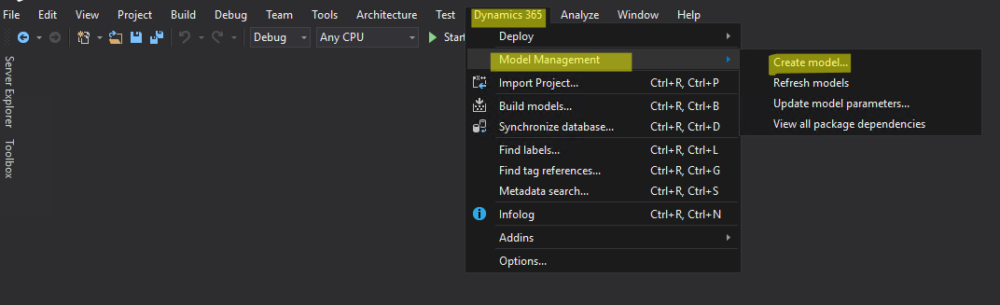
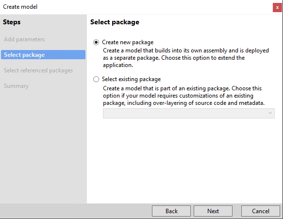
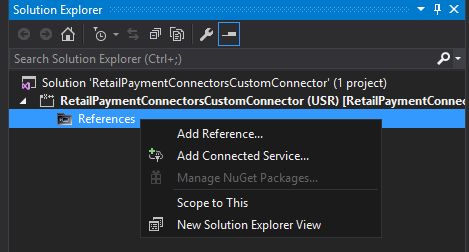

---
# required metadata

title: Create payment packaging for AOS in Service Fabric deployments.
description: This topic explains how to create payment packaging for AOS and deploy it in Dynamics 365 for Commerce service fabric environments.
author: RobinARH
manager: AnnBe
ms.date: 02/13/2020
ms.topic: article
ms.prod: 
ms.service: dynamics-365-commerce
ms.technology: 

# optional metadata

# ms.search.form: 
# ROBOTS: 
audience: Developer
# ms.devlang: 
ms.reviewer: rhaertle
ms.search.scope: Operations, Retail
# ms.tgt_pltfrm: 
ms.custom: 17771
ms.assetid: c54d34a5-32e2-4d0d-a1c2-4a9940d95ade
ms.search.region: Global
# ms.search.industry: 
ms.author: mumani
ms.search.validFrom: 2020-02-02
ms.dyn365.ops.version: 10.0.10

---

# Create payment packaging for AOS in Service Fabric deployments

[!include [banner](../../includes/banner.md)]

This topic explains how to create payment packaging for AOS and deploy it in Dynamics 365 for Commerce service fabric environments.

Before 10.0.10 release the payment packaging for AOS can be created from the Commerce SDK (previously known as Retail SDK) but staring from 10.0.10 AOS payment packaging can be created only using this new approach. Package created using this approach can be deployed in both Service Fabric and in IaaS environments.

**One important change is previously from the Commerce SDK payment package can be created for both the AOS and commerce channel and cloud components (Commerce Scale unit) but going forward two separate package must be created one for AOS using the Dynamics 365 packaging model and other for the commerce channel and cloud components using the Commerce SDK.**

To create payment package which can be deployed both in Dynamics 365 for Commerce service fabric deployments follow the below steps.

**Note:** There is no change in how the package created for the commerce channel and cloud components using the Commerce SDK, see the article [Create and deploy connector](https://docs.microsoft.com/en-us/dynamics365/commerce/dev-itpro/deploy-payment-connector).

**Steps to create AOS payment package starting 10.0.10:**

**Note:** Previous approach for creating AOS payment packaging using Commerce SDK will be deprecated starting 10.0.10.

1.  Click Dynamics 365 menu in the Visual studio menu bar and choose Model Management &gt; Create model.

    
   
2.  In the Create model window enter the Model name, publisher and other required details and click Next.

    **Note:** The model name must be prefixed or start with **RetailPaymentConnectors**. After the **RetailPaymentConnectors** prefix add the custom model name information. **Ex:** **RetailPaymentConnectorsCustomConnector.**

    Only model name begins with this prefix will loaded in the Dynamics 365 for commerce payment connector options.

     

3.  Select Create new package and click Next.

    

4.  Select the required referenced package and Click Next.

5.  Click Finish to complete the model creation.

6.  In the Solution explorer, select the project and right click the Reference options and click Add Reference.

      

7.  Add all the payment connector assemblies and its dependencies as reference to the project.

    

8.  If you don’t have any other payment x++ extension related to the payment connector, Build the solution.

9.  Create the Deployable package by slecting the **Dynamics 365 &gt; Deploy &gt; Create Deployment Package.** Select the model created in step 2 and specify the package file location and click Create.

    

10. VS will build the model and create the deployable package.

11. After a deployable package is created, sign into Microsoft Dynamics Lifecycle Services (LCS), and then, in your LCS project, click the Asset Library tile.

12. Upload the deployable package that you created earlier.

**Apply a deployable package**

To apply a deployable package to an environment, see the article [*Apply updates to cloud environments*](https://docs.microsoft.com/en-us/dynamics365/fin-ops-core/dev-itpro/deployment/apply-deployable-package-system).

**Remove a deployable package**

To uninstall or remove a deployable package from an environment, see the article [*Uninstall a package*](https://docs.microsoft.com/en-us/dynamics365/fin-ops-core/dev-itpro/deployment/uninstall-deployable-package).
