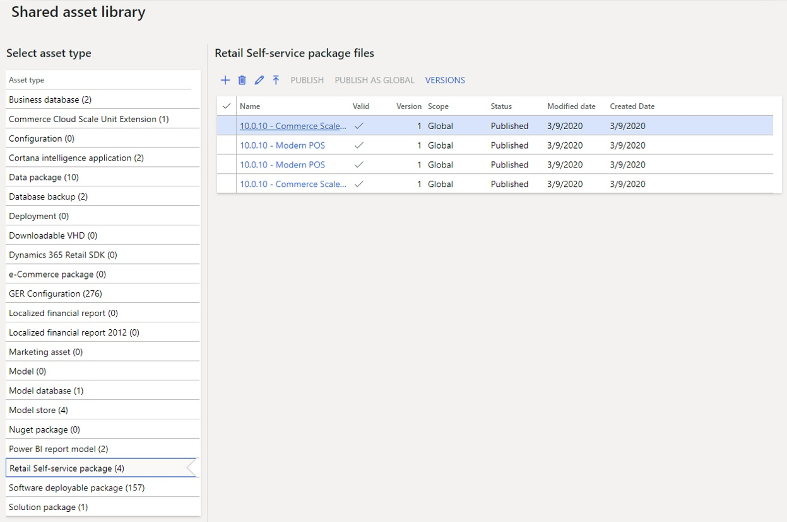

---
# required metadata

title: Synchronize self-service installers in Dynamics 365 Commerce
description: This article explains how to upload and synchronize self-service installers so that they can be used with the standard self-service download mechanism.
author: jashanno
ms.date: 04/07/2023
ms.topic: article
ms.prod: 
ms.technology:  

# optional metadata

ms.search.form: SysAADClientTable, RetailTransactionServiceProfile
# ROBOTS: 
audience: IT Pro
# ms.devlang: 
ms.reviewer: sericks
# ms.tgt_pltfrm: 
ms.custom: 44351
ms.search.region: Global
# ms.search.industry: 
ms.author: jashanno
ms.search.validFrom: 2020-04-30
ms.dyn365.ops.version: 10.0.10

---

# Synchronize self-service installers in Dynamics 365 Commerce

[!include [banner](../../includes/banner.md)]

This article explains how to use the Asset library and Shared asset library in Dynamics Lifecycle Services (LCS), and Dynamics 365 Headquarters, to upload and synchronize self-service installers so that they can be used with the standard self-service download mechanism. Note that this functionality applies only to environments that are continuously managed by Microsoft. For other environments, such as on-premises environments or virtual hard disks (VHDs), we highly recommend that you download and use the installers directly from LCS, where they are currently published.

> [!IMPORTANT]
> The earlier method of uploading self-service packages is currently still supported. However, it's obsolete and will be removed in the future. It's strongly recommended that you retrieve self-service packages from Lifecycle Services (LCS) instead. You can generate configuration files as needed, per standard steps.

The **Retail Self-service package** subsection in the **Shared asset library** stores all monthly releases for self-service installers. These installers include the Store Commerce app, Commerce Scale Unit, and hardware station. You can also upload customized installers into both this library and the project-level asset library. By using these locations, you can then synchronize the available installers in Commerce headquarters. After synchronization is completed, all the installers that are available between these two libraries (and whatever previously existed in the environment) will be accessible for the standard self-service download processes that are described in detail in separate articles (see [Key terms](#key-terms) below.

The following illustration shows a generic example of the **Retail Self-service package** subsection in the Shared asset library (or Asset library).

## Key terms

| Term | Description |
|---|---|
| Shared asset library | In LCS, two types of asset libraries are available: the Shared asset library and the project-level Asset library. For more information about these libraries, see [Asset library in Lifecycle Services (LCS)](../../fin-ops-core/dev-itpro/lifecycle-services/asset-library.md). |
| Asset library | For more information, see [Asset library in Lifecycle Services (LCS)](../../fin-ops-core/dev-itpro/lifecycle-services/asset-library.md). |
| Self-service installers | Self-service installers are the Dynamics 365 Commerce components. For more information about the installers, see the links at the end of this article. |

## Upload or modify the self-service installer packages

When viewing the **Retail Self-service package files** subsection in the **Shared asset library**, the listings will include what is published by Microsoft and anything uploaded by the project owners and users. Regardless of who uploads the package file (Microsoft or a user), the file can be edited to add additional details. At the top of the package listings are buttons. The first button is the **Upload** button, the second is the **Delete** button, and the third is the **Edit** button. Using the **Upload** button, a user can upload a customized package or custom installer/file that is needed for that particular project. Regardless of how the file was uploaded, any package can be selected and the **Edit** button can be used to alter the friendly name and add an informational description to the file. The legacy self-service installer packages that are uploaded by Microsoft or customized and uploaded by a project user/developer can provide easier reading, understanding, and detailing by adding a useful description. Then, when synchronized, the installers showcased can be more easily viewed, understood, and utilized.

## Synchronize installers in Dynamics 365 Headquarters

1. Go to **Retail and Commerce** &gt; **Headquarters setup** &gt; **Parameters** &gt; **Commerce parameters**.
2. On the **Channel deployment** tab, select **Check for package updates** to perform synchronization. The installers that are available for download (through standard self-service processes) are synchronized and updated, depending on which of the installers that are currently available in LCS apply to environment.

    > [!IMPORTANT]
    > Previously, the RetailSelfService table was used as the source that all installer information was pulled from. Information was entered in this table, based on the installers that had been uploaded into headquarters through the earlier package application method. The new self-service population methodology combines all values in the RetailSelfService table (the earlier self-service package upload method) with all available installers in the LCS Shared asset library. The self-service drop-down package selectors will show the options from this newly synchronized, combined source.
    >
    > As noted at the beginning of this article, the earlier self-service package upload method is obsolete but will continue to be supported until it's removed in the future.

3. On the same page, you can select default packages that will be used throughout headquarters in their relevant locations (**Devices**, **All stores**, and **Channel database**).
4. Perform standard configuration and installation flows for Modern POS, hardware station, or Commerce Scale Unit by using the links in the following table.

> [!NOTE]
> There are several installers.  Modern POS, Modern POS with offline (note that this is a separate installer), Commerce Scale Unit (self-hosted, formerly named *Retail Store Scale Unit*), hardware station, and the less frequent installers (AX 2012 R3 support installers and the Peripheral Simulator).

| Component | Link |
|---|---|
| Modern POS | [Configure, install, and activate Modern POS (MPOS)](../retail-modern-pos-device-activation.md) |
| Hardware station | [Configure and install Retail hardware station](../retail-hardware-station-configuration-installation.md) |
| Commerce Scale Unit (formerly known as Retail Store Scale Unit) | [Configure and install Commerce Scale Unit](retail-store-scale-unit-configuration-installation.md) |

[!INCLUDE[footer-include](../../includes/footer-banner.md)]
