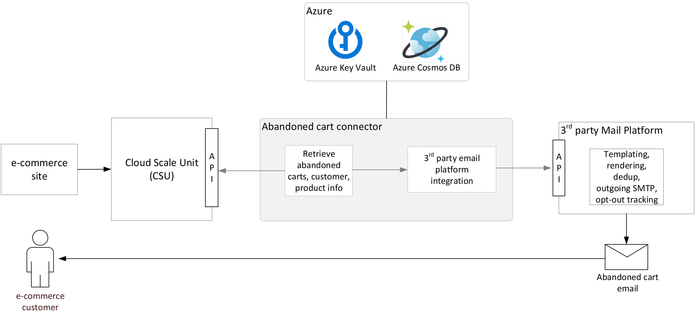

---
# required metadata

title: Detect abandoned carts and send notifications to customers
description: This article describes how to customize the Microsoft Dynamics 365 Commerce abandoned cart connector sample app to detect abandoned carts and send reminder email notifications to customers.
author: bicyclingfool
ms.date: 08/02/2024
ms.topic: how-to
audience: Developer, IT Pro
ms.reviewer: v-chrgriffin
ms.search.region: Global
ms.author: asharchw
ms.search.validFrom: 2017-06-20
ms.custom: 
  - bap-template
---

# Detect abandoned carts and send notifications to customers

[!include [banner](../includes/banner.md)]

This article describes how to customize the Microsoft Dynamics 365 Commerce abandoned cart connector sample app to detect abandoned carts and send reminder email notifications to customers.

The ability to recover revenue and retain customers through abandoned cart notifications is an important capability that Dynamics 365 Commerce supports. By customizing the Commerce abandoned cart connector sample app, retailers can access shopping carts on Retail Server that haven't been modified during a time window that the retailers define. Those carts can then be retrieved, augmented with product and customer data, and passed on to a third-party email marketing provider that can generate email notifications and send them customers.

The abandoned cart email notification that customers receive can contain the following information:

- The customer's first name.
- The customer's last name.
- The customer's email address.
- A URL that returns the customer to their cart.
- The transaction currency.
- A list of products in the customer's cart. For each product, the following information is included:

    - The product's display name
    - The product ID (used to assemble a URL to the product description page)
    - A product image that can automatically be resized to accommodate different viewport sizes
    - Alt text for the product image
    - The product's unit price

## Abandoned cart connector sample

A connector model that Microsoft provides through the Retail software development kit (SDK) enables abandoned cart information to be retrieved and sent to a third-party email marketing provider. This connector handles communication with Retail Server, uses Azure Key Vault for security, handles scheduling of cart retrieval for a specified time window, and retrieves order and product data. It also provides a sample implementation for an integration with a third-party email marketing provider. The connector is built to communicate with [Emarsys](https://emarsys.com) out of the box. However, it can easily be customized to integrate with other solutions, such as Constant Contact, Mailchimp, and SendGrid.

The following illustration shows the components of the abandoned cart connector sample app.

> [!IMPORTANT]
> Some regions require that customers be able to opt out of having their cart data passed to an email marketing provider, or request that their data be removed. However, Microsoft doesn't provide these options for customers. Therefore, if you plan to do business in regions that mandate them, you must provide the required infrastructure and customizations to track customers' preferences and, based on them, prevent customer data from being passed to your email platform. You must also define a process for purging customer data from your email marketing provider at the customer's request.

## Obtain the code sample

The abandoned cart connector sample app is included in the [Dynamics365Commerce.Solutions](https://github.com/microsoft/Dynamics365Commerce.Solutions). The code can be found in project [AbandonedCartSample](https://github.com/microsoft/Dynamics365Commerce.Solutions/tree/release/9.50/src/Extensions.AbandonedCartSample).

## Prerequisites and dependencies

Before you can deploy and configure the abandoned cart connector sample code, the following prerequisites must be met.

### Access to Commerce resources

To configure and deploy the abandoned cart connector app, you must have access to the following Commerce resources:

- Administrator access to Commerce headquarters for your environment
- Access to the Microsoft Dynamics Lifecycle Services (LCS) project for your environment

### Azure Cosmos DB

The abandoned cart connector app uses Azure Cosmos DB to track the IDs and timestamps of carts that have previously been retrieved. You can use Azure Cosmos DB to persist this data, or you can customize the code sample to integrate with another data storage option. For more information about Azure Cosmos DB, see [Welcome to Azure Cosmos DB](/azure/cosmos-db/introduction).

If you use Azure Cosmos DB, the following prerequisites must be met before you can run the sample:

- You must have an active Azure Cosmos DB account. If you don't have an account, see [Create a database account](/azure/cosmos-db/create-sql-api-dotnet#create-a-database-account).
- You must retrieve the **URI** and **PRIMARY KEY** (or **SECONDARY KEY**) values from the **Keys** blade of your Azure Cosmos DB account in the Azure portal. For more information about how to retrieve endpoint and key information for your Azure Cosmos DB account, see [View, copy, and regenerate access keys and passwords](/azure/cosmos-db/manage-account#keys).

### Azure Key Vault

The abandoned cart connector app uses Key Vault to store the names and secrets of the different components that require secure access.

To set up a key vault, follow these steps.

1. Follow the instructions in [Manage Key Vault in Azure Stack Hub using the portal](/azure-stack/user/azure-stack-key-vault-manage-portal?view=azs-2002&preserve-view=true).
2. Create secrets for the following information:

    - Emarsys application programming interface (API) user name and API secret
    - Abandoned cart application ID and secret

The abandoned cart connector sample code uses Azure default credentials to access Key Vault. You must provide **List** and **Read** permissions to the identity that you plan to use to access Key Vault.

For more information about Azure default credentials, see [DefaultAzureCredential Class](/dotnet/api/azure.identity.defaultazurecredential?view=azure-dotnet&preserve-view=true).

## Create an abandoned cart connector sample app application ID for the Microsoft Entra tenant

You must create an abandoned cart connector sample app application ID for the Microsoft Entra (AD) tenant. For information about how to create an application ID, see [Use the portal to create a Microsoft Entra application and service principal that can access resources](/azure/active-directory/develop/howto-create-service-principal-portal).

## Add the abandoned cart connector sample app application ID to the allow list for the Retail Server API

Next, you must add the abandoned cart connector sample app application ID to the allow list for the Retail Server API. For information about how to add an application ID to the allow list in Azure, see [Support for Service to Service authentication in Retail Server](https://community.dynamics.com/ax/b/axforretail/posts/support-for-service-to-service-authentication-in-retail-server).

## Configure the abandoned cart connector sample app

To configure the abandoned cart connector sample app, modify the **appSettings.json** configuration file that is located at the root of the **AbandonedCartDetectionSample** directory. The following tables describe the configuration file properties.

### KeyVaultOptions

| Property    | Description |
| ----------- | ----------- |
| KeyVaultURI | The Domain Name System (DNS) name of the key vault that you're using in the Azure portal. |

### RetailServerClientOptions

| Property                                      | Description |
| --------------------------------------------- | ----------- |
| TenantId                                      | The Microsoft Entra tenant ID of your Azure tenant. |
| RetailServerAudienceId                        | The Retail Server audience ID. You can leave the default value. |
| AppIdKeyVaultSecretName                       | The name of the secret that you created for the abandoned cart connector sample app application ID. |
| AppSecretKeyVaultSecretName                   | The name of the secret that stores the app secret for the abandoned cart connector sample app application ID. |
| RetailServerUrl                               | The URL of your Retail Server instance. You can find this value in LCS. |
| OperatingUnitNumber                           | The operating unit number (OUN). You can find this value in Commerce headquarters. |
| IncludeAbandonedCartsModifiedSinceLastMinutes | The beginning of the time window for the abandoned carts that you want to retrieve. The value is expressed as a number of minutes before the current time. For example, set this property to **120** to retrieve all carts that were last modified between 120 minutes ago and the end of the time window that is defined by the **ExcludeAbandonedCartsModifiedSinceLastMinutes** property. |
| ExcludeAbandonedCartsModifiedSinceLastMinutes | The end of the time window for the abandoned carts you want to retrieve. The value is expressed as a number of minutes before the current time. For example, if the **IncludeAbandonedCartsModifiedSinceLastMinutes** property is set to **120**, set this property to **30** to retrieve all carts that were modified between 120 minutes ago and 30 minutes ago. In practice, this property defines the amount of time that you want to wait before a cart is declared abandoned. |
| ReturnToCartUrl                               | The URL of the cart on your e-commerce site, in the format that is used in the **app.config** file. |

### AzureCosmosOptions

The abandoned cart retrieval job status, cart IDs, and modified timestamps are stored in Azure Cosmos DB. By default, the settings in the configuration file point to the local emulator instance of Azure Cosmos DB. When you deploy the connector to production, you must update these settings so that they point to the Azure Cosmos DB instance in your Azure subscription. For local or sandbox testing, you can use the [Azure Cosmos DB Emulator](/azure/cosmos-db/local-emulator).

| Property    | Description |
| ----------- | ----------- |
| EndPointUri | The endpoint URI that is provided by Azure or the emulator. |
| PrimaryKey  | The primary key that is provided by Azure or the emulator. |
| DatabaseId  | The database ID. You can leave the default value or provide your own. |
| ContainerId | The container ID. You can leave the default value or provide your own. |

### EmarsysClientOptions

> [!NOTE]
> If you're integrating with an email marketing provider other than Emarsys, you must extend the **IEmailProvider** interface as appropriate to communicate with that provider.

| Property                      | Description |
| ----------------------------- | ----------- |
| ApiUrl                        | `https://api.emarsys.net/api/v2/event/{0}/trigger` |
| ExternalEventId               | The ID of the external event record that is created in Emarsys. You can find the value under **Trigger settings** in the campaign that you created to send abandoned cart email notifications. |
| ApiUserNameKeyVaultSecretName | The name of the key where the Emarsys API user name is stored. |
| ApiSecretKeyVaultSecretName   | The name of the key where the Emarsys API secret is stored. |
| EmarsysContactKeyId           | The ID of the email column in the Emarsys contact database. The default value is **3** and should not have to be changed. |

### MediaOptions

If you're using the e-commerce capabilities in Commerce, you can use Commerce digital asset management to retrieve product images. For more information about the image resizer capabilities in digital asset management, see [ImageSettings viewport configuration](../e-commerce-extensibility/image-component.md#imagesettings-viewport-configuration).

| Property                             | Description |
| ------------------------------------ | ----------- |
| ImageServerUrl                       | The root URL of your site's digital asset manager. You can find the value in the **Media Server Base URL** property key at **Retail and Commerce \> Channel setup \> Channel profiles** in Commerce headquarters. |
| ImageViewPorts                       | The container node for individual viewport configurations. |
| ImageViewPorts/viewport              | The viewport definition. Use this property to specify the width ranges for the viewport, in pixels. For an example that shows how this property is used, see the **appSettings.json** configuration file. |
| ImageViewPorts/imageWidth            | The image width of the viewport, in pixels. |
| imageViewPorts/imageHeight           | The image height of the viewport, in pixels. |
| imageViewPorts/useForDefaultImageTag | A **true**/**false** value that indicates whether the image dimensions that are defined by the viewport should be used if the `<picture>` HTML tag isn't supported for a web browser or email client. |

[!INCLUDE[footer-include](../../includes/footer-banner.md)]
