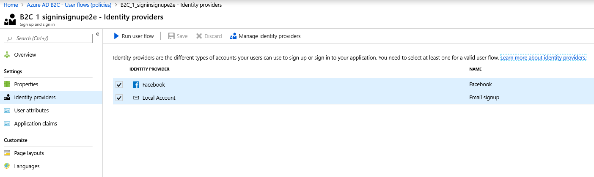
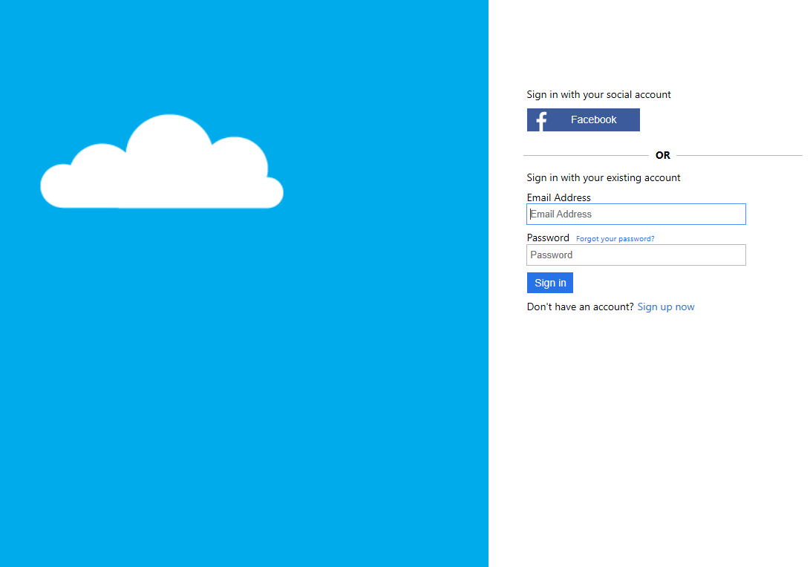

# Add social identity providers

[!include [banner](../includes/banner.md)]

This article describes how to add social identity providers in the Microsoft Azure portal.

Social identity providers allow users to use their social accounts for authentication. Adding social identity provider authentication is optional in Dynamics 365 Commerce. 

If social identity provider authentication isn't added, the default Microsoft Entra B2C profiles will be the main profiles for your user base. Users will select their own username (their preferred email address) and set a password. Microsoft Entra ID B2C will authenticate users directly. 

If social identity provider authentication is added and a user chooses one of the social identity providers offered, an entity is still created in the Microsoft Entra B2C tenant. Microsoft Entra ID B2C will then authenticate the user's credentials with the social identity provider.

> [!NOTE]
> The identity provider sign in creates a record in the B2C tenant, but in a different format than local accounts since it will call the external social identity provider reference for authentication. The user can use the same email address across social identity providers, meaning that the email username used for authentication may not be unique to the tenant. Microsoft Entra ID B2C will only enforce that users have a unique email address on local B2C accounts.

Before you can add a social identity provider for authentication, you must go to the identity provider's portal and set up an identity provider application as instructed in the Microsoft Entra B2C documentation. A list of links to the documentation is provided below.

- [Amazon](/azure/active-directory-b2c/active-directory-b2c-setup-amzn-app)
- [Microsoft Entra ID (Single Tenant)](/azure/active-directory-b2c/active-directory-b2c-setup-oidc-azure-active-directory)
- [Microsoft Account](/azure/active-directory-b2c/active-directory-b2c-setup-msa-app)
- [Facebook](/azure/active-directory-b2c/active-directory-b2c-setup-fb-app)
- [GitHub](/azure/active-directory-b2c/active-directory-b2c-setup-github-app)
- [Google](/azure/active-directory-b2c/active-directory-b2c-setup-goog-app)
- [LinkedIn](/azure/active-directory-b2c/active-directory-b2c-setup-li-app)
- [OpenID Connect](/azure/active-directory-b2c/active-directory-b2c-setup-oidc-idp)
- [Twitter](/azure/active-directory-b2c/active-directory-b2c-setup-twitter-app)

### Add and set up a social identity provider

> [!NOTE]
> Adding social identity providers is an optional step when setting up a business-to-consumer (B2C) tenant in Microsoft Dynamics 365 Commerce.

To add and set up a social identity provider, follow these steps.  

1. In the Azure portal, navigate to **Identity Providers**.
1. Select **Add**. The **Add identity provider** screen appears.
1. Under **Name**, enter the name to be displayed to users on your sign-in screen.
1. Under **Identity provider type**, select an identity provider from the list.
1. Select **OK**.
1. Select **Set up this identity provider** to access the **Set up the social identity provider** screen.
1. Under **Client ID**, enter the client ID as obtained from the identity provider application setup.
1. Under **Client secret**, enter the client secret as obtained from the identity provider application setup.
1. Attach user flow for sign-in/sign-up policies:
1. Go to **Microsoft Entra B2C – User flows (policies) \> {your sign-in sign-up policy} \> Identity providers**.
1. To attach the sign-in/sign-up user flow policy, select each identity provider you have set up for your account. To test the flows, select **Run user flow** for each identity provider. A new tab displays the sign-in page displaying the new identity provider selection box.

The following image shows examples of the **Add identity provider** and **Set up the social identity provider** screens in Microsoft Entra ID B2C.

The following image shows an example of how to select identity providers on the Microsoft Entra B2C **Identity Providers** page.

The following image shows an example of a default sign-in screen with a social identity provider sign-in button displayed.

> [!NOTE]
> If using the custom pages built in Commerce for your user flows, the buttons for social identity providers will need to be added using the extensibility features of the Commerce module library. Additionally, when setting up your applications with a specific social identity provider, in some cases URL or configuration strings may be case sensitive. Refer to your social identity provider's connection instructions for more information.
 

## Next steps

To continue the process of setting up a B2C tenant in Commerce, proceed to [Update Commerce headquarters with the new Microsoft Entra B2C information](update-hq-aad-b2c-info.md).

## Additional resources

[Set up a B2C tenant in Commerce](set-up-B2C-tenant.md)

[Create or link to an existing Microsoft Entra B2C tenant in the Azure portal](create-link-aad-b2c-tenant.md)

[Create the B2C application](create-b2c-app.md)

[Create user flow policies](create-user-flow-policies.md)

[Update Commerce headquarters with the new Microsoft Entra B2C information](update-hq-aad-b2c-info.md)

[Configure your B2C tenant in Commerce site builder](config-b2c-tenant-site-builder.md)

[Additional B2C information](additional-b2c-info.md)

[!INCLUDE[footer-include](../../includes/footer-banner.md)]
