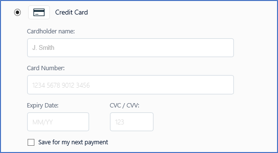
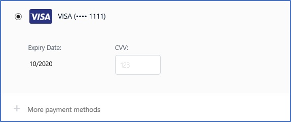

---
# required metadata

title: Saving online payment instruments with the Adyen connector
description: This topic describes how to save payment instruments by using the Adyen connector for e-commerce.
author: BrianShook
ms.date: 05/13/2019
ms.topic: article
ms.prod: 
ms.technology: 

# optional metadata

# ms.search.form: 
# ROBOTS: 
audience: IT Pro
# ms.devlang: 
ms.reviewer: tfehr
# ms.tgt_pltfrm: 
ms.custom: 141393
ms.assetid: e23e944c-15de-459d-bcc5-ea03615ebf4c
ms.search.region: Global
ms.search.industry: Retail
ms.author: brshoo
ms.search.validFrom: 2019-01-01
ms.dyn365.ops.version: AX 7.0.1

---

# Saving online payment instruments with the Adyen connector

[!include [banner](../includes/banner.md)]

This topic describes the setup and functionality that are related to saving payment instruments when you use the Adyen "card not present" payment connector for the Dynamics e-Commerce platform. 

## Key terms

| Term | Description |
|---|---|
| Token | A string of data that a payment processor provides as a reference. Tokens can represent payment card numbers, payment authorizations, and previous payment captures. Tokens are important because they help keep sensitive data out of the point of sale (POS) system. |
| Card token | A token that a payment processor provides for storage in the POS system. The card token, or card reference, can be used only by the merchant who receives it |
| Authorization (Auth) token | After a POS system makes an authorization request to a payment processor, the payment processor provides a unique ID to the POS system as part of the response to that request. This authorization token, or authorization reference, can be used later, when the processor is called to perform actions such as reversing or voiding the authorization. However, an authorization token is most often used to capture funds when an order is fulfilled or when a transaction is being finalized. |
| List PI | A frequently used generic name for the capability that is described in this topic. List PI refers to the ability to save payment instruments and to list previously used payment instruments during future checkouts that are done through the same e-commerce website. |
| Named user | An e-commerce customer who is signed in to the online storefront at the time of checkout. Named users have a unique customer ID, and their online purchases are always mapped to the same customer ID whenever they are signed in to the online storefront. |

## Overview

When e-commerce orders are created, retailers often offer to save the customer's payment card information so that it can be used for future transactions. This topic explains how that capability ("List PI") is delivered through the Microsoft Dynamics 365 Payment Connector for Adyen. Although the Adyen payment connector supports this capability out of the box, third-party payment connectors require customization. Additionally, not all payment processors might support the same method of saving payment card information. 

The out-of-box implementation of the List PI capability relies on the payment processor to keep a mapping of an online customer's unique ID to the payment instruments that have previously been processed through that payment connector. Only customers who are signed in to the website as named users have the option to save their payment card information for their next online visit. Customers who use a "guest checkout" option when they create an online order won't be able to save payment card information for future transactions. 

## Prerequisites

The List PI capability requires the following elements:

- An e-commerce integration with Microsoft Dynamics 365 Commerce
- A payment connector that is compatible with the List PI capability
- A payment processor that maps unique customer IDs to the payment instruments that the customers want that payment processor to save

For more information about how to implement payment connectors and the software development kit (SDK) in general, visit the [Commerce for IT pros and developers home page](/dynamics365/unified-operations/retail/dev-itpro/dev-retail-home-page#payment-connectors).

## Setup

The List PI capability requires the following components and setup steps:

- **E-commerce integration** – An online storefront integration with Commerce is required. For more information about the e-Commerce SDK, see [e-Commerce platform software development kit (SDK)](/dynamics365/unified-operations/retail/dev-itpro/ecommerce-platform-sdk).
- **Online payments configuration** – The Dynamics 365 Payment Connector for Adyen supports List PI out of the box. For information about how to configure payments for online stores, see [Dynamics 365 Payment Connector for Adyen](/dynamics365/unified-operations/retail/dev-itpro/adyen-connector?tabs=8-1-3#e-commerce). 

    In addition to completing the ecommerce setup steps that are described in that topic, you must set the **Allow saving payment information in e-commerce** option in the Payment accounts fasttab of the **Online store** form to **Yes**. 

- **Omni-channel payments configuration** – In the back office, go to **Retail and Commerce \> Headquarters setup \> Parameters \> Commerce shared parameters**. Then, on the **Omni-channel payments** tab, set the **Use omni-channel payments** option to **Yes**. 

## Functional experience

### Guest checkout

When e-commerce visitors choose to check out as guests, customer records aren't created during checkout, and the customers can't save payment instruments for their next visit. 

### Named user checkout

When named users (signed-in customers) go to the payment step of the checkout process, they will experience the List PI capability. The first time that a named user checks out, a **Save for my next payment** check box appears in the section where credit card information is entered. 

If this check box is selected, when a new credit card is submitted for payment, the named user's unique customer ID is sent to the payment processor, and the credit card is securely saved and mapped to the that unique customer ID. 

If the same customer signs in during future visits to the storefront, they will be able to select the same credit card for payment at checkout. 

### Order fulfillment and processing

E-Commerce orders where the customer applied a tender line by using the List PI capability work in the same way as orders that were created without using a saved card payment. From the standpoint of order processing and fulfillment, the two types of payment are indistinguishable. 

## Details of eCommerce payment card tokenization

### Standard flow

In e-Commerce integrations, the payment card is typically entered as part of the checkout process and is saved together with the order before finalization. The card details are entered directly on a payment acceptance page that a payment processor provides. After card details are entered and the customer moves on to the next step of the checkout process, the processor creates a token that is used later in the order creation process. 

When the customer finalizes the online order, the payment card token is sent to the payment processor as part of an authorization request. If the payment authorization request is successful, the payment processor replies by sending an authorization token. This authorization token is saved together with the customer's order and is referenced when that order is fulfilled from the back office. 

### List PI flow

The main difference between the standard flow and the List PI flow is that the customer doesn't have to enter the full credit card number. Instead, the customer just has to select a previously saved credit card and provide the Card Verification Value (CVV number). If the customer provides the correct CVV number and moves on to the next step of the checkout process, the payment processor provides a payment card token that will be included in the authorization request. 

## Related articles

- [Payments FAQ](/dynamics365/unified-operations/retail/dev-itpro/payments-retail)

[!INCLUDE[footer-include](../../includes/footer-banner.md)]