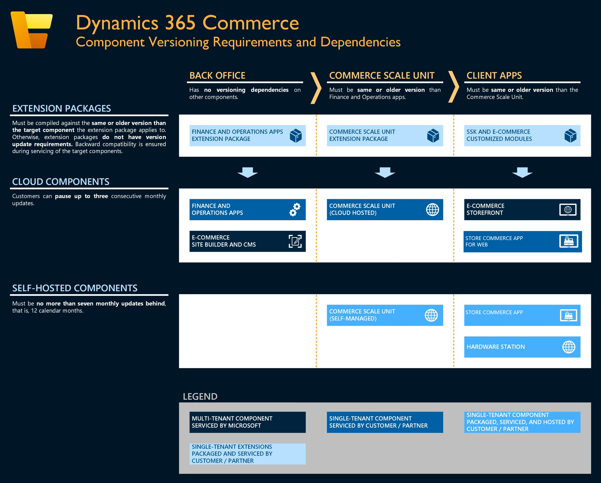

# Dynamics 365 Commerce component versioning requirements

[!include [banner](../includes/banner.md)]

This article provides an overview of the component versioning requirements and dependencies for all components in the Microsoft Dynamics 365 Commerce ecosystem.

The following illustration shows an overview of Dynamics 365 Commerce components and corresponding versioning requirements and dependencies.

</a>

## Component dependencies

### Service updates

To ensure compatibility between all Commerce components that are serviced and deployed by customers and partners, you must follow several versioning dependencies during servicing updates. The following list describes all these dependencies.

- **Commerce Scale Unit (CSU), whether cloud or self-hosted, must be on a serviceable release that is either the same as or lower than the F&O app release, but it must always be  serviceable. The current supported versions information can be found here - [Service update availability](https://learn.microsoft.com/en-us/dynamics365/fin-ops-core/dev-itpro/get-started/public-preview-releases)**

  For example, hypothetically, consider today's date as Sep 20, 2024 and there are following releases for reference :
    - _Release Winter (GA: Jan 15, 2024, End of service: Aug 15, 2024)_
    - _Release Spring (GA: Mar 15, 2024, End of service: Nov 15, 2024)_
    - _Release Summer (GA: Jun 15, 2024, End of service: Feb 15, 2025)_
    - _Release Autumn (GA: Sep 15, 2024, End of service: May 15, 2025)_

  Of the above releases, as of Sep 20, 2024, _Release Winter_ has already reached _End-of-service_ that means you cannot have CSU version from _Winter_ release and they need to be at least from _Spring_ release (earliest serviceable release). 

  In that case, if Commerce headquarters and Finance and operations apps are on _Autumn_ version, Commerce Scale Unit must be on version from any of the releases that are still serviceable that means either from _Autumn, or Summer or Spring_ releases  but it cannot be from _Winter_ release as that has already hit _End-of-service_. 

- **Store Commerce app, Hardware Station, and the Commerce software development kit (SDK), along with associated local site configurations (including modules, data actions, and themes), must be on a serviceable release. This release should be the same as or lower than the Commerce Scale Unit release, but it must always be serviceable. The current supported versions information can be found here - [Service update availability](https://learn.microsoft.com/en-us/dynamics365/fin-ops-core/dev-itpro/get-started/public-preview-releases)**

  For example, hypothetically, consider today's date as Sep 20, 2024 and there are following releases for reference :
    - _Release Winter (GA: Jan 15, 2024, End of service: Aug 15, 2024)_
    - _Release Spring (GA: Mar 15, 2024, End of service: Nov 15, 2024)_
    - _Release Summer (GA: Jun 15, 2024, End of service: Feb 15, 2025)_
    - _Release Autumn (GA: Sep 15, 2024, End of service: May 15, 2025)_

  Of the above releases, as of Sep 20, 2024, _Release Winter_ has already reached _End-of-service_ that means you cannot have Store Commerce App, Hardware Station and the Commerce SDK version from _Winter_ release and they need to be at least from _Spring_ release (earliest serviceable release).

  In that case, if Commerce Scale Unit is on _Autumn_ version, then Store Commerce app, Hardware Station, and the Commerce SDK must be on one of the serviceable version that means either from _Autumn or Summer or Spring_ but it cannot be from _Winter_ release  as that has already hit _End of service_.

- **Extension packages must be compiled against the same version as, or an earlier serviceable version than, the target component that the extension applies to. The current supported versions information can be found here - [Service update availability](https://learn.microsoft.com/en-us/dynamics365/fin-ops-core/dev-itpro/get-started/public-preview-releases)**
  For e.g., hypothetically, consider today's date as Sep 20, 2024 and there are following releases for reference:
     - _Release Winter (GA: Jan 15, 2024, End of service: Aug 15, 2024)_
     - _Release Spring (GA: Mar 15, 2024, End of service: Nov 15, 2024)_
     - _Release Summer (GA: Jun 15, 2024, End of service: Feb 15, 2025)_
     - _Release Autumn (GA: Sep 15, 2024, End of service: May 15, 2025)_

  Of the above releases, as of Sep 20, 2024, _Release Winter_ has already reached _End-of-service_ that means you cannot have _Extension packages_ from _Winter_ release and they need to be at least from _Spring_ release (earliest serviceable release). 

  In that case, if the _target component_ is on _Autumn_ version, the corresponding _extension packages_ must be compiled against one of the serviceable version that means either from _Autumn or Summer or Spring_ but it cannot be from _Winter_ release  as that has already hit _End of service_.

### Quality updates

During quality updates, no specific versioning requirements must be followed for each Commerce component, besides what is required for service updates.

## One Version requirements

Commerce components follow the One Version service updates. For more information, see [One Version service updates FAQ](../../fin-ops-core/dev-itpro/get-started/one-version.md).

### Cloud components

For more information about how to pause service updates for Cloud components listed below, see [Pause service updates through Lifecycle Services)](../../dev-itpro/lifecycle-services/pause-service-updates.md).

- Commerce headquarters and finance and operations apps
- Commerce Scale Unit (cloud-hosted)
- Commerce SDK and associated local site configurations (such as modules, data actions, and themes)

### In-store components

Following In-store components need to be within serviceable releases, as shared above, for it to be supported 

- Store Commerce app for Windows, Android, and iOS
- Sealed Commerce Scale Unit (self-hosted)
- Sealed Hardware station

> [!Note] Legacy in-store components are NOT supported
> - Commerce Scale Unit (self-hosted)
> - Modern point of sale (MPOS) and hybrid apps
> - Hardware station (Legacy)
> - Retail SDK

## Additional resources

### Component selection

For more information about how to select the correct components to meet your needs, see the following articles:

- [Select an in-store topology](retail-in-store-topology.md)
- [Choose between Store Commerce app and Store Commerce for web](MPOS-or-CPOS.md)

### Servicing instructions

For more information about how to service individual components that are described in this article, see the following articles:

- [Configure and install Commerce Scale Unit](retail-store-scale-unit-configuration-installation.md)
- [Apply updates and extensions to Retail Cloud Scale Unit](../../fin-ops-core/dev-itpro/deployment/update-retail-channel.md)
- [Configure and install Retail hardware station](retail-hardware-station-configuration-installation.md)
- [Package configurations and deploy them to an online channel](../e-commerce-extensibility/package-deploy.md)
<!-- [Configure, install, and activate the Store Commerce app](retail-modern-pos-device-activation.md)-->

### Extensibility and packing

For more information about serviceability for extensions, see [Create deployable packages](retail-sdk/retail-sdk-packaging.md).

[!INCLUDE[footer-include](../../includes/footer-banner.md)]

