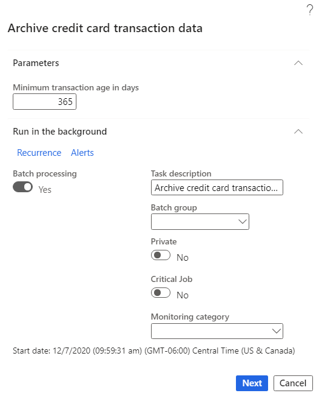
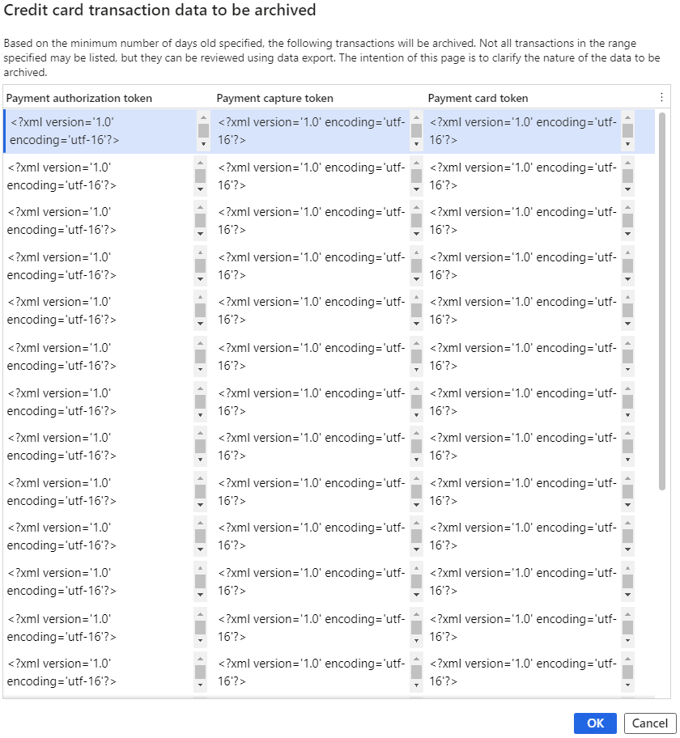
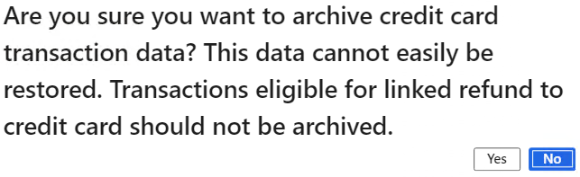

---
# required metadata

title: Archive credit card transaction data
description: This topic describes an archival job in Microsoft Dynamics 365 Commerce that can help free up space in the database by archiving credit card transactions.
author: BrianShook
ms.date: 01/28/2021
ms.topic: article
ms.prod: 
ms.technology: 

# optional metadata

# ms.search.form: 
# ROBOTS: 
audience: IT Pro
# ms.devlang: 
ms.reviewer: v-chgri
ms.search.scope: Operations, Retail
# ms.tgt_pltfrm: 
ms.custom: 141393
ms.assetid: e23e944c-15de-459d-bcc5-ea03615ebf4c
ms.search.region: Global
ms.search.industry: Retail
ms.author: brshoo
ms.search.validFrom: 2019-01-01
ms.dyn365.ops.version: AX 7.0.1

---

# Archive credit card transaction data

[!include [banner](../includes/banner.md)]
[!include [banner](../includes/preview-banner.md)]

This topic describes an archival job in Microsoft Dynamics 365 Commerce that can help free up space in the database by archiving credit card transactions. This job is available as of the Commerce version 10.0.17 release.

For every credit card authorization, the authentication binary large object ([auth blob](#key-terms)) is stored in the database. Auth blobs contain data that is related to the authorization. Over time, these auth blobs can grow and take up a significant amount of space in the database. The job that is described in this topic lets you archive auth blob data by exporting it to Azure Blob storage and then deleting the data from the database.

The parameters for the archival job are based on the age of the transaction in days. In other words, if the **Minimum transaction age in days** field for the job is set to **365**, for example, all XML data about credit card authorizations that is older than 365 days will be subject to archiving when the job is run.

> [!IMPORTANT]
> Data can't easily be restored after it has been archived. Therefore, transactions that are subject to [linked refunds](#key-terms) should not be archived. For example, if a merchant's returns policy allows transactions to be returned for refund to the same credit card within two years, the **Minimum transaction age in days** field for the job should be set to 730 days (two years). In this case, if a transaction is returned after 730 days, the XML that is required to do a linked refund won't be found. Therefore, the customer will have to be refunded via a [standalone refund](#key-terms) to either a credit card or some other payment method, such as a credit memo or gift card.

## Key terms

| Term | Description |
|---|---|
| Auth blob | The response that a credit card processor returns for a payment request. This response is stored in as an XML blob and, over time, can take up a large amount of space in the database. |
| Linked refund | A refund request that references a previous transaction. Credit card processors consider linked refunds to carry lower risk, and they have lower associated fees. |
| Standalone refund | A refund request that doesn't reference a previous transaction. Standalone refunds carry higher risk and have higher processing fees. |

## Document management dependency

When the archival job is run, document management is used to export XML data about aged credit card authorizations in a zip file. If document management isn't set up in an environment, the archival job can't successfully be run. For more information, see [Configure document management](../../fin-ops-core/fin-ops/organization-administration/configure-document-management.md).

The archival job processes all credit card payment data that meets the criterion that is defined by the **Minimum transaction age in days** value. If the job is active and, based on the defined criterion, a large number of records must be processed, job execution might take several days. However, after the backlog of payments has been archived, the job won't take as long to run.

## Data that is in scope for archiving

The archival job archives data in the **PaymentAuthorization**, **PaymentCaptureToken**, and **PaymentCardToken** fields of the **RetailTransactionPaymentTrans** table. Although transactions that have been archived don't have associated data in these fields, they can still be returned without linked refunds.

## Batch job setup

You can access the archival job in Commerce headquarters by going to **Retail and commerce \> Retail and Commerce IT \> Clean up \> Archive credit card transaction data**. In the **Archive credit card transaction data** dialog box, the **Minimum transaction age in days** field is a required field. Enter the age, in days, of credit card authorizations that will be subject to archiving. The value that you enter should be the amount of time that customers can have refunds linked to their original credit card authorization. If you set the field to 365 days, for example, a return for a transaction that is 366 days old might still be eligible for refund, depending on the merchant's policies. However, because the data that is required to do a linked refund won't be available, any refund that is done will have to be a standalone refund.

In addition to the **Minimum transaction age in days** field, the **Archive credit card transaction data** dialog box includes options for job recurrence. Batch processing for the job is turned on by default and can't be turned off.

The following illustration shows an example of parameter settings in the **Archive credit card transaction data** dialog box.

After the **Minimum transaction age in days** field and batch details have been set, select **Next** to view a sample of the data that will be exported. The following illustration shows an example. Although the data in this sample is limited, all data that is subject to archiving can be exported.

> [!IMPORTANT]
> The data that is subject to archiving includes personally identifiable customer information such as the name of the cardholder. This sensitive data should be handled according to your local regulatory requirements.

After you confirm the parameters for data that must be archived, you're prompted to confirm that you understand that the data that is being archived can't easily be restored, as shown in the following illustration.

After you select **Yes**, the archival job becomes active, and all XML data about credit card authorizations that is older than the **Minimum transaction age in days** value will be subject to archiving.

## Additional resources

[Payments FAQ](/dynamics365/unified-operations/retail/dev-itpro/payments-retail)

[Dynamics 365 Payment Connector for Adyen](adyen-connector.md?tabs=8-1-3)

[Checkout module](../add-checkout-module.md)

[!INCLUDE[footer-include](../../includes/footer-banner.md)]