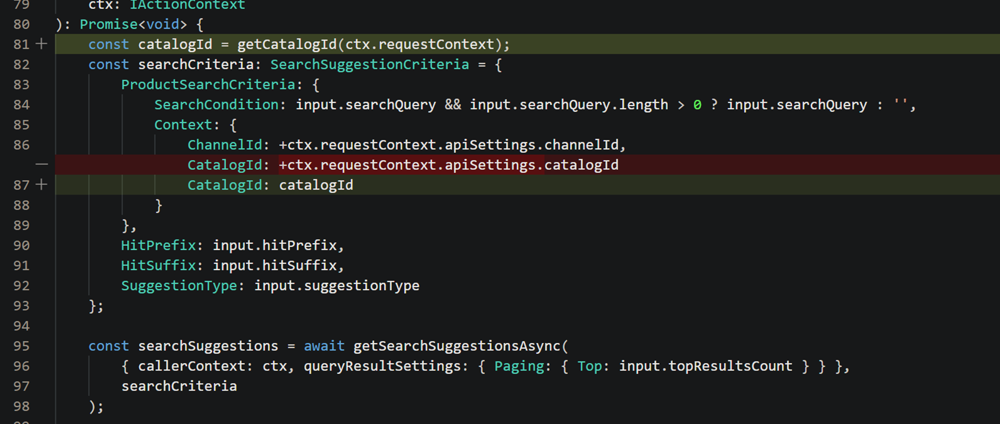
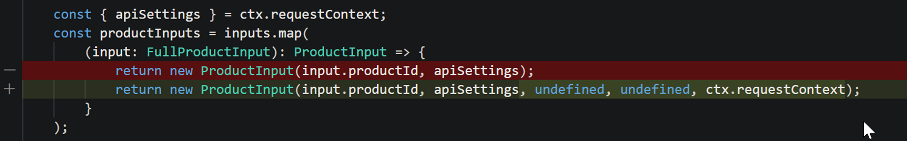
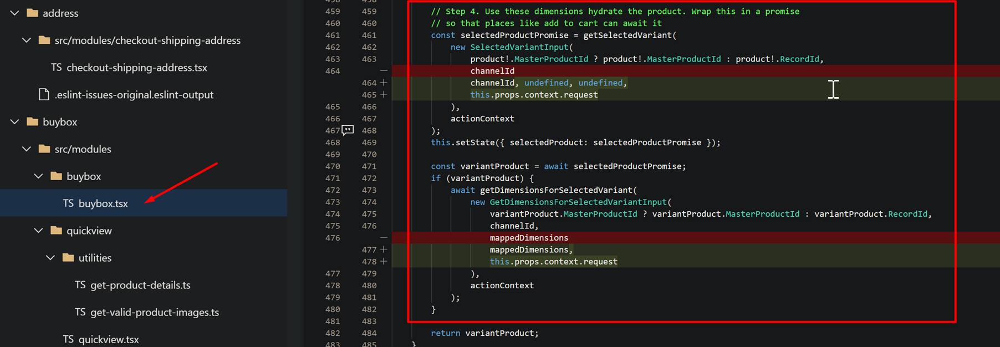
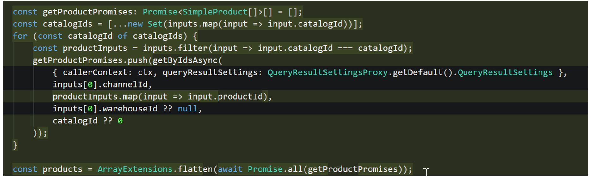

# Extensibility impact of Commerce catalogs for B2B customizations

[!include [banner](../includes/banner.md)]

This article describes the extensibility impact of the **Commerce catalogs for B2B** feature in Microsoft Dynamics 365 Commerce.

If you're interested in extending the catalog context to custom scenarios, your customizations might have to be updated. This update follows the standard process that customers must follow, because their customizations might not automatically support the latest features after upgrades are done. If your customizations include any new feature or bug fixes in their experiences, we recommend that you update the customization code accordingly. This update resembles the changes that Microsoft might have made for the core code.

Review the customization cases that follow to determine whether your customizations must be updated.

> [!NOTE]
> - All merchandising application programming interfaces (APIs) should be catalog-aware. Therefore, it's critical that you pass the **CatalogID** parameter.
> - The default catalog (**CatalogID**=**0**) isn't a valid catalog for signed-in business-to-business (B2B) users. Therefore, all API calls that pass "0" or use a default value will fail, because site users don't have access to catalog 0. To get the correct experience, the customer API calls must be updated so that they pass the catalog ID that was selected in the catalog picker. If you use a default value, and the user switches catalogs, the website should provide the data for the selected catalog. Therefore, to match the APIs that are run from core Commerce code, customized APIs should pass the selected catalog.

The following customization cases require development updates:

- **Case 1:** A customer introduces their own [data action](../e-commerce-extensibility/data-actions.md) that calls a product-related API or data action. The following update steps are required:

    1. If the data action uses a direct API call, update the data action so that it passes the catalog ID, as shown in the following example illustration.

        

    1. If the data action calls a different product-related data action inside the customization, the code must be updated so that it passes some new parameters, such as **requestContext**. The **requestContext** parameter is used to retrieve the current catalog ID, as shown in the following example illustration.

        

- **Case 2:** A customer has an [overridden data action](../e-commerce-extensibility/data-action-overrides.md). The following update step is required:

    - Update the data action as for case 1.

- **Case 3:** A customer has a view extension, script injector module, or [cloned module](../e-commerce-extensibility/modules-overview.md#clone-a-module-library-module) that includes calls to APIs or data actions. The following update step is required:

    - Update the code as for case 1, as shown in the following example illustration.

       

- **Case 4:** A customer uses a **getById** API call. The following update step is required:

    - Switch to the **getByIds** API call instead, because the **getById** APT call has some limitations and doesn't support catalog awareness.

- **Case 5:** A customer has a data action that retrieves information for multiple products that might be from different catalogs. The following update step is required:

    - Split the API calls by catalog ID. For example, for cart APIs, the cart might contain products from different catalogs. The product lines should be grouped by catalog ID, and they should call the API for each catalog separately, as shown in the following example illustration.

        

## Additional resources

[Create Commerce catalogs for B2B sites](../catalogs-b2b-sites.md)

[Commerce catalogs for B2B FAQ](../catalogs-b2b-sites-FAQ.md)

[Catalog picker module](../catalog-picker.md)
