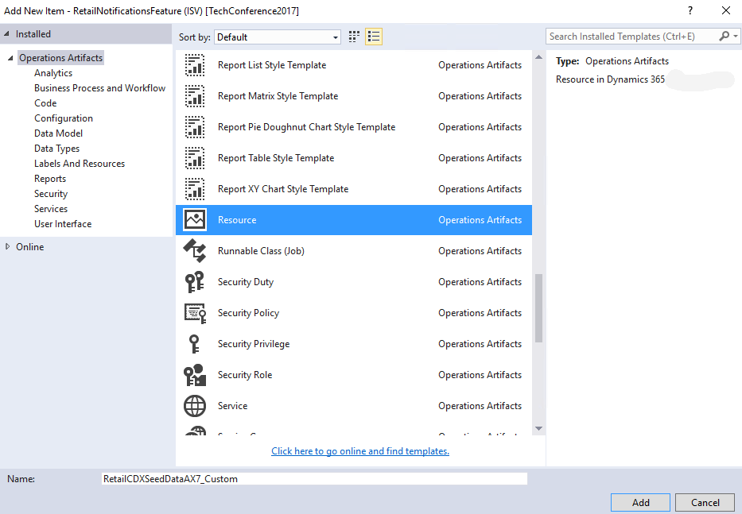

# Enable custom Commerce Data Exchange synchronization via extension

[!include [banner](../../includes/banner.md)]

This article explains how you can extend the Commerce initialization class to support custom Commerce Data Exchange (CDX) synchronization. For this extension, you use the new extension points that were added in Microsoft Dynamics 365 Finance platform update 8 or Microsoft Dynamics 365 Retail platform update 8.

CDX is a system that transfers data between Commerce Headquarters (HQ) and channels, such as online stores or brick-and-mortar stores. The data transfer between HQ and the channel database is controlled by scheduler jobs. Each scheduler job contains a list of scheduler subjobs. The scheduler subjobs contain the names of the source tables and destination tables, and the transfer field mapping of those tables. There are two ways to configure the data synchronization between HQ and the channel database:

+ Configure all the custom jobs and subjobs by using the configuration user interface (UI) for CDX.
+ Extend the Commerce initialization class by using the extension points that are provided to support custom jobs and subjobs for both push and pull.

The advantage of using the Commerce initialization class is that you don't have to configure the custom jobs in different environments (dev, test, and production). Instead, you can run the CDX initialization by using the **Initialize commerce scheduler** dialog box from **Retail and Commerce > Headquarters setup > Commerce scheduler > Initialize commerce scheduler**. Information about the custom job for the data synchronization is then automatically created in CDX.

There are various scenarios for data transfer between HQ and the channel database:

+ Send data from a new HQ table to a new channel database table by using a download job.
+ Pull data from a new channel database table to a new HQ table by using a push job.

## Send data from a new HQ table to a new channel database table by using a download job

Before you push or pull data, you must understand various metadata definitions in the XML resource file. The resource file contains the custom job information that will be initialized in your environment to push and pull data. Here is a list of the resource files that you must configure:

+ **ChannelDBSchema** – The extension schema that you created in the channel database.
+ **TargetTableSchema** – The extension schema that you created in the channel database to add your custom tables.
+ **AxTableName** – The table name.
+ **IsUpload** – A flag that determines whether the job is a push job or a pull job. (In other words, the flag indicates whether you want to send data from HQ to the channel database or pull data from the channel database to HQ). The default value is **false**, which indicates that you're sending data from HQ to the channel database.
+ **ScheduledByJob** – This resource file contains one or more subjobs.
+ **Subjob** – Each table is added as a subjob, and each subjob is scheduled by one or more scheduler jobs.
+ **TargetTable** – The name of the channel database table. This table is the target table that the push job or pull job must send data to. If a value isn't specified, the system assumes that name of the target table and the name of the source table are the same.

If you created a new HQ table and a new channel database table, follow these steps to push the data between the two tables.

1. Create a custom project and use the Application Object Tree (AOT) to add a custom table.
2. Create a new resource file to add all custom job information. Here is the template for the resource file.

```csharp
    <RetailCdxSeedData ChannelDBMajorVersion="7" ChannelDBSchema="ext" Name="AX7">
        <Jobs>
        </jobs>
        <Subjobs>
            <Subjob Id="" TargetTableSchema="" TargetTableName="">
        </Subjobs>
     </RetailCdxSeedData>
```

> [!NOTE]
> The **DataAreaId** column name should not be explicitly included in the field mapping. This is automatically added by Commerce Data Exchange (CDX). If added, an error will occur during initialization of the retail scheduler.

3. Use the AOT to create a new XML resource. In the XML file for the resource, specify the new table and new job details, as shown in the following example.

    > [!NOTE]
    > You can either add the new table as part of the existing job, or create a new job and add this table. In this case, we are creating a new job, where the job ID is **7000** and the custom table is named **ContosoRetailSeatingArrangementData**.
    >
    > ```xml
    > <RetailCdxSeedData ChannelDBMajorVersion="7" ChannelDBSchema="ext" Name="AX7">
    >    <Jobs>
    >        <Job DescriptionLabelId="REX4520710" Description="Custom job" Id="7000"/>
    >    </Jobs>
    >    <Subjobs>
    >        <Subjob Id="ContosoRetailSeatingArrangementData" TargetTableSchema="ext" AxTableName="ContosoRetailSeatingArrangementData">
    >            <ScheduledByJobs>
    >                <ScheduledByJob>7000</ScheduledByJob>
    >            </ScheduledByJobs>
    >            <AxFields>
    >                <Field Name="seatNumber"/>
    >                <Field Name="capacity"/>
    >                <Field Name="channelRecId"/>
    >                <Field Name="RecId"/>
    >             </AxFields>
    >        </Subjob>
    >    </Subjobs>
    > </RetailCdxSeedData>
    > ```

    By default, the name of the target table isn't specified here. The system assumes the name of the target table on the channel side is the same as the name of the source table on the Commerce side (**AXTableName**). However, the name of the target table on the channel side might sometimes differ from the name of the source table. In this case, in the **&lt;Subjob&gt;** node, you can use the **&lt;TargetTableName&gt;** attribute to set the name of the target table on the channel side.

    Similarly, in the mapping section, only the names of fields on the Commerce side are specified (**AxFields**). By default, it's assumed that the same field name is also used on the channel side. However, the field name on the corresponding channel table might sometimes differ from the field name on the Commerce side. In this case, in the mapping, you can use the **ToName** attribute of the **&lt;Field&gt;** node to set the name of the field on the channel side.

4. Right-click the project, and then select **Add** &gt; **New Item**.
5. In the **Add New item** dialog box, select **Resources**, name the resource file **RetailCDXSeedDataAX7_Custom**, and then select **Add**.

    

6. In the **Select a Resource file** dialog box, find the resource file that you created in step 2, and then select **Open**.
7. Add a new class that should be used to handle the **registerCDXSeedDataExtension** event. Search for the **RetailCDXSeedDataBase** class, and then open it in the designer. Right-click the **registerCDXSeedDataExtension** delegate, and then select **Copy event handler**.
8. Go to the event handler class that you created and paste the following event handler code into it.

    ```csharp
    if (originalCDXSeedDataResource == resourceStr(RetailCDXSeedDataAX7))
    {
        resources.addEnd(resourceStr(RetailCDXSeedDataAX7_Custom));
    }
    ```

    > [!NOTE]
    > Because there are two definitions for CDX seed data in the system, you must specify that your extension CDX seed data should be added only if the CDX seed data that is being generated is the version that you're trying to extend. If the **if** condition is removed, your extension CDX seed data could also be applied on top of the N-1 CDX seed data and cause unintended results. As a best practice, try to avoid any other customization on CDX/Retail scheduler sync framework class in X++. This could impact the flow of data when extra processing is performed. The suggested pattern is to have a separate class and batch job to process the uploaded data.
    >
    > You don't have to create separate resource files for the various scenarios that are mentioned later. You can have one file that contains all the custom job information and register that file from the extension class.
    >
    > When the initialization class runs, it looks for any extension that implements this handler. If an extension is found, the runtime will also initialize the custom information that is found in the resource file.

9. Go to **Retail and Commerce > Headquarters setup > Commerce scheduler >Initialize commerce scheduler**.
10. Run the CDX initialization by clicking the **OK** button on **Initialize commerce scheduler** dialog.

## Pull data from a new channel database table to a new HQ table by using a push job

To pull data from a new channel table to HQ, you have two options:

+ Create a new resource file and add the new resource to the event handler as a second line, as shown here.

    ```csharp
    if (originalCDXSeedDataResource == resourceStr(RetailCDXSeedDataAX7))
    {
        resources.addEnd(resourceStr(RetailCDXSeedDataAX7\_Custom));
        resources.addEnd(resourceStr(RetailCDXSeedDataAX7\_Custom1));
    }
    ```

+ Update the existing resource file with the new information, so that you don't have to add a new line. To upload you set the **IsUpload** attribute to **true** in the resource file and add information about your custom pull job, as shown in the following example.

    ```xml
    <Subjob Id="ContosoRetailSeatReservationTrans" TargetTableSchema="ext" IsUpload="true"
    ReplicationCounterFieldName="ReplicationCounterFromOrigin" AxTableName="ContosoRetailSeatReservationTrans">
        <ScheduledByJobs>
            <ScheduledByJob>P-1000</ScheduledByJob>
        </ScheduledByJobs>
        <AxFields>
            <Field Name="transactionId"/>
            <Field Name="storeId"/>
            <Field Name="terminalId"/>
            <Field Name="contactPhoneNo"/>
            <Field Name="numberOfCustomers"/>
            <Field Name="customerName"/>
            <Field Name="reservationDate"/>
            <Field Name="reservationTime"/>
            <Field Name="replicationCounterFromOrigin"/>
        </AxFields>
    </Subjob>
    ```

    > [!NOTE]
    > If you are creating an extended table and want to sync the data back to HQ, then the table must have the same primary key and clustered index as the HQ table in the extended table, if not, the CDX sync will fail. If you need to pull the data from the extension table to HQ, then the REPLICATIONCOUNTERFROMORIGIN identity column ([REPLICATIONCOUNTERFROMORIGIN] [int] IDENTITY(1,1) NOT NULL,) is required in the extension table.
    
    > You can either add this new table as part of the existing pull job (P-0001) or create a new pull job.

## Other scenarios

For the remaining push and pull scenarios, only the information for the sample resource file is described, because initialization is the same as we described in the previous sections.

### Push existing headquarters tables to channel database that are not part of CDX configurations

In this case, the extension should create a new sub job with the same name as the core table and create the same table in the channel database ext schema and map it. Because CDX doesn’t support multiple sub jobs for the same table, the sub job name must match the core table name to avoid any future conflicts. In the future, the headquarters table may be added for CDX push/pull by out-of-band (OOB) products with the sub job name same as the core table. CDX framework will automatically merge if there are any duplicate sub job names.

### Push existing columns that aren't mapped as part of any subjobs

You can push the existing unmapped column to either new extension columns or existing columns in the channel database, as shown in the following example.

```xml
<Subjob Id="RetailChannelTable" TargetTableSchema="ext">
    <AxFields>
        <Field Name="Payment"/>
        <!-- Existing column which was not pushed to channel db-->
        <Field Name="PaymMode"/>
        <!-- Existing column which was not pushed to channel db-->
        <Field Name="ContosoRetailWallPostMessage"/>
        <!-- New column from the extended table -->
    </AxFields>
</Subjob>
```

If the table has a primary key that isn't **RecId**, your extension table on the channel side should also contain the non-**RecId** primary keys, as shown in the following example.

```xml
    <Subjob Id="RetailCustTable" TargetTableSchema="ext">
        <AxFields>
            <Field Name="ReturnTaxGroup_W"/>
            <!-- Existing column which was not pushed to channel db-->
            <Field Name="SSNNumber"/>
            <!-- New column from the extended table-->
        </AxFields>
    </Subjob>
</Subjobs>
```

### Pull new columns to an existing table

If you add new columns and want to pull in part of the existing table, use the following code.

```xml
<Subjob Id="RetailTransactionTable" TargetTableName="CONTOSORETAILTRANSACTIONTABLE" TargetTableSchema="ext"  OverrideTarget="false">
    <AxFields>
        <Field Name="ContosoRetailSeatNumber"/>
        <Field Name="ContosoRetailServerStaffId"/>
    </AxFields>
</Subjob>
```

### Move an existing subjob to another subjob

To move an existing subjob to another job, you can change the **ScheduledByJob** attribute in the resource file and it is run as part of the event handler.

```xml
<Subjob Id="DirPartyTable">
    <ScheduledByJobs>
        <ScheduledByJob>1000</ScheduledByJob>
        <!--add existing subjob to another job-->
    </ScheduledByJobs>
```

## CDX sample - Pull new columns to an existing table

In Microsoft Dynamics 365 Retail App update 5, we added a new sample in **RetailSDK\Documents\SampleExtensionsInstructions\ExtensionTables**, it has all the sample SQL scripts, ax project files for different CDX extension scenarios, please use it as a reference for different CDX extension scenarios.

In the next sections, we discuss the steps and best practices for customizing transactional tables by using extension tables. Another section shows how to customize CDX to upload the customized (extension) tables on the channel side back to Commerce. We have also included a section that describes how to test the customization.

### Setup steps

We recommend that you implement these changes on an untouched Retail software development kit (SDK). Alternatively, you can put the SDK under source control, such as Microsoft Azure DevOps, so that you can easily revert your changes at any step. To begin, you import the \*.axpp package that is located in the SDK. You then run the SQL update script on your channel database.

1. Import the package on the Commerce side that contains the customization code:

    1. Copy the ExtensionTablesAndCDXCustomization.axpp file from the RetailSDK\Documents\SampleExtensionsInstructions\ExtensionTables   folder and paste in your extension project folder.
    2. Start Microsoft Visual Studio.
    3. Select **Dynamics 365** > **Import project**.
    4. In the **Import project** dialog box, specify the path of the .axpp file you copied in step 1.
    5. Select either **Current solution** or **New solution**, according to your preference.
    6. Select **OK** to begin to import the package.

        After the import is completed, you have the files in Solution Explorer.

    7. Build the solution.
    8. Right-click the project, and then select **Synchronize database**.

2. Run the SQL update script:

   1. Copy the **ContosoRetailExtensionTablesUpdate.sql** file from the Retail SDK folder. You can run the other sample files in a similar manner.
   2. Open the script in Microsoft SQL Server Browser, and run the script against your channel database.

      This step creates the extension tables that are required in order to customize the transactional tables. Note that the script also creates other tables that are used for other sample scenarios.

### Extend the data in the sample

The table extension on the Commerce side is already created in the sample. To create it manually, follow these steps.

1. Start Visual Studio.
2. On the menu, select **View** > **Application Explorer**.
3. Select **Data Model** > **Tables** > **RetailTransactionTable**, right-click **RetailTransactionTable**, and then select **Create extension**.

    As a best practice, you should change the default name to something like **RetailTransactionTable.ContosoRetailExtension**. Always add your unique prefix. In this sample, **ContosoRetail** is used as a unique prefix. By using a unique prefix, you help prevent naming conflicts if a table is extended by multiple independent software vendors (ISVs).

4. In the new **RetailTransactionTable.ContosoRetailExtension** table, create two new fields:

    **Type=string, name=ContosoRetailServerStaffId**: Set the **Extended data type** property to **RetailStaffId**.
    **Type=int, name=ContosoRetailSeatNumber**: Set the **Extended data type** property to **ContosoRetailSeatNumber**.

5. Save the changes, and build your project.
6. Right-click your project, and then select **Synchronize the database**.

    > [!NOTE]
    > As a best practice, the unique prefix is added to the new column names to help prevent future naming conflicts. A naming conflict can occur if another ISV creates a column that has the same name, or if Microsoft releases an update that uses a column that has the same name. Even though the extension table is created in a different AOT asset, the new columns are added to the original table in SQL.

### Extend the database on the channel side

From the Retail SDK folder, open and run the SQL Server **ContosoRetailExtensionTablesUpdate.sql** script. Several items are created and configured:

+ The **[ext].ContosoRetailTransactionTable** table that has the foreign key and custom (extension) fields is created. In addition to the extension columns that we added in the tables, the extension table on the channel side must have the same primary key columns as the original table on the channel side. Therefore, [ext].RetailTransactionTable_ContosoRetailExtension has the four primary key columns that are used in [ax].RetailTransactionTable. As a best practice, when you add the primary key columns to the extension table on the channel side, keep the names of the columns the same as the names of the primary key column on the original table.

+ CDX is configured to upload and pull the custom columns from the channel extension table back to Commerce. The RetailCDXSeedDataAX7 resource contains the information for the table mapping from Commerce to the channel database. CDX uses this information to create the required data transfer scheduler jobs and subjobs. To include your new extension tables or columns in the data transfer, you must provide a resource file that specifies the customization for the CDX data transfer. As a best practice, use the following naming convention to prevent conflicts: **RetailCDXSeedDataAX7_ContosoRetailExtension**. (Here, **ContosoRetail** is your unique extension.)

The sample CDX resource file in the Retail SDK contains additional customizations. However, for our example of RetailTransactionTable extension, the section in the following code is the only section that is required to pull data from the channel side back to HQ.

```csharp
<RetailCdxSeedData Name="AX7" ChannelDBSchema="ext" ChannelDBMajorVersion="7">
    <Subjobs>
        <!--Adding additional columns to (existing) RetailTransactionTable and wants to pull it back to HQ.For upload subjobs, set the OverrideTarget property to  "false", as ilustrated below. This will tell CDX to use the table defined by TargetTableName and TargetTableSchema as extension table on this subjob.-->
        <Subjob Id="RetailTransactionTable" TargetTableName ="CONTOSORETAILTRANSACTIONTABLE" TargetTableSchema="ext" OverrideTarget="false">
            <!--Notice that there is no mention of the <ScheduledByJobs></ScheduledByJobs> because the subjob is already part of an upload job. -->
            <AxFields>
                <!--If you notice the existing columns are not listed here in the <Field> tag, it's because the existing fields are already mapped in the main RetailCdxSeedData resource file, we only add the delta here. -->
                <Field Name="ContosoRetailSeatNumber" />
                <Field Name="ContosoRetailServerStaffId" />
            </AxFields>
        </Subjob>
    </Subjobs>
</RetailCdxSeedData>
```

**Description  of the fields used in this resource file:**

**ChannelDBSchema='ext'** – This field is included so that the resource reads from the extension schema in the channel database.

**Subjob Id="RetailTransactionTable"** – You must make sure that the SubJob ID is the same as the original subjob id for that table. so that the extensibility framework can determine that you're customizing the existing subjob. If you use new subjob di, system will throw duplicate subjob error for the same table.

**TargetTableName ="CONTOSORETAILTRANSACTIONTABLE"** - Your channel extension table name.

**TargetTableSchema="ext"** - Your channel extension schema. Currently we support the extension schema name only as ext.

**OverrideTarget="false"** - For upload subjobs (the ones that bring data from the channel to the headquarters), OverrideTarget when set to "false" will tell CDX that the table defined by TargetTableName is an extension table and data will be uploaded along with the primary table already defined in the subjob.

If OverrideTarget is set to "true" the table defined by TargetTableName will override the primary table for the subjob (default value fields will be omitted during the pull job and only the extension fields will be considered). For instance, in this sample, if you set this value to true, this would mean that instead of uploading the data from ax.RetailTransactionTable, CDX would only upload the data from ext.CONTOSORETAILTRANSACTIONTABLE.

The **AxTableName** attribute isn't specified, because the framework can already determine the **AxTableName** value that the specified subjob uses as a sink. You only have to specify the differences when you customize the RetailCDXSeedDataAX7 resource. Any data that the framework can infer doesn't have to be added by extensions. Similarly, in the `<AXFields></AXFields?` section, you can see that we specified only the custom or new fields, because the extensibility framework can determine the list of remaining fields from the specified subjob ID.

+ The CDX module that has the CDX customization resource is updated. To apply the customization that is specified in RetailCDXSeedDataAX7_ContosoRetailExtension, you must subscribe to the registerCDXSeedDataExtension delegate. By subscribing to this event, you help guarantee that the customization is applied when initialization of the CDX seed data is run.

#### Subscribe to the registerCDXSeedDataExtension delegate

1. Select **View** > **Application Explorer**.
2. Search for the **RetailCDXSeedDataBase** class.
3. Right-click the class, and then select **Open in designer**.
4. In the designer, in the list of delegates and methods, select the **registerCDXSeedDataExtension** delegate.
5. Right-click, and then select **Copy event handler**. The method signature that you must implement is copied, so that CDX picks up the customized resource for CDX seed data.
6. Create a new class, and give it a name, such as **ContosoRetailCDXSeedDataAX7EventHandler**. You can specify any name. However, as a best practice, be sure to prefix the class name with your prefix.
7. Paste the code that you copied in step 5.

    ```csharp
    class ContosoRetailCDXSeedDataAX7EventHandler
    {
        /// <summary>
        /// Registers the extension CDX seed data resource to be used during CDX seed data generation.
        /// </summary>
        /// <param name="result">The result object which is used to return the resource name.</param>
        [SubscribesTo(classStr(RetailCDXSeedDataBase), delegateStr(RetailCDXSeedDataBase, registerCDXSeedDataExtension))]
        public static void RetailCDXSeedDataBase_registerCDXSeedDataExtension(str originalCDXSeedDataResource, List resources)
        {
        }
    }
    ```

8. The CDX extensibility framework calls this method when you select the Commerce initialization. To help guarantee that the CDX extensibility module uses the CDX customization, paste the following code into the preceding method.

    ```csharp
    if (originalCDXSeedDataResource == resourceStr(RetailCDXSeedDataAX7))
    {
        resources.addEnd(resourceStr(RetailCDXSeedDataAX7_ContosoRetailExtension));
    }
    ```

    Before you add your custom resource to the list, you must verify that the originalCDXSeedDataResource resource that is being processed is RetailCDXSeedDataAX7. Otherwise, you might cause unintended results.

9. To initialize or reinitialize the CDX module with the customized configuration, follow these steps:

   1. Go to **Retail and Commerce** > **Headquarters setup** > **Commerce scheduler** > **Scheduler jobs** > **Initialize commerce scheduler**.
   2. In the dialog box that appears, select **Delete existing configuration**.
   3. Select **OK** to start the initialization.

      When the initialization is completed, the CDX scheduler jobs, subjob definitions, and distribution schedules are updated by using the original RetailCDXSeedDataAX7 resource and the customized RetailCDXSeedDataAX7_ContosoRetailExtension resource.

#### Validate the customization

1. Verify that your customization works correctly:

    1. After the initialization is completed, go to **Retail and Commerce** > **Headquarters setup** > **Commerce scheduler**, and then select the **Scheduler subjobs** link.
    2. On the subjobs table, search for the **RetailTransactionTable** subjob ID.
    3. In the details area, under the **Channel field mapping** section, verify that the new custom (extension) columns are listed in the mapping.

2. Test that the CDX job will upload and pull from the original and extension tables on the channel side(a view combining original and extensible tables is generated by the CDX framework):

    1. Create some transactions in the Store Commerce app.
    2. Because the extension table isn't used in the Commerce Runtime (CRT) and Store Commerce app, you must manually insert data into the extension table. Run the following script after you change the required values.

        ```sql
        INSERT INTO [ext].[CONTOSORETAILTRANSACTIONTABLE] (
        [CONTOSORETAILSEATNUMBER],
        [CONTOSORETAILSERVERSTAFFID],
        [TRANSACTIONID],
        [STORE],
        [CHANNEL],
        [TERMINAL],
        [DATAAREAID])
        VALUES (
        1, /*normally this needs to be an existing seat number from ContosoRetailSeatingData table, but for this test add any number*/
        '000160' /*add any staff ID here*/,
        'HOUSTON-HOUSTON-11-101',/\*add the transaction id you just created */
        'HOUSTON', /*add the store used to create the transaction */
        5637144592, /*add the channel RecId of the store used to create the transaction*/
        'HOUSTON-11', /*add the terminalId used to create the transaction*/
        'USRT' /*add the dataareaId used by the store*/)
        GO
        ```

        Repeat this step for the other transactions. Don't add corresponding data in [ext].[CONTOSORETAILTRANSACTIONTABLE] for some of the transactions that you created in the Store Commerce app. In this way, you can verify that the data from [ax].RetailTransactionTable is pulled and uploaded even if there is no corresponding data in the extension table.

    3. Go to **Dynamics 365** > **Retail and Commerce** > **Retail and Commerce IT**, and then select **Distribution schedule**.
    4. In the list of distribution schedules, select **P-0001**. This distribution schedule contains the RetailTransactionTable subjob that you customized.
    5. On the Action Pane, select **Run**. When the confirmation message appears, select **Yes**.
    6. On the Action Pane, select **History** to open the **History** page, where you can verify that the uploaded session was completed successfully.
    7. On the **History** page, verify that there is a new upload session record. Also verify that the status of the record is set to **Applied**, and that the **Rows Affected** value isn't **0** (zero).

3. If the upload session is applied successfully, go to **Retail and Commerce** > **Inquiries and reports** > **Store transactions**, and search for the new transactions that you just uploaded. Verify that the transactions, seat number, and server staff ID custom columns have the expected values.

    Additionally, verify that the transactions that don't have a corresponding record in the [ext].ContosoRetailTransactionTable extension table on the channel side are also uploaded. Verify that these transactions have default values for the seat number and server staff ID. The seat number should be set to **0** (zero), and the server staff ID should be set to **000160**.

#### Store Commerce app offline transaction sync

Switch Store Commerce app to offline mode and do some transaction. Switch back to online and verify that the data is synced properly from the offline database to the channel database and then to headquarters.


[!INCLUDE[footer-include](../../includes/footer-banner.md)]
