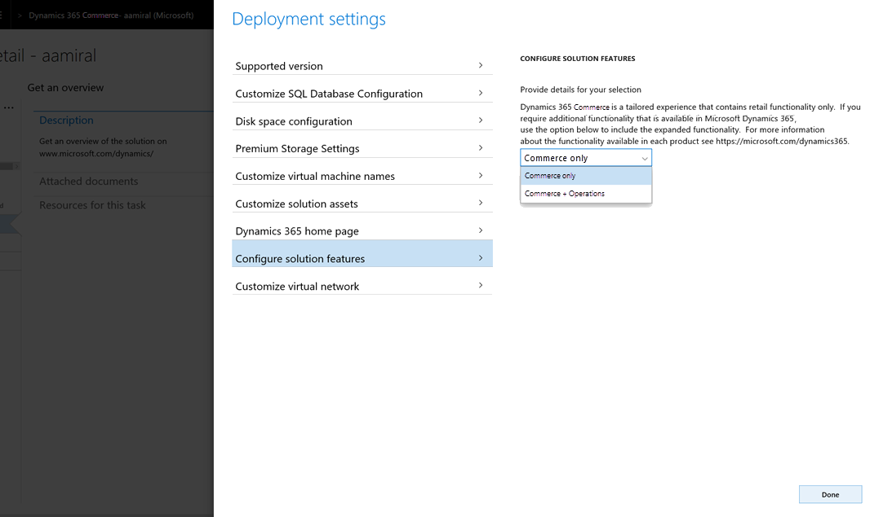

---
# required metadata

title: Deployment options for retail functionality
description: This topic explains the differences in the functionality between Dynamics 365 Commerce and Dynamics 365 Finance.
author: ashishmsft 
manager: AnnBe
ms.date: 10/17/2017
ms.topic: article
ms.prod: 
ms.service: dynamics-365-retail
ms.technology: 

# optional metadata

# ms.search.form:  [Operations AOT form name to tie this topic to]
audience: IT Pro
# ms.devlang: 
ms.reviewer: rhaertle
ms.search.scope: Operations, Retail 
# ms.tgt_pltfrm: 
# ms.custom: [used by loc for topics migrated from the wiki]
ms.search.region: Global
ms.search.industry: retail
ms.author: asharchw
ms.search.validFrom: 2017-06-30 
ms.dyn365.ops.version: Retail July 2017 update 
---

# Deployment options for retail functionality

[!include [banner](../../includes/banner.md)]

Commerce functionality is available in the following products:
 
- Dynamics 365 Commerce
- Dynamics 365 Finance
 
Commerce contains core functionality that is typically used by most retailers. This tailored functionality improves productivity and helps to ease the on-boarding and training processes for your employees. 

With Commerce, you also have the option to enable additional functionality. This means that you could deploy an environment that has the same functional footprint as a Finance environment.
 
The following table lists the key differences between Commerce and Finance and Operations.

| Capability   |  Dynamics 365 Commerce   |  Dynamics 365 Finance |
|--------------|----------------------------|-------------------------------------------|
|Receive app model updates seamlessly. (App model updates do not need to be compiled or merged with your customizations.) | Yes | No|
|Receive channel component updates seamlessly. (Channel components updates do not need to be merged with your customizations.) | Yes | Yes |
|Deploy a solution that is scoped to provide commerce functionality only. | Yes  | Yes*  \* Can be configured after deployment.  |
|Optimize your financials and operations to drive growth and make real-time, data-driven decisions with an intelligent, modern enterprise business application.| No*  \* You can enable additional functionality with a Finance and Operations Plan or Dynamics 365 Plan. | Yes |

For more information about licensing, see the [Licensing Guide](https://go.microsoft.com/fwlink/?LinkId=866544&clcid=0x409).

When you first visit Lifecycle Services (LCS) after acquiring the necessary licenses for your tenant, you will be prompted to choose an implementation project type, which is where you must select **Dynamics 365 Commerce** or **Dynamics 365 Finance**. You can use the above considerations to choose the right product to deploy.
 
As indicated in the table above, if you choose to deploy Dynamics 365 Commerce--and you have the necessary licenses--you will have the option, at deployment time, to configure the solution: 

- If you want the solution scoped to commerce functionality only, select **Commerce only**. 
- If you want to enable additional functionality, select **Commerce + Operations**.
 

