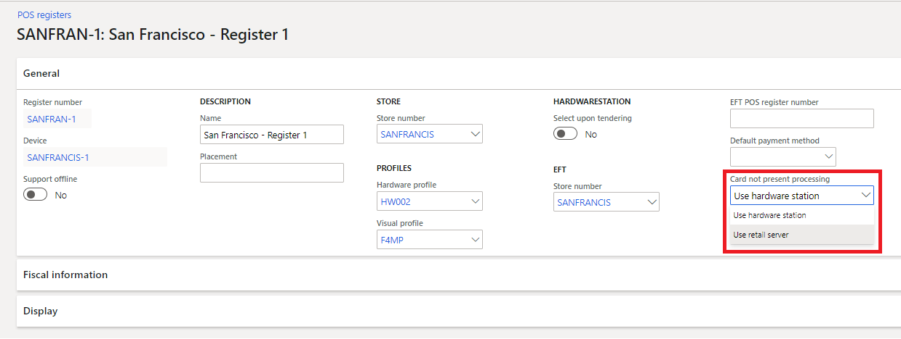

---
# required metadata

title: Process credit cards without a hardware station
description: This article describes how to configure the point of sale (POS) to process "card not present" transactions in POS clients that don't include a hardware station.
author: BrianShook
ms.date: 02/01/2023
ms.topic: article
ms.prod: 
ms.technology: 

# optional metadata

# ms.search.form: 
# ROBOTS: 
audience: IT Pro
# ms.devlang: 
ms.reviewer: josaw
# ms.tgt_pltfrm: 
ms.custom: 141393
ms.assetid: e23e944c-15de-459d-bcc5-ea03615ebf4c
ms.search.region: Global
ms.search.industry: Retail
ms.author: brshoo
ms.search.validFrom: 2020-08-31
ms.dyn365.ops.version: AX 7.0.1

---

# Process credit cards without a hardware station

[!include [banner](../includes/banner.md)]

This article describes how to configure the point of sale (POS) to process "card not present" transactions in POS clients that don't include a hardware station. This feature specifically targets emerging scenarios such as curbside pickup.

When this feature is turned on, Store Commerce for web can make credit card processing calls through Commerce Scale Unit because it doesn't require a standalone hardware station that is deployed on the local network. Any POS client can support curbside pickup, and fewer setup steps are required.

> [!NOTE]
> This feature should not be turned on for registers that support offline mode. The feature routes all "card not present" payment requests through the Commerce Scale Unit, but the Commerce Scale Unit isn't available when the register goes offline.

## Key terms

| Term | Description |
|---|---|
| BOPIS | This abbreviation is short for "buy online, pick up in store." |
| Curbside pickup | This scenario resembles BOPIS. However, instead of picking up items in the store, customers don't usually enter the store and often don't even leave their vehicle. |
| Card not present | This term is sometimes abbreviated CNP. It describes scenarios where the credit card or other form of electronic payment isn't physically present. In BOPIS and curbside pickup scenarios, customers make a payment online or over the phone, and the payment is then captured from the POS at the time of pickup. |
| Hardware station | This term describes the business logic that drives interactions between the POS and payment terminals or retail peripherals such as receipt printers. The hardware station is built into the Store Commerce app for Windows, Android and iOS. Store Commerce for web requires a standalone deployed hardware station to interact with physical devices. |

## Overview

When this feature is turned off, Store Commerce for web can't process "card not present" credit card requests by itself because it doesn't have a built-in hardware station. When the feature is turned on, the Commerce Scale Unit can be used to facilitate the requests for Store Commerce for web.

Although this feature can also be used for the Store Commerce app for Windows and Store Commerce app for Android, in addition to Store Commerce for web and Store Commerce app for iOS, it isn't supported for offline mode. Therefore, the feature should not be used in scenarios where a Windows client uses offline mode.

## Supported scenarios

The following scenarios are supported for POS clients that don't have a built-in hardware station.

| Scenario | Description |
|---|---|
| Payment capture | An order can be recalled for pickup, and the credit card payment that is associated with the order can be captured. |
| Linked refund | A refund can be linked to the original payment instrument for return orders and cash-and-carry transactions. |
| Order editing | Orders can be recalled and edited in the POS, and the same payment card can be authorized to support the new order total. |
| Order cancellation | For orders that are canceled, the balance that is due back to the customer can be refunded to the original payment card. |

## Unsupported scenarios

Creation of credit card authorizations isn't supported. Only existing card payments can be captured, refunded, or edited.

| Scenario | Description |
|---|---|
| Creating a payment | This feature doesn't support the creation of new customer orders and authorization of payments for fulfillment. Creation of new payments will continue to require a hardware station. |
| Changing the payment card | If an order is recalled in the POS, the same payment method must be used for pickup. Store associates can substitute a different card for the card that is associated with an order only if a hardware station is available. |
| Offline mode | When this feature is turned on, "card not present" requests are always sent to the Commerce Scale Unit. If a register goes offline, "card not present" requests will fail, because the Commerce Scale Unit is no longer available. The feature should not be turned on for registers that are configured to support offline mode. |

## Set up the POS to process "card not present" transactions without a hardware station

The configuration to turn on this feature is completed at the register level.

1. In the back office, go to **Retail and Commerce \> Channel setup \> POS setup \> Registers**.
2. Select the relevant register, and then select **Edit**.
3. On the **General** FastTab, in the **Card not present processing** field, select **Use retail server**. (By default, this field is set to **Use hardware station**.)

    

4. Select **Save**.
5. After the change is saved, run the **1090** distribution schedule to sync the changes to the POS.

## Additional resources

[Omni-channel payments overview](../omni-channel-payments.md)

[!INCLUDE[footer-include](../../includes/footer-banner.md)]
